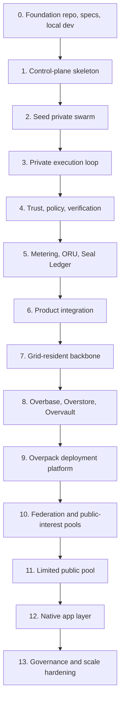

# Overrid Master Build Plan

## Purpose

This document defines the build order for Overrid. It turns the whitepaper into an implementation sequence with dependency gates, acceptance criteria, and the order in which subsystems should become real.

The build must start from founder-provided seed servers and GPUs, but every core service must be designed to migrate into the grid. The first hardware is the bootstrap environment, not the permanent backbone.

## Build Principles

- Build the private swarm before the public marketplace.
- Build a modular control plane and node agent first; split into independent services only after APIs and load patterns are proven.
- Make identity, tenancy, manifests, policy, queues, leases, metering, audit, and failure handling durable from the beginning.
- Treat public nodes as untrusted until verification, abuse controls, payout holds, and workload-sensitivity boundaries exist.
- Keep ORU, Seal Ledger, and Overasset as utility/accounting/rights infrastructure, not speculative blockchain or NFT mechanics.
- Make every phase usable by at least one real workload before widening scope.
- Move backbone services into protected grid-resident system workloads as soon as private execution and trust controls are stable.

## Dependency Spine

## Phase Detail Documents

| Phase | Detailed plan |
| --- | --- |
| 0 | [Foundation](phase_00_foundation.md) |
| 1 | [Control-Plane Skeleton](phase_01_control_plane_skeleton.md) |
| 2 | [Seed Private Swarm](phase_02_seed_private_swarm.md) |
| 3 | [Private Execution Loop](phase_03_private_execution_loop.md) |
| 4 | [Trust, Policy, and Verification](phase_04_trust_policy_verification.md) |
| 5 | [Metering, ORU, Seal Ledger, and Overbill](phase_05_metering_oru_seal_ledger_overbill.md) |
| 6 | [First Product Integration](phase_06_first_product_integration.md) |
| 7 | [Grid-Resident Backbone](phase_07_grid_resident_backbone.md) |
| 8 | [Data, Storage, and Namespace Platform](phase_08_data_storage_namespace_platform.md) |
| 9 | [Overpack Deployment Platform](phase_09_overpack_deployment_platform.md) |
| 10 | [Trusted Federation and Public-Interest Pools](phase_10_trusted_federation_public_interest_pools.md) |
| 11 | [Limited Public Low-Sensitivity Pool](phase_11_limited_public_low_sensitivity_pool.md) |
| 12 | [Native Application Layer](phase_12_native_application_layer.md) |
| 13 | [Governance, Compliance, and Scale Hardening](phase_13_governance_compliance_scale_hardening.md) |

## Service Catalog Alignment

Per-service implementation plans are aligned to the phase order in [Build Plan to Service Catalog Alignment](service_catalog_alignment.md). The build plan is the canonical order of work; the service catalog is the canonical per-service implementation scope.

## Per-SDS Sub-Build Plans

Per-SDS sub-build plans provide the service-level implementation sequence for numbered SDS documents. They do not replace the master Phase 0 through Phase 13 order; they attach detailed work items to the phase where each SDS first becomes buildable.

| SDS | Sub-build plan | Master phase alignment |
| --- | --- | --- |
| SDS #1: [Admin and Developer UI](../sds/foundation/admin_developer_ui.md) | [SUB BUILD PLAN #1 - Admin and Developer UI](sub_build_plan_001_admin_developer_ui.md) | First build point remains Phase 6, with prerequisites from Phases 0, 1, 3, 4, and 5. |
| SDS #2: [CLI](../sds/foundation/cli.md) | [SUB BUILD PLAN #2 - CLI](sub_build_plan_002_cli.md) | First build point remains Phase 1, with Phase 6 hardening for product integrations and prerequisites from Phases 0 through 5. |
| SDS #3: [Integration Test Harness](../sds/foundation/integration_test_harness.md) | [SUB BUILD PLAN #3 - Integration Test Harness](sub_build_plan_003_integration_test_harness.md) | First build point remains Phase 0, with later phase-gate expansion through Phases 1 through 13. |
| SDS #4: [Local Development Stack](../sds/foundation/local_development_stack.md) | [SUB BUILD PLAN #4 - Local Development Stack](sub_build_plan_004_local_development_stack.md) | First build point remains Phase 0, with later local/test simulator expansion gated by owning service phases. |
| SDS #5: [Repository Layout](../sds/foundation/repository_layout.md) | [SUB BUILD PLAN #5 - Repository Layout](sub_build_plan_005_repository_layout.md) | First build point remains Phase 0, with later workspace expansion gated by owning service phases and layout-change governance. |
| SDS #6: [SDK](../sds/foundation/sdk.md) | [SUB BUILD PLAN #6 - SDK](sub_build_plan_006_sdk.md) | First build point remains Phase 1, with Phase 0 prerequisites and Phase 6 product-integration hardening. |
| SDS #7: [Shared Schema Package](../sds/foundation/shared_schema_package.md) | [SUB BUILD PLAN #7 - Shared Schema Package](sub_build_plan_007_shared_schema_package.md) | First build point remains Phase 0, with downstream schema expansion gated by owning service phases. |
| SDS #8: [Overgate](../sds/control_plane/overgate.md) | [SUB BUILD PLAN #8 - Overgate](sub_build_plan_008_overgate.md) | First build point remains Phase 1, with Phase 0 prerequisites and later hardening through policy, metering, product integration, and grid-resident operation. |
| SDS #9: [Overkey](../sds/control_plane/overkey.md) | [SUB BUILD PLAN #9 - Overkey](sub_build_plan_009_overkey.md) | First build point remains Phase 1, with Phase 0 prerequisites and broader key/secret-ref expansion through Phase 8 plus later policy, product, grid-resident, and governance hardening. |
| SDS #10: [Overpass](../sds/control_plane/overpass.md) | [SUB BUILD PLAN #10 - Overpass](sub_build_plan_010_overpass.md) | First build point remains Phase 1, with Phase 0 prerequisites and broader namespace/route-binding expansion through Phase 8 plus later policy, product, grid-resident, native-app, and governance hardening. |
| SDS #12: [Overregistry](../sds/control_plane/overregistry.md) | [SUB BUILD PLAN #12 - Overregistry](sub_build_plan_012_overregistry.md) | First build point remains Phase 1, with Phase 0 prerequisites and later expansion through provider capability, package provenance, policy/trust, metering refs, product clients, grid-resident operation, federation/public catalogs, native-app catalogs, and governance hardening. |
| SDS #13: [Overrid Protocol Core](../sds/control_plane/overrid_protocol_core.md) | [SUB BUILD PLAN #13 - Overrid Protocol Core](sub_build_plan_013_overrid_protocol_core.md) | First build point remains Phase 0 as the protocol specification and conformance layer, with Phase 1 golden-trace adoption and later expansion through all service domains plus Phase 13 PIP governance. |
| SDS #14: [Overtenant](../sds/control_plane/overtenant.md) | [SUB BUILD PLAN #14 - Overtenant](sub_build_plan_014_overtenant.md) | First build point remains Phase 1, with Phase 0 prerequisites and later expansion through policy, accounting refs, product clients, grid-resident operation, namespace/storage refs, federation/public scopes, native-app clients, and governance hardening. |
| SDS #15: [Overwatch](../sds/control_plane/overwatch.md) | [SUB BUILD PLAN #15 - Overwatch](sub_build_plan_015_overwatch.md) | First build point remains Phase 1, with Phase 0 prerequisites and later expansion through trust/policy evidence, accounting evidence refs, product clients, grid-resident health/failover/restore, storage/archive refs, federation/public evidence, native-app trace consumers, and governance/compliance exports. |
| SDS #16: [Benchmark Runner](../sds/execution_scheduling/benchmark_runner.md) | [SUB BUILD PLAN #16 - Benchmark Runner](sub_build_plan_016_benchmark_runner.md) | First build point remains Phase 2, with Phase 0 and Phase 1 prerequisites and later handoffs through private execution, verification/challenges, metering visibility, grid-resident operation, public-provider anti-gaming, product clients, and governance hardening. |
| SDS #17: [Hardware Discovery](../sds/execution_scheduling/hardware_discovery.md) | [SUB BUILD PLAN #17 - Hardware Discovery](sub_build_plan_017_hardware_discovery.md) | First build point remains Phase 2, with Phase 0 and Phase 1 prerequisites and later handoffs through private execution eligibility, policy/verification evidence, metering visibility, system-service runtime readiness, federation/public-provider hardening, client reads, and governance hardening. |
| SDS #18: [Node Installer](../sds/execution_scheduling/node_installer.md) | [SUB BUILD PLAN #18 - Node Installer](sub_build_plan_018_node_installer.md) | First build point remains Phase 2, with Phase 0 and Phase 1 prerequisites and later handoffs through private execution readiness, policy/verification evidence, installer overhead visibility, grid-resident update/rollback operation, provider onboarding, public-provider hardening, and governance hardening. |
| SDS #19: [Overcache](../sds/execution_scheduling/overcache.md) | [SUB BUILD PLAN #19 - Overcache](sub_build_plan_019_overcache.md) | First useful build work remains Phase 4 metadata-first cache trust scopes, with Phase 3 consumers, Phase 5 usage-fact handoff, Phase 8 storage/namespace expansion, Phase 11 public low-sensitivity constraints, and governance hardening. |
| SDS #20: [Overcell](../sds/execution_scheduling/overcell.md) | [SUB BUILD PLAN #20 - Overcell](sub_build_plan_020_overcell.md) | First build point remains Phase 2, with Phase 0 and Phase 1 prerequisites and later handoffs through Phase 3 lease-bound execution, Phase 5 raw usage facts, Phase 7 system-service eligibility, public-provider hardening, and governance. |
| SDS #21: [Overlease](../sds/execution_scheduling/overlease.md) | [SUB BUILD PLAN #21 - Overlease](sub_build_plan_021_overlease.md) | First build point remains Phase 3, with Phase 0 through Phase 2 prerequisites and later handoffs through policy/trust, metering/accounting, grid-resident system-service leasing, public-provider constraints, and governance. |
| SDS #22: [Overmesh](../sds/execution_scheduling/overmesh.md) | [SUB BUILD PLAN #22 - Overmesh](sub_build_plan_022_overmesh.md) | First build point remains Phase 4 for trusted private endpoint discovery and tenant-scoped service routing, with Phase 8 namespace route resolution plus later product, grid-resident, federation, public-provider, native-app, and governance hardening. |
| SDS #23: [Overmeter](../sds/execution_scheduling/overmeter.md) | [SUB BUILD PLAN #23 - Overmeter](sub_build_plan_023_overmeter.md) | First build point remains Phase 3 for raw usage events, with signed rollups and accounting handoff in Phase 5 plus later product, grid-resident, native-app, public-provider, and governance hardening. |
| SDS #24: [Overpack](../sds/execution_scheduling/overpack.md) | [SUB BUILD PLAN #24 - Overpack](sub_build_plan_024_overpack.md) | First build point remains Phase 3 for strict workload manifests, with application-intent deployment expansion in Phase 9 plus later federation, public-provider, native-app, and governance hardening. |
| SDS #25: [Overrun](../sds/execution_scheduling/overrun.md) | [SUB BUILD PLAN #25 - Overrun](sub_build_plan_025_overrun.md) | First build point remains Phase 3 for lease-bound sandbox execution, with Phase 8 Overstore/Overvault integration, Phase 11 public low-sensitivity sandbox constraints, and later governance hardening. |
| SDS #26: [Oversched](../sds/execution_scheduling/oversched.md) | [SUB BUILD PLAN #26 - Oversched](sub_build_plan_026_oversched.md) | First build point remains Phase 3 for deterministic private-swarm placement, reason codes, Overlease reservation requests, and replayable decisions, with later trust, federation/public, system-service, native-platform, and governance hardening. |

## Phase 0: Foundation

**Goal:** Establish the implementation workspace, coding standards, protocol skeleton, local development flow, and shared schemas.

**Build first:**

- Repository structure for control plane, node agent, SDK/CLI, specs, docs, and tests.
- Local dev environment for API, worker, Overrid-shaped local durable state, durable job table, object/artifact stub, and one local node-agent simulator.
- Canonical schema package for identities, tenants, manifests, commands, events, and audit records.
- Basic API conventions: request signing, idempotency keys, trace ids, tenant ids, error format, pagination, and versioning.
- Test harness for local integration tests and deterministic fixture generation.

**Exit criteria:**

- A developer can start the local stack and run a smoke test.
- Shared schema validation works across API, worker, and node-agent boundaries.
- All mutating commands produce structured audit events.

## Phase 1: Control-Plane Skeleton

**Goal:** Build the minimum control plane that can accept identities, tenants, resources, manifests, commands, and queued work.

**Core components:**

- Overpass-lite: identities for people, organizations, nodes, apps, native services, service accounts, and system services.
- Overtenant: tenant boundaries, roles, quotas, suspension states, and audit context.
- Overgate: API ingress, authentication, request signing, idempotency, rate limits, and command audit.
- Overregistry: resource manifests, workload manifests, package manifests, provider records, and schema versions.
- Overkey-lite: signing keys, API credentials, key rotation metadata, and revocation.
- Overwatch event log: append-only operational events, request traces, health events, and policy decision records.
- Overqueue skeleton: persistent pending jobs, priorities, retry metadata, and dead-letter state.

**Exit criteria:**

- Tenant admin can create a tenant, identity, credential, resource manifest, and signed workload command.
- Duplicate idempotency keys are rejected correctly.
- A synthetic workload reaches pending queue state with a complete audit chain.

## Phase 2: Seed Private Swarm

**Goal:** Turn founder servers/GPUs into the first private swarm and prove node registration, heartbeat, capability discovery, and resource inventory.

**Core components:**

- Overcell node agent with install, register, heartbeat, shutdown, and update flow.
- Node Installer for signed bundle verification, scoped enrollment, protected config rendering, supervised service install, idempotent lifecycle commands, rollback, diagnostics, and uninstall.
- Node classes: compute, GPU, storage, structured-state, cache, gateway, and specialized.
- Hardware discovery for CPU, RAM, GPU, storage, bandwidth, OS, accelerator runtime, and region.
- Benchmark runner for useful capacity, not only hardware names.
- Capability publication into Overregistry.
- Private swarm membership and tenant-scoped resource visibility.

**Exit criteria:**

- At least one seed server and one GPU node register successfully.
- The control plane shows live/expired/stale node states.
- Benchmarks produce normalized capability records usable by the scheduler.

## Phase 3: Private Execution Loop

**Goal:** Run real private workloads from signed request to result, retry, metering, and audit.

**Core components:**

- Overpack v0 manifest for command jobs, containers/WASI where feasible, model references, inputs, outputs, egress policy, and resource cards.
- Oversched v0 for private-swarm placement using queue priority, capability, availability, workload/resource cards, policy, trust, grant, cost-class, cache, locality, lease availability, reason codes, and replayable placement decisions.
- Overlease v0 for short-lived reservations and stale lease cleanup.
- Overrun v0 for sandbox preparation, package verification, execution supervision, result capture, and safe termination.
- Overmeter v0 for raw usage events: CPU time, GPU time, storage, bandwidth, wall time, queue wait, and model inference.
- Retry, cancellation, timeout, and dead-letter flows.

**Exit criteria:**

- A known private node runs a real job through queue, scheduler, lease, runner, metering, result return, and audit.
- Controlled failures produce retries or dead-letter records.
- Failed, cancelled, timed-out, and successful workloads have distinct final states.

## Phase 4: Trust, Policy, and Verification

**Goal:** Make execution safe enough for multiple tenants and real workloads.

**Core components:**

- Overguard policy engine for workload class, data sensitivity, tenant quota, package trust, egress, secrets, and provider eligibility.
- Policy dry-run API with reason codes, matched rules, estimated cost, and expected placement class.
- Oververify v0 for provider verification, benchmark validation, challenge checks, and trust scoring.
- Overclaim v0 for dispute records, evidence links, holds, challenge windows, refunds, and corrections.
- Overmesh private discovery and service connectivity for trusted private nodes.
- Cache trust scopes: private tenant, trusted swarm, federation grant, public low-sensitivity content.

**Exit criteria:**

- Policy decisions are replayable from stored facts and policy version.
- Invalid packages, denied egress, wrong tenant context, and insufficient trust are rejected before execution.
- Verification evidence influences scheduler eligibility.
- Disputed jobs can hold settlement until resolved.

## Phase 5: Metering, ORU, Seal Ledger, and Overbill

**Goal:** Make usage accountable without blockchain, NFT, or per-transaction fee friction.

**Core components:**

- ORU account model for people, organizations, apps, native services, providers, grants, escrow, and reserves.
- ORU states: available, reserved, held, spent, earned, sponsored, refunded/corrected, expired/revoked.
- Resource-class dimensions: CPU-ORU, GPU-ORU, STOR-ORU, NET-ORU, MEM-ORU, DATA-ORU.
- Overmeter rollup signing, retention, and dispute windows.
- Overcache usage facts for cache hits, misses, writes, storage bytes, egress, warming, eviction, and saved upstream work.
- Seal Ledger append-only accounting for balances, holds, usage rollups, corrections, disputes, and settlement state.
- Overmark v0 for bounded reference rates, resource cards, budgets, and placement signals.
- Overgrant primitives for programmable allocation of sponsored, grant-funded, and purpose-scoped resources.
- Overasset utility records for non-speculative resource rights and operational ownership references.
- Overbill v0 for invoices, receipts, payment-provider integration, refunds, payout holds, and audit export.

**Exit criteria:**

- Private workloads produce signed usage rollups that become ORU balance transitions.
- Provider earnings can be batched and held before payout.
- Users can see usage, holds, refunds, and receipts.
- Internal ORU accounting works without per-operation external payment rails.

## Phase 6: First Product Integration

**Goal:** Connect real ecosystem products to Overrid before broadening infrastructure.

**Priority integrations:**

- Docdex encrypted RAG jobs: indexing, search, retrieval, model-routing support.
- Mcoda agent workloads: execution, model routing, tool usage, usage reporting.
- Codali/code-agent workloads: package execution, artifacts, logs, result capture.
- Developer/admin UI: tenants, nodes, jobs, usage, policies, audit, disputes.
- SDK/CLI for workload submission, package validation, node registration, and usage queries.

**Exit criteria:**

- At least one real product submits jobs, retrieves results, shows usage, and survives retry/cancellation.
- A developer can use CLI/SDK without manually calling internal APIs.
- Admins can inspect jobs, audit records, policy decisions, node health, and ORU usage.

## Phase 7: Grid-Resident Backbone

**Goal:** Move core services from founder-operated seed machines into protected grid-resident system workloads.

**Core components:**

- System-service workload class for Overgate, Overregistry, Overqueue, Oversched, Overmeter, Overwatch, Overguard, Overpass, and supporting stores.
- Trusted placement rules for system workloads.
- Replicated control-plane state, backups, restore tests, leader election or equivalent failover, and disaster recovery.
- Signed state transitions and operator actions.
- Maintenance mode, rolling update, rollback, and break-glass controls.

**Exit criteria:**

- Core services run on trusted grid nodes.
- Founder hardware can be removed from the normal production path without stopping the system.
- Backup restore and failover are proven in a controlled drill.

## Phase 8: Data, Storage, and Namespace Platform

**Goal:** Build the broader application substrate: state, objects, private storage, names, routes, and discovery.

**Core components:**

- Overbase v0: document collections, key-value collections, event streams, vector indexes, consistency levels, index lifecycle, sharding, replication, backup, and recovery.
- Overstore v0: content-addressed objects, package/artifact storage, datasets, models, media, snapshots, backups, chunking, replication or erasure coding, repair.
- Overvault v0: encrypted private state, secrets, escrowed records, key policies, controlled access, and private app data.
- Universal namespace: names for people, organizations, apps, services, agents, swarms, tags, assets, and routes.
- Overasset namespace and storage bindings for non-NFT operational rights, ownership references, and resource entitlements.
- Overmesh route resolution from namespace to service endpoint.
- Anti-squatting, impersonation, delegation, transfer, route binding, and dispute rules.

**Exit criteria:**

- A simple app can use Overbase, Overstore, Overvault, namespace routing, and Overmesh access.
- Packages and model artifacts can be content-addressed and reused.
- A namespace can resolve to identity, application route, service, or asset record.

## Phase 9: Overpack Deployment Platform

**Goal:** Make application deployment intent-driven and repeatable.

**Core components:**

- Overpack application-intent manifest covering app identity, services, runtime cards, data, storage, models, permissions, wallet budget, billing rules, routes, geography, scaling, security, and health checks.
- Package validation, signing, versioning, provenance, dependency locks, SBOM, and policy checks.
- Deployment planner: validate, authorize, plan, allocate, deploy, activate traffic, observe, scale, update, recover.
- Rolling, blue-green, and canary deployment strategies.
- AI-generated package/deployment compatibility.

**Exit criteria:**

- A developer can deploy an app from one signed Overpack manifest.
- The platform provisions runtime, Overbase-backed state, Overstore-backed storage, routes, policy, metering, and billing automatically.
- Updates and rollback work without manual infrastructure edits.

## Phase 10: Trusted Federation and Public-Interest Pools

**Goal:** Extend beyond one private swarm while keeping providers known and policies enforceable.

**Core components:**

- Federation templates for universities, companies, research groups, family/community clouds, and trusted partner swarms.
- Cross-tenant Overgrant policies.
- Verified purpose tags: science, education, medical, opensource, climate, and later additional stewarded tags.
- Public-interest grant pools with quotas, eligibility, reporting, abuse controls, and per-grantee fairness.
- Federation billing and dispute boundaries.

**Exit criteria:**

- Known organizations can share approved low-risk capacity under explicit tenant, policy, and billing boundaries.
- Donated pools enforce tag eligibility and produce public-interest reports.
- Cross-tenant disputes can be investigated from stored evidence.

## Phase 11: Limited Public Low-Sensitivity Pool

**Goal:** Allow unknown or semi-trusted providers only where risk is bounded.

**Core components:**

- Public provider onboarding.
- Anti-Sybil verification levels and reputation hardening.
- Strict workload classes: public nodes only run capped low-sensitivity workloads.
- Payout holds, fraud controls, challenge tasks, result verification, and abuse throttles.
- Public-node sandbox profiles with deny-by-default secrets and egress.

**Exit criteria:**

- Unknown public nodes can run only workloads explicitly marked public low-sensitivity.
- Private, regulated, tenant-sensitive, and secret-bearing workloads cannot leak into public placement.
- Fraud, failed verification, and abuse reduce eligibility and hold payouts.

## Phase 12: Native Application Layer

**Goal:** Build native public utilities on top of Overrid as ordinary clients of the same identity, policy, metering, privacy, and accounting rails.

**Order:**

1. Wallet and usage center.
2. Personal AI assistant with encrypted Docdex RAG and model/resource routing.
3. Workspace and office suite.
4. Directory listings.
5. Search engine.
6. Messaging center.
7. Social photo/video.
8. Maps and navigation.
9. Central AI stewardship interface and governance console.

**Reasoning:**

- Wallet/usage comes first because every native service needs balances, usage, grants, refunds, and receipts.
- Personal AI and workspace exercise model routing, RAG, storage, documents, permissions, and billing.
- Directory listings exercises identity, moderation, local discovery, search, messaging, payments, escrow-like holds where legal, and disputes without needing social-network scale.
- Messaging, social, maps, and broad search need stronger privacy, moderation, abuse control, and product maturity.
- Central AI governance should grow alongside evidence systems, not before the evidence substrate exists.

**Exit criteria:**

- Native apps use normal Overrid APIs.
- Native apps pay for resource usage through ORU/Seal Ledger and Overbill where applicable.
- Native app surplus, if any, routes through central AI stewardship rules rather than private profit.

## Phase 13: Governance, Compliance, and Scale Hardening

**Goal:** Make the ecosystem durable enough for broader participation.

**Core components:**

- Protocol Improvement Proposal process.
- Stewardship legal entity and public reporting.
- Central AI evidence thresholds, appeal/dispute flow, privacy boundaries, and proportional intervention rules.
- Jurisdiction-specific payment/custody boundaries.
- Formal security reviews and threat models.
- Performance, cost, reliability, and incident drills.
- Migration tooling from seed/private deployments to grid-resident deployments.

**Exit criteria:**

- Core governance is documented and testable.
- Operators can explain why policy, fraud, payout, suspension, or grant decisions happened.
- The system can survive node failures, provider abuse, workload abuse, payment disputes, and partial control-plane outages.

## Build Order Summary

| Order | Build | Why now |
| --- | --- | --- |
| 0 | Foundation | Everything needs shared schemas, local dev, and event discipline. |
| 1 | Control-plane skeleton | No node or workload can be trusted without identity, tenancy, manifests, API ingress, keys, audit, and queue state. |
| 2 | Seed private swarm | The first hardware must become a controlled private testbed. |
| 3 | Private execution loop | Real work must run before economics, federation, or native apps matter. |
| 4 | Trust and policy | Multi-tenant and external workloads need explicit safety controls. |
| 5 | ORU, Seal Ledger, billing | Usage must become accountable before product integrations scale. |
| 6 | Product integration | Real demand from Docdex/Mcoda/Codali proves the platform. |
| 7 | Grid-resident backbone | Core services must stop depending on founder hardware. |
| 8 | Data/storage/namespace | Real apps need durable state, objects, private data, and human-readable routes. |
| 9 | Deployment platform | Overrid becomes usable when apps deploy from intent, not infrastructure work. |
| 10 | Trusted federation | Known external capacity is safer than public supply. |
| 11 | Limited public pool | Public providers only after verification, abuse, and payout controls exist. |
| 12 | Native apps | Build daily utilities after the platform rails are proven. |
| 13 | Governance and hardening | Scale requires policy, compliance, recovery, reporting, and institutional trust. |

## Immediate Next Work

1. Create the Phase 0 implementation plan with repository structure, service boundaries, schema package, local dev stack, and test harness.
2. Draft the Phase 1 API/spec package for Overpass-lite, Overtenant, Overgate, Overregistry, Overkey-lite, Overwatch, and Overqueue.
3. Define the first seed-node inventory: servers, GPUs, storage, expected roles, network access, secrets policy, and operational constraints.
4. Choose the first real workload to prove the loop, preferably a Docdex or model-routing job that benefits from local GPU/private context.
5. Create a separate progress tracker for build execution once coding starts.
