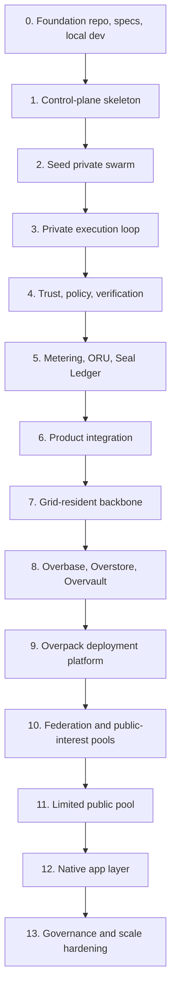

# Overrid Master Build Plan

## Purpose

This document defines the build order for Overrid. It turns the whitepaper into an implementation sequence with dependency gates, acceptance criteria, and the order in which subsystems should become real.

The build must start from founder-provided seed servers and GPUs, but every core service must be designed to migrate into the grid. The first hardware is the bootstrap environment, not the permanent backbone.

## Build Principles

- Build the private swarm before the public marketplace.
- Build a modular control plane and node agent first; split into independent services only after APIs and load patterns are proven.
- Make identity, tenancy, manifests, policy, queues, leases, metering, audit, and failure handling durable from the beginning.
- Treat public nodes as untrusted until verification, abuse controls, payout holds, and workload-sensitivity boundaries exist.
- Keep ORU, Seal Ledger, and Overasset as utility/accounting/rights infrastructure, not speculative blockchain or NFT mechanics.
- Make every phase usable by at least one real workload before widening scope.
- Move backbone services into protected grid-resident system workloads as soon as private execution and trust controls are stable.

## Dependency Spine

## Phase Detail Documents

| Phase | Detailed plan |
| --- | --- |
| 0 | [Foundation](phase_00_foundation.md) |
| 1 | [Control-Plane Skeleton](phase_01_control_plane_skeleton.md) |
| 2 | [Seed Private Swarm](phase_02_seed_private_swarm.md) |
| 3 | [Private Execution Loop](phase_03_private_execution_loop.md) |
| 4 | [Trust, Policy, and Verification](phase_04_trust_policy_verification.md) |
| 5 | [Metering, ORU, Seal Ledger, and Overbill](phase_05_metering_oru_seal_ledger_overbill.md) |
| 6 | [First Product Integration](phase_06_first_product_integration.md) |
| 7 | [Grid-Resident Backbone](phase_07_grid_resident_backbone.md) |
| 8 | [Data, Storage, and Namespace Platform](phase_08_data_storage_namespace_platform.md) |
| 9 | [Overpack Deployment Platform](phase_09_overpack_deployment_platform.md) |
| 10 | [Trusted Federation and Public-Interest Pools](phase_10_trusted_federation_public_interest_pools.md) |
| 11 | [Limited Public Low-Sensitivity Pool](phase_11_limited_public_low_sensitivity_pool.md) |
| 12 | [Native Application Layer](phase_12_native_application_layer.md) |
| 13 | [Governance, Compliance, and Scale Hardening](phase_13_governance_compliance_scale_hardening.md) |

## Service Catalog Alignment

Per-service implementation plans are aligned to the phase order in [Build Plan to Service Catalog Alignment](service_catalog_alignment.md). The build plan is the canonical order of work; the service catalog is the canonical per-service implementation scope.

## Per-SDS Sub-Build Plans

Per-SDS sub-build plans provide the service-level implementation sequence for numbered SDS documents. They do not replace the master Phase 0 through Phase 13 order; they attach detailed work items to the phase where each SDS first becomes buildable.

| SDS | Sub-build plan | Master phase alignment |
| --- | --- | --- |
| SDS #1: [Admin and Developer UI](../sds/foundation/admin_developer_ui.md) | [SUB BUILD PLAN #1 - Admin and Developer UI](sub_build_plan_001_admin_developer_ui.md) | First build point remains Phase 6, with prerequisites from Phases 0, 1, 3, 4, and 5. |
| SDS #2: [CLI](../sds/foundation/cli.md) | [SUB BUILD PLAN #2 - CLI](sub_build_plan_002_cli.md) | First build point remains Phase 1, with Phase 6 hardening for product integrations and prerequisites from Phases 0 through 5. |
| SDS #3: [Integration Test Harness](../sds/foundation/integration_test_harness.md) | [SUB BUILD PLAN #3 - Integration Test Harness](sub_build_plan_003_integration_test_harness.md) | First build point remains Phase 0, with later phase-gate expansion through Phases 1 through 13. |
| SDS #4: [Local Development Stack](../sds/foundation/local_development_stack.md) | [SUB BUILD PLAN #4 - Local Development Stack](sub_build_plan_004_local_development_stack.md) | First build point remains Phase 0, with later local/test simulator expansion gated by owning service phases. |
| SDS #5: [Repository Layout](../sds/foundation/repository_layout.md) | [SUB BUILD PLAN #5 - Repository Layout](sub_build_plan_005_repository_layout.md) | First build point remains Phase 0, with later workspace expansion gated by owning service phases and layout-change governance. |
| SDS #6: [SDK](../sds/foundation/sdk.md) | [SUB BUILD PLAN #6 - SDK](sub_build_plan_006_sdk.md) | First build point remains Phase 1, with Phase 0 prerequisites and Phase 6 product-integration hardening. |
| SDS #7: [Shared Schema Package](../sds/foundation/shared_schema_package.md) | [SUB BUILD PLAN #7 - Shared Schema Package](sub_build_plan_007_shared_schema_package.md) | First build point remains Phase 0, with downstream schema expansion gated by owning service phases. |
| SDS #8: [Overgate](../sds/control_plane/overgate.md) | [SUB BUILD PLAN #8 - Overgate](sub_build_plan_008_overgate.md) | First build point remains Phase 1, with Phase 0 prerequisites and later hardening through policy, metering, product integration, and grid-resident operation. |
| SDS #9: [Overkey](../sds/control_plane/overkey.md) | [SUB BUILD PLAN #9 - Overkey](sub_build_plan_009_overkey.md) | First build point remains Phase 1, with Phase 0 prerequisites and broader key/secret-ref expansion through Phase 8 plus later policy, product, grid-resident, and governance hardening. |
| SDS #10: [Overpass](../sds/control_plane/overpass.md) | [SUB BUILD PLAN #10 - Overpass](sub_build_plan_010_overpass.md) | First build point remains Phase 1, with Phase 0 prerequisites and broader namespace/route-binding expansion through Phase 8 plus later policy, product, grid-resident, native-app, and governance hardening. |
| SDS #11: [Overqueue](../sds/control_plane/overqueue.md) | [SUB BUILD PLAN #11 - Overqueue](sub_build_plan_011_overqueue.md) | First build point remains Phase 1 for durable pending queue state, accepted command handoff, queue item schemas, idempotent enqueue, caller-visible status, queue health, backpressure, and Overwatch evidence, with Phase 3 scheduler fetch/claim/ack/retry/dead-letter integration plus later policy, accounting, grid-resident, public-provider, native-app, and governance hardening. |
| SDS #12: [Overregistry](../sds/control_plane/overregistry.md) | [SUB BUILD PLAN #12 - Overregistry](sub_build_plan_012_overregistry.md) | First build point remains Phase 1, with Phase 0 prerequisites and later expansion through provider capability, package provenance, policy/trust, metering refs, product clients, grid-resident operation, federation/public catalogs, native-app catalogs, and governance hardening. |
| SDS #13: [Overrid Protocol Core](../sds/control_plane/overrid_protocol_core.md) | [SUB BUILD PLAN #13 - Overrid Protocol Core](sub_build_plan_013_overrid_protocol_core.md) | First build point remains Phase 0 as the protocol specification and conformance layer, with Phase 1 golden-trace adoption and later expansion through all service domains plus Phase 13 PIP governance. |
| SDS #14: [Overtenant](../sds/control_plane/overtenant.md) | [SUB BUILD PLAN #14 - Overtenant](sub_build_plan_014_overtenant.md) | First build point remains Phase 1, with Phase 0 prerequisites and later expansion through policy, accounting refs, product clients, grid-resident operation, namespace/storage refs, federation/public scopes, native-app clients, and governance hardening. |
| SDS #15: [Overwatch](../sds/control_plane/overwatch.md) | [SUB BUILD PLAN #15 - Overwatch](sub_build_plan_015_overwatch.md) | First build point remains Phase 1, with Phase 0 prerequisites and later expansion through trust/policy evidence, accounting evidence refs, product clients, grid-resident health/failover/restore, storage/archive refs, federation/public evidence, native-app trace consumers, and governance/compliance exports. |
| SDS #16: [Benchmark Runner](../sds/execution_scheduling/benchmark_runner.md) | [SUB BUILD PLAN #16 - Benchmark Runner](sub_build_plan_016_benchmark_runner.md) | First build point remains Phase 2, with Phase 0 and Phase 1 prerequisites and later handoffs through private execution, verification/challenges, metering visibility, grid-resident operation, public-provider anti-gaming, product clients, and governance hardening. |
| SDS #17: [Hardware Discovery](../sds/execution_scheduling/hardware_discovery.md) | [SUB BUILD PLAN #17 - Hardware Discovery](sub_build_plan_017_hardware_discovery.md) | First build point remains Phase 2, with Phase 0 and Phase 1 prerequisites and later handoffs through private execution eligibility, policy/verification evidence, metering visibility, system-service runtime readiness, federation/public-provider hardening, client reads, and governance hardening. |
| SDS #18: [Node Installer](../sds/execution_scheduling/node_installer.md) | [SUB BUILD PLAN #18 - Node Installer](sub_build_plan_018_node_installer.md) | First build point remains Phase 2, with Phase 0 and Phase 1 prerequisites and later handoffs through private execution readiness, policy/verification evidence, installer overhead visibility, grid-resident update/rollback operation, provider onboarding, public-provider hardening, and governance hardening. |
| SDS #19: [Overcache](../sds/execution_scheduling/overcache.md) | [SUB BUILD PLAN #19 - Overcache](sub_build_plan_019_overcache.md) | First useful build work remains Phase 4 metadata-first cache trust scopes, with Phase 3 consumers, Phase 5 usage-fact handoff, Phase 8 storage/namespace expansion, Phase 11 public low-sensitivity constraints, and governance hardening. |
| SDS #20: [Overcell](../sds/execution_scheduling/overcell.md) | [SUB BUILD PLAN #20 - Overcell](sub_build_plan_020_overcell.md) | First build point remains Phase 2, with Phase 0 and Phase 1 prerequisites and later handoffs through Phase 3 lease-bound execution, Phase 5 raw usage facts, Phase 7 system-service eligibility, public-provider hardening, and governance. |
| SDS #21: [Overlease](../sds/execution_scheduling/overlease.md) | [SUB BUILD PLAN #21 - Overlease](sub_build_plan_021_overlease.md) | First build point remains Phase 3, with Phase 0 through Phase 2 prerequisites and later handoffs through policy/trust, metering/accounting, grid-resident system-service leasing, public-provider constraints, and governance. |
| SDS #22: [Overmesh](../sds/execution_scheduling/overmesh.md) | [SUB BUILD PLAN #22 - Overmesh](sub_build_plan_022_overmesh.md) | First build point remains Phase 4 for trusted private endpoint discovery and tenant-scoped service routing, with Phase 8 namespace route resolution plus later product, grid-resident, federation, public-provider, native-app, and governance hardening. |
| SDS #23: [Overmeter](../sds/execution_scheduling/overmeter.md) | [SUB BUILD PLAN #23 - Overmeter](sub_build_plan_023_overmeter.md) | First build point remains Phase 3 for raw usage events, with signed rollups and accounting handoff in Phase 5 plus later product, grid-resident, native-app, public-provider, and governance hardening. |
| SDS #24: [Overpack](../sds/execution_scheduling/overpack.md) | [SUB BUILD PLAN #24 - Overpack](sub_build_plan_024_overpack.md) | First build point remains Phase 3 for strict workload manifests, with application-intent deployment expansion in Phase 9 plus later federation, public-provider, native-app, and governance hardening. |
| SDS #25: [Overrun](../sds/execution_scheduling/overrun.md) | [SUB BUILD PLAN #25 - Overrun](sub_build_plan_025_overrun.md) | First build point remains Phase 3 for lease-bound sandbox execution, with Phase 8 Overstore/Overvault integration, Phase 11 public low-sensitivity sandbox constraints, and later governance hardening. |
| SDS #26: [Oversched](../sds/execution_scheduling/oversched.md) | [SUB BUILD PLAN #26 - Oversched](sub_build_plan_026_oversched.md) | First build point remains Phase 3 for deterministic private-swarm placement, reason codes, Overlease reservation requests, and replayable decisions, with later trust, federation/public, system-service, native-platform, and governance hardening. |
| SDS #27: [Overbase](../sds/data_storage_namespace/overbase.md) | [SUB BUILD PLAN #27 - Overbase](sub_build_plan_027_overbase.md) | First build point remains Phase 8 for governed structured state, document/KV collections, event streams, indexes, vector/RAG metadata, consistency policy, replication metadata, backup/restore, migrations, and Overpack provisioning hooks, with later native-app and governance hardening. |
| SDS #28: [Overstore](../sds/data_storage_namespace/overstore.md) | [SUB BUILD PLAN #28 - Overstore](sub_build_plan_028_overstore.md) | First build point remains Phase 8 for native content-addressed object and artifact persistence, upload/download grants, transfer sessions, placement, replication, repair, verification, retention, quarantine, tombstones, and raw usage events, with later federation/public-provider, native-app, and governance hardening. |
| SDS #29: [Overvault](../sds/data_storage_namespace/overvault.md) | [SUB BUILD PLAN #29 - Overvault](sub_build_plan_029_overvault.md) | First full build point remains Phase 8 for native encrypted private state, secrets, access decisions, grants, mount leases, rotation, revocation, escrow, emergency access, redaction, and protected app state, with only minimal Phase 3 founder-local secret refs and later native-app/governance hardening. |
| SDS #30: [Universal Namespace Service](../sds/data_storage_namespace/universal_namespace_service.md) | [SUB BUILD PLAN #30 - Universal Namespace Service](sub_build_plan_030_universal_namespace_service.md) | First full build point remains Phase 8 for normalized names, scoped uniqueness, owner/target refs, route bindings, delegation, transfers, verification markers, disputes, tombstones, privacy-aware resolution, and Overmesh route handoff, with later federation/public-interest, native-app, and governance hardening. |
| SDS #31: [Challenge Task Service](../sds/trust_policy_verification/challenge_task_service.md) | [SUB BUILD PLAN #31 - Challenge Task Service](sub_build_plan_031_challenge_task_service.md) | First build point remains Phase 4 for trusted-node challenge orchestration, safe manifests, target snapshots, assignments, normalized results, evidence refs, replay bundles, rate limits, and bounded consequence proposals, with Phase 11 public-provider duplicate/challenge/fraud expansion and later governance hardening. |
| SDS #32: [Overclaim](../sds/trust_policy_verification/overclaim.md) | [SUB BUILD PLAN #32 - Overclaim](sub_build_plan_032_overclaim.md) | First build point remains Phase 4 for record-only claims, evidence links, challenge windows, hold requests, remedy proposals, appeals, and finality records, with Phase 5 settlement/accounting integration and later storage, public-provider, native-app, and governance hardening. |
| SDS #33: [Overguard](../sds/trust_policy_verification/overguard.md) | [SUB BUILD PLAN #33 - Overguard](sub_build_plan_033_overguard.md) | First build point remains Phase 4 for deterministic admission policy evaluation, input fact bundles, signed policy bundles, stable reason codes, replayable decisions, dry-run behavior, and deny-by-default gates, with Phase 5 accounting refs and later grid, storage, public-provider, native-app, and governance hardening. |
| SDS #34: [Oververify](../sds/trust_policy_verification/oververify.md) | [SUB BUILD PLAN #34 - Oververify](sub_build_plan_034_oververify.md) | First build point remains Phase 4 for evidence-backed provider/node verification records, evidence validation, explainable trust and eligibility signals, certification, lifecycle actions, and recompute history, with Phase 11 public-provider hardening plus later accounting, grid, storage, native-app, and governance gates. |
| SDS #35: [Policy Dry-Run API](../sds/trust_policy_verification/policy_dry_run_api.md) | [SUB BUILD PLAN #35 - Policy Dry-Run API](sub_build_plan_035_policy_dry_run_api.md) | First build point remains Phase 4 for side-effect-free policy previews, Overguard evaluator reuse, reason codes, fact snapshots, missing prerequisites, and dry-run evidence, with Phase 5 accounting precheck refs plus later grid, storage, deployment-plan, public-provider, native-app, and governance gates. |
| SDS #36: [Reputation and Anti-Sybil Service](../sds/trust_policy_verification/reputation_anti_sybil_service.md) | [SUB BUILD PLAN #36 - Reputation and Anti-Sybil Service](sub_build_plan_036_reputation_anti_sybil_service.md) | First build point remains Phase 11 for public-provider reputation records, anti-Sybil signal refs, risk windows, eligibility recommendations, throttles, duplicate-execution and challenge-cadence recommendations, payout-hold trigger recommendations, redacted explanations, appeals/corrections, and replayable signal history, with prerequisites from Phases 0, 1, 4, 5, 7, 8, and 10 plus later native-app and governance gates. |
| SDS #37: [Workload Classifier](../sds/trust_policy_verification/workload_classifier.md) | [SUB BUILD PLAN #37 - Workload Classifier](sub_build_plan_037_workload_classifier.md) | First build point remains Phase 4 for deterministic workload/data classification facts, input snapshots, rule matches, decisions, reason codes, policy input facts, replay bundles, redacted explanations, and strict public-provider eligibility guards, with Phase 8 storage/private-ref expansion, Phase 11 public low-sensitivity hardening, Phase 12 client/native previews, and Phase 13 governance gates. |
| SDS #38: [ORU Account Service](../sds/accounting/oru_account_service.md) | [SUB BUILD PLAN #38 - ORU Account Service](sub_build_plan_038_oru_account_service.md) | First build point remains Phase 5 for ORU account metadata, explicit resource dimensions, ledger-derived balance projections, transition refs, reservations, holds, grants, refunds, corrections, short-lived budget prechecks, wallet/admin views, statement refs, and replay bundles, with prerequisites from Phases 0, 1, 3, and 4 plus later grid, storage/private-ref, public-provider, native-app, and governance gates. |
| SDS #39: [Overasset](../sds/accounting/overasset.md) | [SUB BUILD PLAN #39 - Overasset](sub_build_plan_039_overasset.md) | First build point remains Phase 5 for evidence-backed non-speculative operational rights, ownership evidence refs, capacity-claim rights, grant-right refs, service/app ownership refs, delegation/revocation/dispute/replay refs, and transfer blocking, with Phase 8 storage entitlement and namespace-bound right expansion plus later public-provider, native-app, and governance gates. |
| SDS #40: [Overbill](../sds/accounting/overbill.md) | [SUB BUILD PLAN #40 - Overbill](sub_build_plan_040_overbill.md) | First build point remains Phase 5 for receipts, invoices, line items, payment-provider refs, signed external payment events, refunds, chargebacks, payout batch inputs, payout hold views, statements, audit exports, reconciliation jobs, and no per-operation external payment rails, with earlier control/execution/trust prerequisites plus later grid, storage/private-ref, public-provider, native-app, and governance gates. |
| SDS #41: [Overgrant](../sds/accounting/overgrant.md) | [SUB BUILD PLAN #41 - Overgrant](sub_build_plan_041_overgrant.md) | First build point remains Phase 5 for local/private grant programs, source refs, eligibility rule bundles, purpose scopes, resource dimensions, quotas, fairness windows, authorization refs, usage/report refs, abuse controls, revocations, corrections, and replay bundles, with Phase 10 cross-tenant grants, stewarded purpose tags, and public-interest pool expansion plus later public-provider, native-app, and governance gates. |
| SDS #42: [Overmark](../sds/accounting/overmark.md) | [SUB BUILD PLAN #42 - Overmark](sub_build_plan_042_overmark.md) | First build point remains Phase 5 for versioned resource cards, explicit resource dimensions, bounded reference bands, budget-preview facts, placement signal refs, rate-change audit history, redaction profiles, and replay bundles, with Phase 10 trusted federation card expansion plus later public-provider, native-app, and governance gates. |
| SDS #43: [Provider Payout Service](../sds/accounting/provider_payout_service.md) | [SUB BUILD PLAN #43 - Provider Payout Service](sub_build_plan_043_provider_payout_service.md) | First build point remains Phase 5 for private-provider earning views, payout eligibility, holds, payout batches, Overbill payment instruction/result refs, failures, reversals, corrections, provider-facing status, and audit exports, with Phase 11 public-provider holds and throttles plus later native-app and governance gates. |
| SDS #44: [Seal Ledger](../sds/accounting/seal_ledger.md) | [SUB BUILD PLAN #44 - Seal Ledger](sub_build_plan_044_seal_ledger.md) | First build point remains Phase 5 for append-only internal accounting streams, ledger entries, entry batches, authorized append APIs, idempotency, expected-sequence checks, paired entries, bounded indexes, checkpoints, replay, reconciliation, audit exports, and correction-by-new-entry, with Phase 7 backup/restore and grid-resident promotion, Phase 8 native persistence, and later federation/public/native-app/governance gates. |
| SDS #45: [Backup and Restore Service](../sds/deployment_grid/backup_restore_service.md) | [SUB BUILD PLAN #45 - Backup and Restore Service](sub_build_plan_045_backup_restore_service.md) | First build point remains Phase 7 for backup targets, policies, runs, manifests, snapshot sets, integrity verification, restore plans, restore sessions, restore drills, retention tombstones, disaster-recovery evidence, and founder-hardware removal gates, with Phase 8 Overbase/Overstore/Overvault integration and Phase 13 governance, compliance, and reliability hardening. |
| SDS #46: [Deployment Planner](../sds/deployment_grid/deployment_planner.md) | [SUB BUILD PLAN #46 - Deployment Planner](sub_build_plan_046_deployment_planner.md) | First build point remains Phase 9 for signed Overpack manifest intake, canonical `deployment_graph_v0`, preflight aggregation, rollback graph generation, idempotent execution cursors, downstream command envelopes, route/health/release gates, timeline/replay evidence, and no-manual-infrastructure deployment proof, with prerequisites from Phases 0, 1, 3, 4, 5, 7, and 8 plus Phase 13 governance and security hardening. |
| SDS #47: [Failover and Recovery Coordinator](../sds/deployment_grid/failover_recovery_coordinator.md) | [SUB BUILD PLAN #47 - Failover and Recovery Coordinator](sub_build_plan_047_failover_recovery_coordinator.md) | First build point remains Phase 7 for health snapshots, failover decisions, recovery plans/steps, writer guards, route shifts, replacement capacity requests, queue worker failover, restore-backed recovery, drills, evidence bundles, and founder-hardware removal gates, with Phase 8 native state/storage/vault integration, Phase 9 package/deployment/release handoffs, and Phase 13 incident, security, governance, and reliability hardening. |
| SDS #48: [Grid-Resident Service Packager](../sds/deployment_grid/grid_resident_service_packager.md) | [SUB BUILD PLAN #48 - Grid-Resident Service Packager](sub_build_plan_048_grid_resident_service_packager.md) | First build point remains Phase 7 for system-service package manifests, runtime artifact refs, config/secret contracts, health/readiness/migration/backup/restore/rollback/drain/diagnostics command contracts, privilege profiles, compatibility windows, validator/registry/deployment/release/backup/failover handoff records, immutable package lifecycle states, package diff/supersede/retire/revoke flows, first non-critical Overwatch/internal-observability package, and Phase 7 backbone migration gates, with Phase 8 native storage/vault/namespace refs, Phase 9 shared Overpack/deployment/release handoffs, and Phase 13 incident, security, governance, and reliability hardening. |
| SDS #49: [Package Validator](../sds/deployment_grid/package_validator.md) | [SUB BUILD PLAN #49 - Package Validator](sub_build_plan_049_package_validator.md) | First build point remains Phase 3 for workload package validation before Overrun execution, with Phase 7 system-service promotion validation, Phase 9 application-intent and AI-generated package validation, and Phase 13 replay, retention, incident, compliance, security, and governance hardening. |
| SDS #50: [Release Strategy Service](../sds/deployment_grid/release_strategy_service.md) | [SUB BUILD PLAN #50 - Release Strategy Service](sub_build_plan_050_release_strategy_service.md) | First build point remains Phase 9 for release plans, strategy templates, release channels, traffic-step progression, health gates, promotion rules, freeze windows, version pins, rollback supervision, and release evidence, with prerequisites from Phases 0, 1, 3, 4, 5, 7, and 8 plus Phase 13 incident, security, compliance, and governance hardening. |
| SDS #51: [System-Service Workload Class](../sds/deployment_grid/system_service_workload_class.md) | [SUB BUILD PLAN #51 - System-Service Workload Class](sub_build_plan_051_system_service_workload_class.md) | First build point remains Phase 7 for versioned system-service class definitions, eligible service records, node eligibility requirements, placement guardrails, operational requirement bundles, signed operator action requirements, evaluation snapshots, overrides, first non-critical eligibility proof, and founder-hardware removal gates, with prerequisites from Phases 0 through 5, Phase 8/9 downstream handoffs, and Phase 13 governance/security/compliance hardening. |
| SDS #52: [Federation Template Service](../sds/federation_public/federation_template_service.md) | [SUB BUILD PLAN #52 - Federation Template Service](sub_build_plan_052_federation_template_service.md) | First build point remains Phase 10 for known-participant federation templates, participant role requirements, capacity contribution scopes, workload/data-class eligibility, operational terms, accounting-boundary refs, dispute-boundary refs, federation instances, readiness preflight, usage-boundary refs, trusted partner swarm proof, and public-interest template handoffs, with prerequisites from Phases 0, 1, 4, 5, and 9 plus Phase 11 public-provider separation and Phase 13 governance/security/compliance hardening. |
| SDS #53: [Fraud Control Service](../sds/federation_public/fraud_control_service.md) | [SUB BUILD PLAN #53 - Fraud Control Service](sub_build_plan_053_fraud_control_service.md) | First build point remains Phase 11 for public-provider fraud signals, risk cases, hold/throttle/challenge recommendations, evidence packages, correction/retraction paths, public-pool abuse controls, and low-sensitivity public fraud proof, with prerequisites from Phases 0, 1, 3, 4, 5, 7, 8, and 10 plus Phase 13 governance/security/compliance hardening. |
| SDS #54: [Public-Interest Pool Service](../sds/federation_public/public_interest_pool_service.md) | [SUB BUILD PLAN #54 - Public-Interest Pool Service](sub_build_plan_054_public_interest_pool_service.md) | First build point remains Phase 10 for accountable public-interest pools, contribution refs, purpose requirements, eligible grantees, quotas, fairness windows, allocation requests, Overgrant handoffs, usage/accounting refs, abuse throttles, outcome reports, and redacted public summaries, with prerequisites from Phases 0, 1, 3, 4, and 5 plus Phase 11 public-provider hardening and Phase 13 governance/security/compliance hardening. |
| SDS #55: [Public Provider Onboarding](../sds/federation_public/public_provider_onboarding.md) | [SUB BUILD PLAN #55 - Public Provider Onboarding](sub_build_plan_055_public_provider_onboarding.md) | First build point remains Phase 11 for public-provider enrollments, policy acknowledgements, node refs, resource claims, verification/anti-Sybil/challenge/fraud/payout refs, public workload acceptance contracts, public sandbox gates, Overguard eligibility, Overregistry capability publication, corrections, appeals, and bounded low-sensitivity public-node proof, with prerequisites from Phases 0, 1, 2, 4, 5, and 10 plus Phase 13 governance/security/compliance hardening. |
| SDS #56: [Public Sandbox Profile](../sds/federation_public/public_sandbox_profile.md) | [SUB BUILD PLAN #56 - Public Sandbox Profile](sub_build_plan_056_public_sandbox_profile.md) | First build point remains Phase 11 for sandbox profile versions, restriction sets, workload/data-class bindings, secret/private/regulated/system-service denials, egress classes, evaluation records, Overguard/Oversched prechecks, Overrun/Overcell enforcement handoffs, output validation, artifact quarantine, log redaction, profile deprecation, emergency disablement, and low-sensitivity public sandbox proof, with prerequisites from Phases 0, 1, 2, 3, 4, 5, and 10 plus Phase 13 governance/security/compliance hardening. |
| SDS #57: [Purpose Tag Registry](../sds/federation_public/purpose_tag_registry.md) | [SUB BUILD PLAN #57 - Purpose Tag Registry](sub_build_plan_057_purpose_tag_registry.md) | First build point remains Phase 10 for stewarded purpose tags, immutable tag versions, eligibility criteria, evidence requirements, steward reviews, activation/deprecation/supersession, claim validation refs, policy exports, public documentation, and replay, with prerequisites from Phases 0, 1, 4, 5, and 8 plus Phase 11 public-provider hardening and Phase 13 governance/security/compliance hardening. |
| SDS #58: [ADES Enrichment Adapter](../sds/ai_rag_model_routing/ades_enrichment_adapter.md) | [SUB BUILD PLAN #58 - ADES Enrichment Adapter](sub_build_plan_058_ades_enrichment_adapter.md) | First build point remains Phase 12 for optional local ADES enrichment, connector health, approved domain-pack refs, privacy guards, local-only input handling, normalized entity/topic/warning outputs, advisory routing hint bundles, degradation records, usage refs, and audit/replay evidence, with prerequisites from Phases 0, 1, 4, 5, 6, and 8 plus Phase 13 governance/security/compliance hardening. |
| SDS #59: [AI Gateway Router](../sds/ai_rag_model_routing/ai_gateway_router.md) | [SUB BUILD PLAN #59 - AI Gateway Router](sub_build_plan_059_ai_gateway_router.md) | First build point remains Phase 6 for product AI route requests, dry-run previews, classification fact bundles, context access plans, capability snapshots, immutable route decisions, route attempts, fallback policies, usage refs, audit refs, and replay evidence, with prerequisites from Phases 0, 1, 3, 4, 5, and 8 plus Phase 12 native assistant/native app expansion and Phase 13 governance/security/compliance hardening. |
| SDS #60: [Central AI Service](../sds/ai_rag_model_routing/central_ai_service.md) | [SUB BUILD PLAN #60 - Central AI Service](sub_build_plan_060_central_ai_service.md) | First build point remains Phase 12 for evidence packages, analysis jobs, risk assessments, fraud/evidence review queues, recommendation records, intervention proposals, grant/public-interest/native-surplus recommendation review, report refs, model/run provenance, corrections, retractions, usage refs, audit refs, and replay bundles, with prerequisites from Phases 0, 1, 4, 5, 6, 8, 10, and 11 plus Phase 13 governance/security/compliance hardening. |
| SDS #61: [Encrypted Docdex RAG Adapter](../sds/ai_rag_model_routing/encrypted_docdex_rag_adapter.md) | [SUB BUILD PLAN #61 - Encrypted Docdex RAG Adapter](sub_build_plan_061_encrypted_docdex_rag_adapter.md) | First build point remains Phase 6 for encrypted index refs, context-scope manifests, retrieval dry-runs, bounded retrieval result refs, leakage profiles, context grants, context bundle refs, RAG usage refs, audit refs, and replay bundles, with prerequisites from Phases 0, 1, 4, 5, and 8 plus Phase 12 native AI/native app expansion and Phase 13 leakage, revocation, privacy, incident, retention, security, and compliance hardening. |
| SDS #62: [Lightweight Classifier](../sds/ai_rag_model_routing/lightweight_classifier.md) | [SUB BUILD PLAN #62 - Lightweight Classifier](sub_build_plan_062_lightweight_classifier.md) | First build point remains Phase 12 for advisory AI request taxonomy, classifier versions, classification request/result refs, deterministic Rust heuristic baseline, optional ADES and policy-allowed small-local-model hints, confidence policies, hard escalation records, evaluation fixtures, calibration reports, rollout state, usage refs, audit refs, and replay bundles, with prerequisites from Phases 0, 1, 4, 5, 6, and 8 plus Phase 13 false-negative, escalation, privacy, retention, rollout, drift, security, and compliance hardening. |
| SDS #63: [Personal AI Assistant](../sds/ai_rag_model_routing/personal_ai_assistant.md) | [SUB BUILD PLAN #63 - Personal AI Assistant](sub_build_plan_063_personal_ai_assistant.md) | First build point remains Phase 12 for assistant profiles, sessions, turns, permission manifests, context-source selections, tool proposals, delegated native-app calls, route request refs, response refs, privacy audit, usage receipt refs, Wallet permission-control proof, mobile/offline handoffs, and replay bundles, with Phase 6 AI routing/RAG groundwork, prerequisites from Phases 0, 1, 4, 5, 6, and 8, plus Phase 13 permission, privacy, tool-delegation, revocation, unsafe-output, mobile replay, security, and compliance hardening. |
| SDS #64: [Codali Adapter](../sds/adapters/codali_adapter.md) | [SUB BUILD PLAN #64 - Codali Adapter](sub_build_plan_064_codali_adapter.md) | First build point remains Phase 6 for code-agent task intake, Overpack-compatible manifests, authorized repo context refs, sandbox/tool boundaries, phase logs, patch/artifact/result refs, bounded repair loops, approval handoff refs, phase usage, audit refs, and replay bundles, with prerequisites from Phases 0, 1, 3, 4, 5, and 8 plus Phase 13 sandbox, secret, repo-scope, repair, artifact, approval, replay, security, and compliance hardening. |
| SDS #65: [Docdex Adapter](../sds/adapters/docdex_adapter.md) | [SUB BUILD PLAN #65 - Docdex Adapter](sub_build_plan_065_docdex_adapter.md) | First build point remains Phase 6 for Docdex instance refs, repo bindings, encrypted config refs, index/search/retrieval/admin-ingest jobs, capability snapshots, result refs, cleanup/deprovision refs, usage refs, audit refs, and replay bundles, with prerequisites from Phases 0, 1, 3, 4, 5, and 8 plus Phase 7/9 grid-resident package readiness and Phase 13 encrypted-repo leakage, key-failure, cleanup, deprovision, replay, security, and compliance hardening. |
| SDS #66: [Mcoda Adapter](../sds/adapters/mcoda_adapter.md) | [SUB BUILD PLAN #66 - Mcoda Adapter](sub_build_plan_066_mcoda_adapter.md) | First build point remains Phase 6 for Mcoda agent task manifests, capability snapshots, tool-boundary declarations, context-access plans, AI Gateway route refs, Overpack workload refs, phase/result/failure/usage refs, audit refs, and replay bundles, with prerequisites from Phases 0, 1, 3, 4, 5, and 8 plus Phase 13 tool-grant, side-effect confirmation, route fallback, sandbox, repair, log, usage, replay, security, and compliance hardening. |
| SDS #67: [mSwarm Runtime Bridge](../sds/adapters/mswarm_runtime_bridge.md) | [SUB BUILD PLAN #67 - mSwarm Runtime Bridge](sub_build_plan_067_mswarm_runtime_bridge.md) | First build point remains Phase 6 for bridge sessions, runtime capability snapshots, sync manifests, sync cursors, private discovery, collaboration refs, cloud hook refs, failure refs, usage refs, audit refs, and replay bundles, with prerequisites from Phases 0, 1, 4, 5, and 8 plus Phase 12 native-app local-first expansion and Phase 13 identity, compatibility, offline, discovery, collaboration, hook, privacy, replay, security, and compliance hardening. |
| SDS #68: [Central AI Stewardship Interface](../sds/native_apps/central_ai_stewardship_interface.md) | [SUB BUILD PLAN #68 - Central AI Stewardship Interface](sub_build_plan_068_central_ai_stewardship_interface.md) | First build point remains Phase 12 for role-aware stewardship dashboards, recommendation/work-queue views, public-interest/grant/surplus views, fraud evidence summaries, appeal/dispute views, report publication/correction/withdrawal views, signed review action envelopes, usage refs, audit refs, and replay bundles, with prerequisites from Phases 0, 1, 4, 5, 6, 8, 10, and 11 plus Phase 13 authority, redaction, report-publication, incident, retention, security, and compliance hardening. |
| SDS #69: [Directory Listings](../sds/native_apps/directory_listings.md) | [SUB BUILD PLAN #69 - Directory Listings](sub_build_plan_069_directory_listings.md) | First build point remains Phase 12 for category/locality/listing records, organization pages, lifecycle/versioning, search index update refs, map/place handoff refs, Messaging Center contact handoffs, abuse/moderation/Fraud Control/Reputation/Overclaim refs, usage refs, audit refs, and replay bundles, with prerequisites from Phases 0, 1, 4, 5, 8, and 11 plus Phase 13 category, locality privacy, contact-abuse, ranking-manipulation, moderation, dispute, retention, security, and compliance hardening. |
| SDS #70: [Maps and Navigation](../sds/native_apps/maps_navigation.md) | [SUB BUILD PLAN #70 - Maps and Navigation](sub_build_plan_070_maps_navigation.md) | First build point remains Phase 12 for place records, geometry refs, source-attributed map layers, route requests/results, location permission records, offline area manifests, local discovery, Directory/Search/Messaging/Assistant handoff refs, corrections, community layers, usage refs, audit refs, and replay bundles, with prerequisites from Phases 0, 1, 4, 5, 8, and 11 plus Phase 13 location privacy, route safety, source provenance, offline cache, community-layer, retention, security, incident, reporting, and compliance hardening. |
| SDS #71: [Messaging Center](../sds/native_apps/messaging_center.md) | [SUB BUILD PLAN #71 - Messaging Center](sub_build_plan_071_messaging_center.md) | First build point remains Phase 12 for inbox records, organization routes, threads, participant state, message envelopes, delivery/read/recall/tombstone records, app/service notifications, encrypted payload refs, attachment refs, contact preferences, AI triage permissions, abuse reports, usage refs, audit refs, and replay bundles, with prerequisites from Phases 0, 1, 4, 5, 8, and 11 plus Phase 13 messaging privacy, retention, bridge, spam/abuse, compliance-hold, incident, reporting, security, and scale hardening. |
| SDS #72: [Search Engine](../sds/native_apps/search_engine.md) | [SUB BUILD PLAN #72 - Search Engine](sub_build_plan_072_search_engine.md) | First build point remains Phase 12 for source registrations, source policies, crawl/index jobs, Search-owned Overbase lexical/document/secondary/vector index records, Overstore chunk/artifact refs, Overvault grant refs, permission filter snapshots, query sessions, result sets, ranking explanations, handoff refs, removal/tombstone refs, abuse reports, usage refs, audit refs, and replay bundles, with prerequisites from Phases 0, 1, 4, 5, 6, 8, and 11 plus Phase 13 search privacy, ranking-abuse, source-poisoning, retention, incident, reporting, security, and scale hardening. |
| SDS #73: [Social Photo/Video App](../sds/native_apps/social_photo_video_app.md) | [SUB BUILD PLAN #73 - Social Photo/Video App](sub_build_plan_073_social_photo_video_app.md) | First build point remains Phase 12 for upload intents, media asset refs, processing jobs, posts, albums, follows, groups, feeds, visibility controls, comments, reactions, rights/attribution refs, recommendation controls, moderation refs, abuse reports, usage refs, audit refs, and replay bundles, with prerequisites from Phases 0, 1, 4, 5, 6, 8, and 11 plus Phase 13 social privacy, age/safety, rights, recommendation, moderation, retention, incident, reporting, security, and scale hardening. |
| SDS #74: [Wallet and Usage Center](../sds/native_apps/wallet_usage_center.md) | [SUB BUILD PLAN #74 - Wallet and Usage Center](sub_build_plan_074_wallet_usage_center.md) | First build point remains Phase 12 for wallet profiles, account selectors, balance views, usage dashboards, receipt collections, statement/export jobs, app permission controls, revocation requests, privacy audit views, dispute handoffs, notification prefs, usage refs, audit refs, and replay bundles, with prerequisites from Phases 0, 1, 4, 5, 6, and 8 plus Phase 13 accounting-display, custody-boundary, permission, privacy, export, dispute, incident, reporting, security, and compliance hardening. |
| SDS #75: [Workspace and Office Suite](../sds/native_apps/workspace_office_suite.md) | [SUB BUILD PLAN #75 - Workspace and Office Suite](sub_build_plan_075_workspace_office_suite.md) | First build point remains Phase 12 for workspace records, folders, objects, canonical authoring records, editor sessions, versioned edits, shares, comments, approvals, import/export jobs, search handoffs, AI assist proposal/apply/reject refs, mobile draft sync, usage refs, audit refs, and replay bundles, with prerequisites from Phases 0, 1, 4, 5, 6, 8, and 11 plus Phase 13 collaboration privacy, revocation, AI context, retention, export, offline sync, incident, reporting, security, and compliance hardening. |
| SDS #76: [Compliance Boundary Service](../sds/governance_ops/compliance_boundary_service.md) | [SUB BUILD PLAN #76 - Compliance Boundary Service](sub_build_plan_076_compliance_boundary_service.md) | First build point remains Phase 13 for boundary rulesets, marker taxonomy, jurisdiction profiles, regulated scopes, boundary evaluations, signed fact bundles, exception records, jurisdiction updates, compliance exports, replay bundles, threat/security review gates, and public reporting, with prerequisites from Phases 0, 1, 4, 5, 6, 8, 10, 11, and 12. |
| SDS #77: [Incident Response Service](../sds/governance_ops/incident_response_service.md) | [SUB BUILD PLAN #77 - Incident Response Service](sub_build_plan_077_incident_response_service.md) | First build point remains Phase 13 for incident cases, severity, affected-scope snapshots, timelines, role assignments, containment requests, recovery refs, communication records, drills, post-incident reports, follow-up actions, and replay bundles, with simple incident seed records earlier in Overwatch and prerequisites from Phases 0, 1, 4, 5, 6, 7, 8, 9, 10, 11, and 12. |
| SDS #78: [Migration Tooling](../sds/governance_ops/migration_tooling.md) | [SUB BUILD PLAN #78 - Migration Tooling](sub_build_plan_078_migration_tooling.md) | Full first build point remains Phase 13 for migration plans, inventories, preflight reports, dependency graphs, step cursors, checkpoints, cutover windows, integrity reports, rollback records, replay bundles, reporting, threat/security review, reliability drills, and scale hardening, with grid migration tooling starting in Phase 7 for a limited non-critical system-service migration slice and prerequisites from Phases 0, 1, 4, 5, 7, 8, 9, 10, 11, and 12. |
| SDS #79: [Protocol Improvement Proposal Registry](../sds/governance_ops/pip_registry.md) | [SUB BUILD PLAN #79 - Protocol Improvement Proposal Registry](sub_build_plan_079_pip_registry.md) | First build point remains Phase 13 for PIP records, immutable versions, sections, review assignments, findings, decisions, implementation links, migration/rollback refs, supersession/deprecation/correction records, public redacted views, replay bundles, emergency retrospective PIPs, public archive, governance reporting, threat/security review, and scale hardening, with prerequisites from Phases 0, 1, 4, 5, 6, 7, 8, 9, 10, 11, and 12. |
| SDS #80: [Stewardship Reporting Service](../sds/governance_ops/stewardship_reporting_service.md) | [SUB BUILD PLAN #80 - Stewardship Reporting Service](sub_build_plan_080_stewardship_reporting_service.md) | First build point remains Phase 13 for report templates, periods, build jobs, source inventories, metric snapshots, evidence manifests, redaction profiles, review records, artifacts, public/private indexes, publication, correction, retraction, supersession, export, archive, replay, public reporting, threat/security review, and scale hardening, with prerequisites from Phases 0, 1, 4, 5, 6, 7, 8, 9, 10, 11, and 12. |
| SDS #81: [Threat Modeling and Security Review Tracker](../sds/governance_ops/threat_modeling_security_review_tracker.md) | [SUB BUILD PLAN #81 - Threat Modeling and Security Review Tracker](sub_build_plan_081_threat_modeling_security_review_tracker.md) | First build point remains Phase 13 for threat models, security assets, trust boundaries, data flows, threat records, review assignments, findings, mitigations, verification records, accepted risks, review gates, redacted reports, replay bundles, public/security reporting, and scale hardening, with scoped baseline records allowed earlier and prerequisites from Phases 0, 1, 4, 5, 6, 7, 8, 9, 10, 11, and 12. |
| SDS #82: [Mobile Backend Gateway](../sds/mobile/mobile_backend_gateway.md) | [SUB BUILD PLAN #82 - Mobile Backend Gateway](sub_build_plan_082_mobile_backend_gateway.md) | First build point remains Phase 12 for device registration, mobile sessions, capability profiles, sync cursors, offline command replay, push refs, media upload sessions, wallet/usage reads, AI/RAG handoffs, native app handoffs, Mobile SDK contracts, usage refs, audit refs, and replay evidence, with prerequisites from Phases 0, 1, 4, 5, 6, 8, and 11 plus Phase 13 privacy, threat-review, compliance, incident, reporting, reliability, and scale hardening. |
| SDS #83: [Mobile SDK](../sds/mobile/mobile_sdk.md) | [SUB BUILD PLAN #83 - Mobile SDK](sub_build_plan_083_mobile_sdk.md) | First build point remains Phase 12 for generated mobile client bindings, configuration, secure storage provider interfaces, signed requests, device/session helpers, bounded offline queueing, sync cursors, push registration, media upload helpers, wallet/usage readers, native-app helpers, AI/RAG handoffs, permissions, diagnostics, compatibility, and fixtures, with prerequisites from Phases 0, 1, 4, 5, 6, 8, and 11 plus Phase 13 mobile privacy, secure-storage, compatibility, threat-review, compliance, incident, reporting, reliability, and scale hardening. |
| SDS #84: [Overdesk Desktop Client](../sds/native_apps/overdesk_desktop_client.md) | [SUB BUILD PLAN #84 - Overdesk Desktop Client](sub_build_plan_084_overdesk_desktop_client.md) | First build point remains Phase 12 for the desktop app shell, Add This Computer onboarding, resource sharing rules, access rules, Overrid Browser address bar, embedded native-app sessions, wallet/credits, owned app analytics, deployment wizard, Overasset inventory, workspace, directory, app catalog, identity/profile, namespace, privacy, vault, Docdex/RAG, disputes, payouts, grants, activity receipts, node fleet, developer console, release/rollback, governance views, usage refs, audit refs, and replay bundles, with prerequisites from Phases 0, 1, 2, 3, 4, 5, 6, 8, 9, 11, and 13 hardening for desktop privacy, local cache, installer, updates, support bundles, security, incidents, reporting, compliance, releases, and governance. |
| SDS #85: [Internal KYC Service](../sds/governance_ops/internal_kyc_service.md) | [SUB BUILD PLAN #85 - Internal KYC Service](sub_build_plan_085_internal_kyc_service.md) | First build point remains Phase 13 for KYC/KYB profiles, beneficial-owner records, verification attempts, payout destination ownership, source-of-funds/source-of-wealth refs, screening refs, cooling-period state, AML policy versions, cash-out eligibility facts, manual high-credit review, refresh/expiry, exports, and replay evidence, with Phase 5 accounting hooks reserved before public cash-out is enabled. |

## Phase 0: Foundation

**Goal:** Establish the implementation workspace, coding standards, protocol skeleton, local development flow, and shared schemas.

**Build first:**

- Repository structure for control plane, node agent, SDK/CLI, specs, docs, and tests.
- Local dev environment for API, worker, Overrid-shaped local durable state, durable job table, object/artifact stub, and one local node-agent simulator.
- Canonical schema package for identities, tenants, manifests, commands, events, and audit records.
- Basic API conventions: request signing, idempotency keys, trace ids, tenant ids, error format, pagination, and versioning.
- Test harness for local integration tests and deterministic fixture generation.

**Exit criteria:**

- A developer can start the local stack and run a smoke test.
- Shared schema validation works across API, worker, and node-agent boundaries.
- All mutating commands produce structured audit events.

## Phase 1: Control-Plane Skeleton

**Goal:** Build the minimum control plane that can accept identities, tenants, resources, manifests, commands, and queued work.

**Core components:**

- Overpass-lite: identities for people, organizations, nodes, apps, native services, service accounts, and system services.
- Overtenant: tenant boundaries, roles, quotas, suspension states, and audit context.
- Overgate: API ingress, authentication, request signing, idempotency, rate limits, and command audit.
- Overregistry: resource manifests, workload manifests, package manifests, provider records, and schema versions.
- Overkey-lite: signing keys, API credentials, key rotation metadata, and revocation.
- Overwatch event log: append-only operational events, request traces, health events, and policy decision records.
- Overqueue skeleton: persistent pending jobs, priorities, retry metadata, and dead-letter state.

**Exit criteria:**

- Tenant admin can create a tenant, identity, credential, resource manifest, and signed workload command.
- Duplicate idempotency keys are rejected correctly.
- A synthetic workload reaches pending queue state with a complete audit chain.

## Phase 2: Seed Private Swarm

**Goal:** Turn founder servers/GPUs into the first private swarm and prove node registration, heartbeat, capability discovery, and resource inventory.

**Core components:**

- Overcell node agent with install, register, heartbeat, shutdown, and update flow.
- Node Installer for signed bundle verification, scoped enrollment, protected config rendering, supervised service install, idempotent lifecycle commands, rollback, diagnostics, and uninstall.
- Node classes: compute, GPU, storage, structured-state, cache, gateway, and specialized.
- Hardware discovery for CPU, RAM, GPU, storage, bandwidth, OS, accelerator runtime, and region.
- Benchmark runner for useful capacity, not only hardware names.
- Capability publication into Overregistry.
- Private swarm membership and tenant-scoped resource visibility.

**Exit criteria:**

- At least one seed server and one GPU node register successfully.
- The control plane shows live/expired/stale node states.
- Benchmarks produce normalized capability records usable by the scheduler.

## Phase 3: Private Execution Loop

**Goal:** Run real private workloads from signed request to result, retry, metering, and audit.

**Core components:**

- Overpack v0 manifest for command jobs, containers/WASI where feasible, model references, inputs, outputs, egress policy, and resource cards.
- Oversched v0 for private-swarm placement using queue priority, capability, availability, workload/resource cards, policy, trust, grant, cost-class, cache, locality, lease availability, reason codes, and replayable placement decisions.
- Overlease v0 for short-lived reservations and stale lease cleanup.
- Overrun v0 for sandbox preparation, package verification, execution supervision, result capture, and safe termination.
- Overmeter v0 for raw usage events: CPU time, GPU time, storage, bandwidth, wall time, queue wait, and model inference.
- Retry, cancellation, timeout, and dead-letter flows.

**Exit criteria:**

- A known private node runs a real job through queue, scheduler, lease, runner, metering, result return, and audit.
- Controlled failures produce retries or dead-letter records.
- Failed, cancelled, timed-out, and successful workloads have distinct final states.

## Phase 4: Trust, Policy, and Verification

**Goal:** Make execution safe enough for multiple tenants and real workloads.

**Core components:**

- Workload Classifier for deterministic workload/data class facts, input snapshots, strictest-class selection, downgrade/deny/review reason codes, public-provider eligibility guards, and replay bundles.
- Overguard policy engine for workload class, data sensitivity, tenant quota, package trust, egress, secrets, and provider eligibility.
- Policy dry-run API with allow/deny/block/review previews, reason codes, matched rules, expected placement class, estimated reservation requirements, and missing prerequisites.
- Oververify v0 for provider/node verification records, source-authenticated evidence validation, explainable trust and eligibility signals, certification, lifecycle actions, and recompute history.
- Overclaim v0 for dispute records, evidence links, holds, challenge windows, refunds, and corrections.
- Overmesh private discovery and service connectivity for trusted private nodes.
- Cache trust scopes: private tenant, trusted swarm, federation grant, public low-sensitivity content.

**Exit criteria:**

- Policy decisions are replayable from stored facts and policy version.
- Invalid packages, denied egress, wrong tenant context, and insufficient trust are rejected before execution.
- Verification evidence influences scheduler eligibility.
- Disputed jobs can hold settlement until resolved.

## Phase 5: Metering, ORU, Seal Ledger, and Overbill

**Goal:** Make usage accountable without blockchain, NFT, or per-transaction fee friction.

**Core components:**

- ORU account model for people, organizations, apps, native services, providers, grants, escrow, and reserves.
- ORU states: available, reserved, held, spent, earned, sponsored, refunded/corrected, expired/revoked.
- Resource-class dimensions: CPU-ORU, GPU-ORU, STOR-ORU, NET-ORU, MEM-ORU, DATA-ORU.
- Overmeter rollup signing, retention, and dispute windows.
- Overcache usage facts for cache hits, misses, writes, storage bytes, egress, warming, eviction, and saved upstream work.
- Seal Ledger append-only accounting for balances, holds, usage rollups, corrections, disputes, and settlement state.
- Overmark v0 for bounded reference rates, resource cards, budgets, and placement signals.
- Overgrant primitives for programmable allocation of sponsored, grant-funded, and purpose-scoped resources.
- Overasset utility records for non-speculative resource rights and operational ownership references.
- Overbill v0 for invoices, receipts, payment-provider integration, refunds, payout holds, and audit export.

**Exit criteria:**

- Private workloads produce signed usage rollups that become ORU balance transitions.
- Provider earnings can be batched and held before payout.
- Users can see usage, holds, refunds, and receipts.
- Internal ORU accounting works without per-operation external payment rails.

## Phase 6: First Product Integration

**Goal:** Connect real ecosystem products to Overrid before broadening infrastructure.

**Priority integrations:**

- Docdex Adapter jobs and encrypted RAG authorization: instance/repo binding, indexing, search, retrieval-only result refs, admin ingest, capability snapshots, authorized context handoff, and model-routing support through downstream services.
- Mcoda agent workloads: task manifests, capability snapshots, tool-boundary declarations, context-access plans, AI Gateway route refs, Overpack workload refs, phase/result/failure/usage refs, audit refs, and replay bundles.
- Codali/code-agent workloads: package execution, artifacts, logs, result capture.
- Developer/admin UI: tenants, nodes, jobs, usage, policies, audit, disputes.
- SDK/CLI for workload submission, package validation, node registration, and usage queries.

**Exit criteria:**

- At least one real product submits jobs, retrieves results, shows usage, and survives retry/cancellation.
- A developer can use CLI/SDK without manually calling internal APIs.
- Admins can inspect jobs, audit records, policy decisions, node health, and ORU usage.

## Phase 7: Grid-Resident Backbone

**Goal:** Move core services from founder-operated seed machines into protected grid-resident system workloads.

**Core components:**

- System-service workload class for Overgate, Overregistry, Overqueue, Oversched, Overmeter, Overwatch, Overguard, Overpass, and supporting stores.
- Trusted placement rules for system workloads.
- Replicated control-plane state, backups, restore tests, Overrid-owned writer fencing, active/passive failover, replicated-log/checkpoint readiness, and disaster recovery.
- Package Validator report refs for system-service package schema, signature, artifact hash, dependency evidence, permission, policy-compatibility, and command-contract checks before grid-resident promotion.
- Signed state transitions and operator actions.
- Maintenance mode, rolling update, rollback, and break-glass controls.

**Exit criteria:**

- Core services run on trusted grid nodes.
- Founder hardware can be removed from the normal production path without stopping the system.
- Backup restore and failover are proven in a controlled drill.

## Phase 8: Data, Storage, and Namespace Platform

**Goal:** Build the broader application substrate: state, objects, private storage, names, routes, and discovery.

**Core components:**

- Overbase v0: document collections, key-value collections, event streams, vector indexes, consistency levels, index lifecycle, sharding, replication, backup, and recovery.
- Overstore v0: content-addressed objects, package/artifact storage, datasets, models, media, snapshots, backups, chunking, replication or erasure coding, repair.
- Overvault v0: encrypted private state, secrets, escrowed records, key policies, controlled access, and private app data.
- Universal namespace: names for people, organizations, apps, services, agents, swarms, tags, assets, and routes.
- Overasset namespace and storage bindings for non-NFT operational rights, ownership references, and resource entitlements.
- Overmesh route resolution from namespace to service endpoint.
- Anti-squatting, impersonation, delegation, transfer, route binding, and dispute rules.

**Exit criteria:**

- A simple app can use Overbase, Overstore, Overvault, namespace routing, and Overmesh access.
- Packages and model artifacts can be content-addressed and reused.
- A namespace can resolve to identity, application route, service, or asset record.

## Phase 9: Overpack Deployment Platform

**Goal:** Make application deployment intent-driven and repeatable.

**Core components:**

- Overpack application-intent manifest covering app identity, services, runtime cards, data, storage, models, permissions, wallet budget, billing rules, routes, geography, scaling, security, and health checks.
- Package validation, signing, versioning, provenance, dependency locks, SBOM, and policy checks.
- Deployment planner: validate, authorize, plan, allocate, deploy, activate traffic, observe, scale, update, recover.
- Release Strategy Service for release plans, release channels, traffic steps, health gates, rolling, blue-green, canary, manual rollout, route-weight, version-pin, freeze, approval, and rollback supervision.
- AI-generated package/deployment compatibility.

**Exit criteria:**

- A developer can deploy an app from one signed Overpack manifest.
- The platform provisions runtime, Overbase-backed state, Overstore-backed storage, routes, policy, metering, and billing automatically.
- Updates and rollback work without manual infrastructure edits.

## Phase 10: Trusted Federation and Public-Interest Pools

**Goal:** Extend beyond one private swarm while keeping providers known and policies enforceable.

**Core components:**

- Federation templates for universities, companies, research groups, family/community clouds, and trusted partner swarms.
- Cross-tenant Overgrant policies.
- Verified purpose tags: science, education, medical, opensource, climate, and later additional stewarded tags.
- Public-interest grant pools with quotas, eligibility, reporting, abuse controls, and per-grantee fairness.
- Federation billing and dispute boundaries.

**Exit criteria:**

- Known organizations can share approved low-risk capacity under explicit tenant, policy, and billing boundaries.
- Donated pools enforce tag eligibility and produce public-interest reports.
- Cross-tenant disputes can be investigated from stored evidence.

## Phase 11: Limited Public Low-Sensitivity Pool

**Goal:** Allow unknown or semi-trusted providers only where risk is bounded.

**Core components:**

- Public provider onboarding.
- Anti-Sybil verification levels and reputation hardening.
- Strict workload classes: public nodes only run capped low-sensitivity workloads.
- Payout holds, fraud controls, challenge tasks, result verification, and abuse throttles.
- Public-node sandbox profiles with deny-by-default secrets and egress.

**Exit criteria:**

- Unknown public nodes can run only workloads explicitly marked public low-sensitivity.
- Private, regulated, tenant-sensitive, and secret-bearing workloads cannot leak into public placement.
- Fraud, failed verification, and abuse reduce eligibility and hold payouts.

## Phase 12: Native Application Layer

**Goal:** Build native public utilities on top of Overrid as ordinary clients of the same identity, policy, metering, privacy, and accounting rails.

**Order:**

1. Wallet and usage center.
2. Personal AI assistant with encrypted Docdex RAG and model/resource routing.
3. Workspace and office suite.
4. Directory listings.
5. Search engine.
6. Messaging center.
7. Social photo/video.
8. Maps and navigation.
9. Central AI stewardship interface and governance console.
10. Mobile service layer for approved native and third-party mobile apps.

**Reasoning:**

- Wallet/usage comes first because every native service needs balances, usage, grants, refunds, and receipts.
- Personal AI and workspace exercise model routing, RAG, storage, documents, permissions, and billing.
- Directory listings exercises identity, moderation, local discovery, search, messaging, payments, escrow-like holds where legal, and disputes without needing social-network scale.
- Messaging, social, maps, and broad search need stronger privacy, moderation, abuse control, and product maturity.
- Central AI governance should grow alongside evidence systems, not before the evidence substrate exists.
- The mobile service layer comes after native app and AI/storage/accounting rails exist because phones need stable gateway contracts, capability profiles, sync/offline replay, push redaction, media upload sessions, and owner-service handoffs rather than direct low-level service access.

**Exit criteria:**

- Native apps use normal Overrid APIs.
- Native apps pay for resource usage through ORU/Seal Ledger and Overbill where applicable.
- Native app surplus, if any, routes through central AI stewardship rules rather than private profit.

## Phase 13: Governance, Compliance, and Scale Hardening

**Goal:** Make the ecosystem durable enough for broader participation.

**Core components:**

- Protocol Improvement Proposal process.
- Stewardship legal entity and public reporting.
- Central AI evidence thresholds, appeal/dispute flow, privacy boundaries, and proportional intervention rules.
- Jurisdiction-specific payment/custody boundaries.
- Internal KYC, KYB, beneficial-owner, AML, manual high-credit, cooling-period, and cash-out eligibility facts.
- Formal security reviews and threat models.
- Performance, cost, reliability, and incident drills.
- Migration tooling from seed/private deployments to grid-resident deployments.

**Exit criteria:**

- Core governance is documented and testable.
- Operators can explain why policy, fraud, payout, suspension, or grant decisions happened.
- No payout can bypass KYC/KYB, AML policy, cooling-period, app-legitimacy, related-party, dispute, chargeback, and reconciliation checks.
- The system can survive node failures, provider abuse, workload abuse, payment disputes, and partial control-plane outages.

## Build Order Summary

| Order | Build | Why now |
| --- | --- | --- |
| 0 | Foundation | Everything needs shared schemas, local dev, and event discipline. |
| 1 | Control-plane skeleton | No node or workload can be trusted without identity, tenancy, manifests, API ingress, keys, audit, and queue state. |
| 2 | Seed private swarm | The first hardware must become a controlled private testbed. |
| 3 | Private execution loop | Real work must run before economics, federation, or native apps matter. |
| 4 | Trust and policy | Multi-tenant and external workloads need explicit safety controls. |
| 5 | ORU, Seal Ledger, billing | Usage must become accountable before product integrations scale. |
| 6 | Product integration | Real demand from Docdex/Mcoda/Codali proves the platform. |
| 7 | Grid-resident backbone | Core services must stop depending on founder hardware. |
| 8 | Data/storage/namespace | Real apps need durable state, objects, private data, and human-readable routes. |
| 9 | Deployment platform | Overrid becomes usable when apps deploy from intent, not infrastructure work. |
| 10 | Trusted federation | Known external capacity is safer than public supply. |
| 11 | Limited public pool | Public providers only after verification, abuse, and payout controls exist. |
| 12 | Native apps and Overdesk | Build daily utilities and the desktop front face after the platform rails are proven. |
| 13 | Governance and hardening | Scale requires policy, compliance, recovery, reporting, and institutional trust. |

## Immediate Next Work

1. Create the Phase 0 implementation plan with repository structure, service boundaries, schema package, local dev stack, and test harness.
2. Draft the Phase 1 API/spec package for Overpass-lite, Overtenant, Overgate, Overregistry, Overkey-lite, Overwatch, and Overqueue.
3. Define the first seed-node inventory: servers, GPUs, storage, expected roles, network access, secrets policy, and operational constraints.
4. Choose the first real workload to prove the loop, preferably a Docdex or model-routing job that benefits from local GPU/private context.
5. Create a separate progress tracker for build execution once coding starts.
