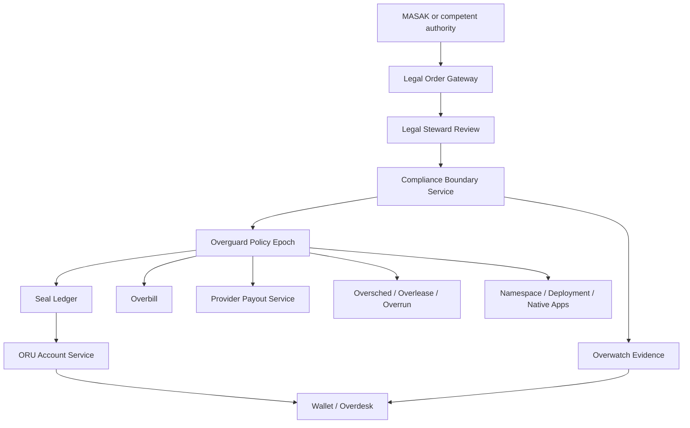
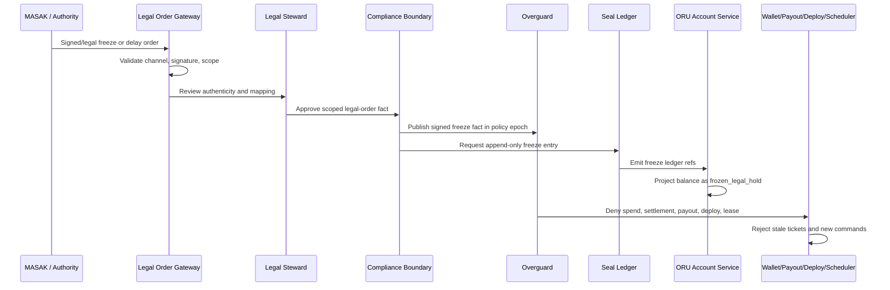

# Regulatory Freezes Without Breaking Distribution

## Purpose

Overrid must be able to comply with lawful Turkish regulatory and judicial freeze orders without turning the distributed system into a centrally controlled database.

MASAK or another lawful Turkish authority should be able to cause accounts, credits, provider earnings, app monetization, or payout paths to be frozen when the law requires it. That must happen through signed, scoped, auditable legal-order records and append-only ledger/policy facts, not through hidden administrator access to user accounts or distributed nodes.

This document is a technical architecture note, not legal advice. Turkish counsel must review the exact order types, statutory timelines, authority channels, appeal paths, and notification rules before production use.

The broader compliance surface is tracked in [Turkish Law Compliance Matrix](turkish_law_compliance_matrix.md). This document only covers freeze, delay, release, and legal-order enforcement architecture.

## Legal Context

Overrid should model Turkish-law freeze and delay actions as distinct legal-control classes rather than one generic "freeze" button.

Reference sources:

- MASAK 5549 law page: <https://masak.hmb.gov.tr/5549-sayili-suc-gelirlerinin-aklanmasinin-onlenmesi-hakkinda-kanun-2/>
- MASAK transaction postponement regulation: <https://masak.hmb.gov.tr/suc-gelirlerinin-aklanmasinin-ve-terorizmin-finansmaninin-onlenmesi-kapsaminda-islemlerin-ertelenmesine-dair-yonetmelik/>
- MASAK terrorism-financing asset-freeze law page: <https://masak.hmb.gov.tr/6415-sayili-terorizmin-finansmaninin-onlenmesi-hakkinda-kanun/>
- MASAK Communique No. 12 for terrorism-financing asset-freeze implementation: <https://masak.hmb.gov.tr/masak-genel-tebligi-sira-no-12/>
- MASAK frozen-assets list: <https://masak.hmb.gov.tr/bkk-ile-malvarliklari-dondurulanlar>

The implementation should support at least:

| Freeze class | Purpose | Typical source |
| --- | --- | --- |
| `transaction_delay` | Temporarily delay a pending or attempted transaction while lawful review happens. | MASAK transaction postponement process or equivalent legal order. |
| `provisional_aml_hold` | Internal risk hold while suspicious activity is reviewed or reported. | Internal AML policy, Overguard, Fraud Control, Internal KYC Service. |
| `asset_freeze_order` | Formal freeze of assets, credits, earnings, or rights. | MASAK/competent authority/court/legal publication process, depending on legal basis. |
| `judicial_seizure_or_block` | Court or prosecutor order affecting specific assets or accounts. | Judicial order. |
| `release_order` | Release, narrow, expire, or correct a prior freeze. | Same authority path or court/steward/legal process required by law. |

## Core Principle

Overrid should remain distributed in execution, storage, routing, and settlement. It should be legally governable through protocol facts.

```text
MASAK does not get root access.
MASAK does not directly mutate accounts.
MASAK orders become verified legal-order facts.
Legal-order facts become signed policy and ledger entries.
Distributed services enforce those facts before settlement, payout, routing, deployment, or spend.
```

The official Overrid network can reject settlement and payouts for frozen subjects even if some node is offline, malicious, or stale.

## Architecture Overview



The Legal Order Gateway ingests an official order, validates the authority channel, and creates a pending legal-order record. Legal Steward Review confirms that the order is authentic, scoped, and mapped to the correct Overrid subjects. Compliance Boundary Service turns the reviewed order into a signed jurisdiction/policy fact. Overguard publishes the active policy epoch. Seal Ledger records append-only freeze and release entries. Owner services enforce the resulting facts.

## Legal Order Gateway

The Legal Order Gateway is the only system surface intended for incoming regulatory or judicial freeze instructions.

It must:

- Accept orders only through approved official channels such as MASAK Online, KEP, UETS, e-imza, official API, physical service converted by legal operations, or other counsel-approved channels.
- Validate source identity, signature, document integrity, timestamp, legal basis, scope, and reference number.
- Reject or quarantine unauthenticated messages.
- Produce a `legal_order_record` with a stable id.
- Keep raw documents in Overvault or legally approved evidence storage.
- Emit Overwatch evidence for every receive, view, validation, approval, rejection, activation, release, and export action.
- Never mutate wallet, ledger, payout, routing, deployment, or app state directly.

The gateway is an evidence intake and validation system, not an admin panel.

## Required Records

### `legal_order_record`

Fields:

- `legal_order_id`
- `authority_type`: `masak`, `court`, `prosecutor`, `other_competent_authority`
- `authority_ref`
- `official_channel_ref`
- `document_ref`
- `signature_validation_ref`
- `legal_basis_ref`
- `order_type`
- `requested_scope`
- `effective_at`
- `expires_at`
- `review_deadline_at`
- `notification_rule`
- `confidentiality_rule`
- `status`
- `created_at`
- `audit_refs`

### `freeze_scope`

Fields:

- `scope_id`
- `legal_order_id`
- `subject_refs`
- `identity_refs`
- `organization_refs`
- `beneficial_owner_refs`
- `account_refs`
- `oru_account_refs`
- `provider_refs`
- `app_refs`
- `namespace_refs`
- `payout_destination_refs`
- `oru_dimensions`
- `action_limits`
- `allowed_exceptions`
- `derived_connected_scope_refs`
- `scope_confidence`

### `regulatory_freeze_fact`

Fields:

- `fact_id`
- `legal_order_id`
- `freeze_scope_id`
- `freeze_class`
- `jurisdiction_profile_ref`
- `policy_version`
- `effective_at`
- `expires_at`
- `state`: `pending_review`, `active`, `partially_active`, `expired`, `released`, `corrected`, `rejected`
- `reason_codes`
- `public_reason_class`
- `private_evidence_refs`
- `signature_ref`
- `overwatch_refs`

### `freeze_ledger_entry`

Seal Ledger entries should include:

- `entry_type`: `legal_freeze`, `legal_freeze_extend`, `legal_freeze_narrow`, `legal_freeze_release`, `legal_freeze_correction`
- `source_legal_order_id`
- `affected_account_ref`
- `affected_oru_dimensions`
- `previous_state_ref`
- `new_state`: `frozen_legal_hold`
- `effective_at`
- `idempotency_key`
- `signature_ref`
- `audit_refs`

Ledger entries must be append-only. A release or correction never deletes the freeze; it records a new fact that changes the projected state.

## Enforcement Model

### Policy Epochs

Overguard should publish signed policy epochs that include active legal freeze facts. Every service that can spend, reserve, transfer, deploy, route, settle, or pay out value must check the current policy epoch before accepting a command.

Commands that need a fresh epoch:

- ORU spend, reservation, transfer, refund, correction, or grant movement.
- Credit purchase and spendability release.
- Provider earning settlement and cash-out eligibility.
- Payout batch creation and payout submission.
- App deployment, app monetization, namespace updates, and provider registration.
- Workload lease creation and renewal.
- Wallet/Overdesk actions that change money or rights.

### Short-Lived Tickets

Long-lived spending or deployment bearer permissions would break freeze enforcement. Overrid should use short-lived signed tickets:

- Budget prechecks expire quickly.
- ORU reservations have explicit expiry.
- Workload leases renew periodically.
- Payout eligibility facts expire.
- App deployment privileges require fresh policy checks.

When a freeze is activated, new tickets cannot be issued. Existing tickets either expire quickly or are cancelled according to the order class.

### Settlement Finality

Distributed execution can continue for unrelated users. For a frozen subject:

- New reservations are denied.
- New workload leases are denied.
- New provider payout items are blocked.
- New app monetization is blocked.
- New credit purchases are held or denied.
- Existing in-flight work is checkpointed, cancelled, or allowed to finish without new payout depending on policy and legal order scope.
- Stale offline work cannot settle because Seal Ledger and Overguard require the current policy epoch.

This preserves distributed execution while making official Overrid settlement legally controlled.

## Service Responsibilities

| Service | Responsibility |
| --- | --- |
| Legal Order Gateway | Ingest, authenticate, validate, and record official legal orders. |
| Compliance Boundary Service | Convert legal orders into signed jurisdiction and freeze fact bundles. |
| Overguard | Enforce freeze facts through policy epochs and deny-by-default decisions. |
| Seal Ledger | Append legal freeze, release, correction, and scope-change entries. |
| ORU Account Service | Project balances into `frozen_legal_hold` state without deleting ownership history. |
| Overbill | Hold credit purchases, refunds, chargebacks, and external payment refs affected by the order. |
| Provider Payout Service | Exclude frozen earnings or providers from payout batches. |
| Internal KYC Service | Link freeze scope to KYC/KYB, beneficial-owner, payout destination, and connected-entity refs. |
| Fraud Control Service | Supply connected-account and graph-risk evidence without final legal authority. |
| Overwatch | Preserve audit trails, operator access records, replay bundles, and legal evidence. |
| Overdesk / Wallet and Usage Center | Show safe user-facing status where notification is legally allowed. |
| Oversched / Overlease / Overrun | Deny new leases and workload execution for frozen spending or provider scopes. |
| Universal Namespace / Overpack / Deployment Planner | Prevent app deployment, route updates, or monetization changes for frozen scopes. |

## Freeze Propagation Flow



## Why This Does Not Break Distribution

The design does not require every node to trust a central live database call before doing unrelated work. It requires every value-changing official Overrid action to carry current signed policy evidence.

Distribution remains intact because:

- Nodes still run workloads for non-frozen subjects.
- Storage remains distributed.
- Discovery and routing remain distributed for lawful scopes.
- Freeze facts are replicated as signed policy data, not enforced through hidden SSH/root access.
- Offline or malicious nodes cannot force settlement because Seal Ledger, ORU projection, payout, namespace, and deployment acceptance require current policy epochs.
- The freeze affects the legal settlement plane, not the physical ability of a computer to execute arbitrary code.
- Forks or unauthorized private copies may exist, but they cannot receive official Overrid settlement, payouts, namespace status, or app monetization.

In practice, Overrid is distributed like a protocol-governed settlement network: anyone can run infrastructure, but only commands satisfying current signed policy and ledger rules become official network truth.

## User And Operator Visibility

User-facing status must depend on the legal order's notification rule.

Allowed safe statuses:

- `account_temporarily_restricted`
- `transaction_under_review`
- `legal_hold_active`
- `payout_unavailable`
- `contact_support_or_legal_channel`
- `release_pending`

Never expose:

- Suspicious transaction report status.
- Private MASAK communication details when disclosure is prohibited.
- Fraud graph cluster membership.
- Exact internal risk thresholds.
- Other connected accounts or identities.
- Operator notes.
- Sensitive evidence refs.

Operators see private evidence only through role-scoped case assignment, purpose logging, and Overwatch audit.

## Exceptions And Essential Access

Some legal orders may allow narrow exceptions. The system should model them explicitly instead of relying on manual workarounds.

Possible exception classes:

- `view_only_access`
- `statement_export`
- `tax_or_compliance_export`
- `lawful_refund`
- `court_approved_payment`
- `living_expense_exception` if Turkish law/order allows it
- `asset_preservation_operation`

Every exception must cite the legal-order ref, authority ref, allowed amount or scope, expiry, and reviewer signature.

## Release And Correction

A release must follow the same rigor as a freeze.

Release flow:

1. Legal Order Gateway receives release or narrowing order.
2. Legal Steward validates authority, scope, and order relationship.
3. Compliance Boundary Service creates a `release_order` or `freeze_scope_narrowed` fact.
4. Overguard publishes a new policy epoch.
5. Seal Ledger appends `legal_freeze_release` or `legal_freeze_narrow`.
6. ORU Account Service reprojects affected balances.
7. Overbill, Provider Payout Service, deployments, and schedulers re-evaluate commands under the new policy.

Release does not erase history. It changes projected state from the release point forward.

## Failure Modes

| Failure mode | Expected behavior |
| --- | --- |
| Fake MASAK message | Quarantine, no freeze, Overwatch alert. |
| Ambiguous scope | `pending_review`; no broad automatic freeze unless emergency policy says otherwise. |
| Overguard unavailable | Deny value-changing commands that require fresh policy. |
| Node offline during freeze | Node cannot settle stale work after reconnect without current epoch. |
| Seal Ledger append failure | Freeze activation is not complete; deny high-risk value-changing commands until resolved. |
| Conflicting release/freeze orders | Legal Steward review; newest order does not silently override without relationship checks. |
| False-positive internal provisional hold | Follow Overclaim/appeal/correction path and append release/correction evidence. |
| User notification prohibited | Show only legally safe generic restriction text. |

## Validation

Required tests:

- A MASAK-style legal order cannot mutate balances directly.
- A freeze writes append-only legal-order, policy, and ledger facts.
- ORU Account Service projects affected credits as `frozen_legal_hold`.
- New spends, reservations, deployments, namespace changes, and payout submissions are denied for frozen scopes.
- Unrelated accounts continue operating normally.
- Offline nodes cannot settle frozen-subject work after reconnect with stale policy.
- Release orders restore availability only through append-only release facts.
- User-facing notices obey notification/no-tipping-off rules.
- Audit replay reconstructs the entire freeze, enforcement, exception, and release path.

## Design Rule

Regulatory freeze support is compatible with a distributed Overrid only if it is implemented as signed, scoped, append-only protocol state.

It becomes incompatible if MASAK, operators, or developers can directly alter balances, delete history, silently edit ledgers, or bypass policy epochs.
