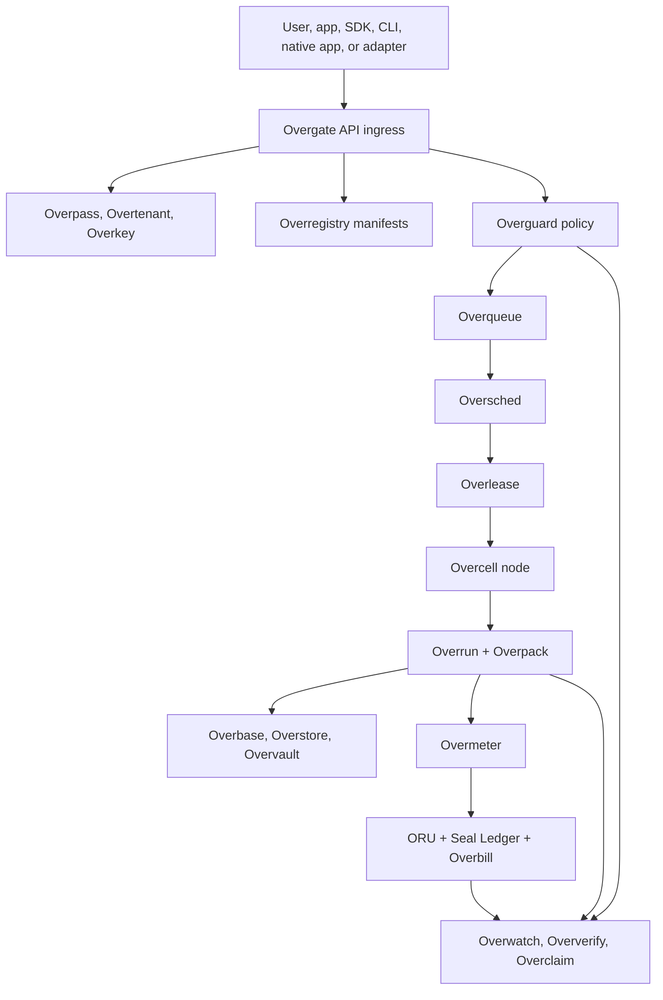

# Overrid Master SDS

## Purpose

This Software Design Specification is the high-level map for Overrid. It explains what is being built, which tools and services are planned, how the build will proceed, and where each deeper document lives.

This file should be the first document a builder reads after the whitepaper. It does not replace the build plan or the service catalog. It points to them and explains how they fit together.

## What Overrid Is Building

Overrid is a distributed infrastructure and native application ecosystem. The goal is to replace extractive centralized internet infrastructure with a resource grid, shared identity, accountable usage, user-owned data flows, and native public utilities that run through the same open rails.

The first servers and GPUs are the bootstrap environment. They let the first control plane, node agent, scheduler, execution loop, accounting layer, and product integrations run before the broader grid exists. Over time, the backbone itself must run inside the grid as protected system workloads so founder hardware is no longer required for normal operation.

Overrid has four major responsibilities:

1. Run workloads on participant-owned compute, GPU, storage, network, and service resources.
2. Govern those workloads through identity, tenant boundaries, policy, trust, verification, audit, and dispute systems.
3. Account for usage through ORU credits, Seal Ledger, Overmark, Overbill, Overgrant, and Overasset without blockchain, NFTs, or per-transaction fee friction.
4. Provide native public utilities such as Overdesk desktop client, wallet, personal AI, workspace, directory listings, search, messaging, social photo/video sharing, maps, and mobile service access.

## Core Documents

| Document | Path | Use it for |
| --- | --- | --- |
| Whitepaper | [docs/whitepaper.md](../whitepaper.md) | The narrative, principles, system overview, native app vision, economics framing, and major diagrams. |
| Tech stack decision | [docs/overrid_tech_stack_choice.md](../overrid_tech_stack_choice.md) | The accepted Rust-first implementation stack and boundary rules for core Overrid primitives. |
| Master build plan | [docs/build_plan/master_plan.md](../build_plan/master_plan.md) | The canonical build order from Phase 0 through Phase 13. |
| Phase detail docs | [docs/build_plan](../build_plan) | Detailed implementation order, workstreams, validation, exit gates, and handoff for every build phase. |
| Build-plan/service crosswalk | [docs/build_plan/service_catalog_alignment.md](../build_plan/service_catalog_alignment.md) | Which services belong to which build phase. |
| Master service catalog | [docs/service_catalog/master_services.md](../service_catalog/master_services.md) | The master list of tools, services, apps, adapters, and support modules to be written. |
| Per-service implementation docs | [docs/service_catalog](../service_catalog) | One implementation-plan file per tool or service, grouped by category. |
| Per-service SDS index | [docs/sds/service_sds_index.md](service_sds_index.md) | Detailed software design specifications for every tool, service, adapter, native app, and support module. |
| This SDS | [docs/sds/master_sds.md](master_sds.md) | High-level orientation across all documents. |

## Service Families

The service catalog is organized by service family. Each family has its own folder under `docs/service_catalog`.

| Family | Folder | What it covers |
| --- | --- | --- |
| Foundation and developer tooling | [docs/service_catalog/foundation](../service_catalog/foundation) | Repository layout, shared schemas, local development, test harness, SDK, CLI, and admin/developer UI. |
| Control plane | [docs/service_catalog/control_plane](../service_catalog/control_plane) | Protocol core, identity, tenancy, API ingress, resource registry, keys, event log, and durable queueing. |
| Execution and scheduling | [docs/service_catalog/execution_scheduling](../service_catalog/execution_scheduling) | Node agent, installer, hardware discovery, benchmarks, scheduler, leases, package execution, mesh, cache, and usage metering. |
| Data, storage, and namespace | [docs/service_catalog/data_storage_namespace](../service_catalog/data_storage_namespace) | Overbase, Overstore, Overvault, and universal namespace services. |
| Trust, policy, verification, and disputes | [docs/service_catalog/trust_policy_verification](../service_catalog/trust_policy_verification) | Policy engine, dry runs, workload classification, provider verification, challenge tasks, disputes, reputation, and anti-Sybil controls. |
| Accounting, credits, billing, and rights | [docs/service_catalog/accounting](../service_catalog/accounting) | ORU accounts, Seal Ledger, Overmark, Overbill, provider payouts, Overgrant, and Overasset. |
| Deployment and grid-resident backbone | [docs/service_catalog/deployment_grid](../service_catalog/deployment_grid) | System-service workload class, service packaging, backups, failover, deployment planning, releases, and package validation. |
| Federation and public capacity | [docs/service_catalog/federation_public](../service_catalog/federation_public) | Trusted federation templates, purpose tags, public-interest pools, public provider onboarding, public sandbox profiles, and fraud controls. |
| AI, RAG, and model routing | [docs/service_catalog/ai_rag_model_routing](../service_catalog/ai_rag_model_routing) | Personal AI, central AI, model routing, lightweight classification, ADES enrichment, and encrypted Docdex RAG. |
| Ecosystem adapters | [docs/service_catalog/adapters](../service_catalog/adapters) | Docdex, Mcoda, Codali, and mSwarm integration bridges. |
| Native applications | [docs/service_catalog/native_apps](../service_catalog/native_apps) | Overdesk desktop client, wallet, workspace, directory listings, search, messaging, social photo/video, maps, and central AI stewardship UI. |
| Governance and operations | [docs/service_catalog/governance_ops](../service_catalog/governance_ops) | Protocol improvement process, stewardship reporting, compliance boundaries, threat modeling, incident response, and migration tooling. |
| Mobile service layer | [docs/service_catalog/mobile](../service_catalog/mobile) | Mobile SDK and mobile backend gateway. |

## Per-Service SDS Layer

The service catalog explains what each tool or service must become. The per-service SDS layer translates that implementation intent into a design contract: ownership, actors, dependencies, data model, APIs, events, workflows, state transitions, policy/security handling, metering, operations, failure modes, validation, build breakdown, and handoff.

The per-service SDS files live under [docs/sds/service_sds_index.md](service_sds_index.md) and mirror the same category layout used by [docs/service_catalog](../service_catalog). Builders should treat the SDS files as the bridge between the whitepaper/build-plan vision and implementation tickets.

The SDS set has been reviewed and refined across the full service list. The public baseline is the current service SDS content and index, not the internal pass logs used while creating it.

## Build Plan Overview

The build plan is phase-based. It starts with the smallest private system that can run useful work, then expands toward grid-resident backbone services, platform storage, deployment, federation, native apps, and governance.

| Phase | Detailed doc | Plain-language goal |
| --- | --- | --- |
| 0 | [Foundation](../build_plan/phase_00_foundation.md) | Create the repo layout, schemas, local development stack, and integration test base. |
| 1 | [Control-Plane Skeleton](../build_plan/phase_01_control_plane_skeleton.md) | Accept signed identities, tenants, resource records, manifests, and queued workload commands. |
| 2 | [Seed Private Swarm](../build_plan/phase_02_seed_private_swarm.md) | Register the first founder servers and GPUs as a private resource pool. |
| 3 | [Private Execution Loop](../build_plan/phase_03_private_execution_loop.md) | Run real private jobs from request to scheduling, lease, execution, result, metering, and audit. |
| 4 | [Trust, Policy, and Verification](../build_plan/phase_04_trust_policy_verification.md) | Add workload classes, policy enforcement, verification, challenge checks, disputes, and private connectivity. |
| 5 | [Metering, ORU, Seal Ledger, and Overbill](../build_plan/phase_05_metering_oru_seal_ledger_overbill.md) | Turn usage into accountable ORU and Seal Ledger records without blockchain or NFT mechanics. |
| 6 | [First Product Integration](../build_plan/phase_06_first_product_integration.md) | Connect Docdex, Mcoda, Codali, SDK, CLI, and admin UI to real Overrid work. |
| 7 | [Grid-Resident Backbone](../build_plan/phase_07_grid_resident_backbone.md) | Move core Overrid services from seed machines into protected grid workloads. |
| 8 | [Data, Storage, and Namespace Platform](../build_plan/phase_08_data_storage_namespace_platform.md) | Add state, object storage, private vaults, names, routes, and asset bindings. |
| 9 | [Overpack Deployment Platform](../build_plan/phase_09_overpack_deployment_platform.md) | Make app deployment intent-driven through manifests, validators, planners, and release strategies. |
| 10 | [Trusted Federation and Public-Interest Pools](../build_plan/phase_10_trusted_federation_public_interest_pools.md) | Let trusted organizations and public-interest pools share capacity under explicit rules. |
| 11 | [Limited Public Low-Sensitivity Pool](../build_plan/phase_11_limited_public_low_sensitivity_pool.md) | Admit unknown or semi-trusted public nodes only for tightly bounded low-risk workloads. |
| 12 | [Native Application Layer](../build_plan/phase_12_native_application_layer.md) | Build native public utilities on top of normal Overrid APIs and accounting rails. |
| 13 | [Governance, Compliance, and Scale Hardening](../build_plan/phase_13_governance_compliance_scale_hardening.md) | Harden governance, compliance, reporting, incident response, migration, and scale operations. |

## How The Main Tools Work Together

The normal path starts with a user, app, adapter, CLI, SDK, or native service submitting a request. The request enters through Overgate, is checked against identity and tenant context, is matched to manifests and policies, is queued, scheduled, leased, executed, metered, recorded, and settled.

At a high level:

- Overpass, Overtenant, and Overkey decide who is acting, for which tenant, with which credentials.
- Overgate is the front door for APIs, CLI, SDK, adapters, and native apps.
- Overregistry stores resource, workload, package, provider, and app records.
- Overguard decides what is allowed before work runs.
- Overqueue, Oversched, and Overlease move accepted work into safe execution.
- Overcell and Overrun run the work on real hardware.
- Overpack describes the workload or app package.
- Overbase, Overstore, and Overvault provide state, objects, and private storage.
- Overmeter, ORU, Seal Ledger, Overmark, Overbill, Overgrant, and Overasset make usage accountable.
- Overwatch, Oververify, and Overclaim keep evidence, trust, disputes, and correction paths.

## Native App Layer

Native apps are built as normal Overrid applications. They do not bypass identity, privacy, storage, policy, metering, billing, or dispute rules.

The planned native apps are:

- Overdesk desktop client.
- Wallet and usage center.
- Personal AI assistant.
- Workspace and office suite.
- Directory listings.
- Search engine.
- Messaging center.
- Social photo/video app.
- Maps and navigation.
- Central AI stewardship interface.

These apps are non-profit oriented public utilities. They may charge for resource usage where needed, but the design must stay structural and near-cost rather than speculative. Surplus routing belongs to stewardship and public-interest mechanisms, not private extraction.

## AI And RAG Layer

The AI layer includes a personal assistant, central AI coordination, model routing, lightweight request classification, ADES semantic enrichment, and encrypted Docdex RAG.

The intended path is:

1. The user asks the personal assistant or an app makes an AI request.
2. The AI gateway classifies the request and decides whether it needs a small model, a larger model, tool use, encrypted Docdex RAG, or another native service.
3. Encrypted Docdex indexes provide authorized context for personal, organization, or repo data.
4. ADES may enrich text with entities, topics, timing, warning signals, and routing hints.
5. Overrid finds suitable model resources in the grid.
6. Usage is metered and visible in the wallet.

The detailed service docs live in [docs/service_catalog/ai_rag_model_routing](../service_catalog/ai_rag_model_routing).

## Mobile App Service Layer

Mobile apps use Overrid as a backend/resource plane. The mobile service layer should provide identity, wallet access, sync, storage, messaging, media processing, AI gateway access, encrypted Docdex RAG access, metering, fraud protection, and resource-aware service execution.

The main documents are:

- [Mobile SDK](../service_catalog/mobile/mobile_sdk.md)
- [Mobile Backend Gateway](../service_catalog/mobile/mobile_backend_gateway.md)
- [Phase 12 Native Application Layer](../build_plan/phase_12_native_application_layer.md)

## Reading Order

Use this order when onboarding a builder:

1. Read the whitepaper: [docs/whitepaper.md](../whitepaper.md).
2. Read this SDS: [docs/sds/master_sds.md](master_sds.md).
3. Read the master build plan: [docs/build_plan/master_plan.md](../build_plan/master_plan.md).
4. Read the phase you are about to build in [docs/build_plan](../build_plan).
5. Read the service catalog overview: [docs/service_catalog/master_services.md](../service_catalog/master_services.md).
6. Read the service-specific files under [docs/service_catalog](../service_catalog).
7. Read the matching per-service SDS through [docs/sds/service_sds_index.md](service_sds_index.md).
8. Check the crosswalk: [docs/build_plan/service_catalog_alignment.md](../build_plan/service_catalog_alignment.md).

## Source Of Truth Rules

- The whitepaper explains why Overrid exists and what it is trying to change.
- The build plan controls build order.
- The phase docs control phase-level workstreams, validation, exit gates, and handoff.
- The service catalog controls what tools and services exist.
- The per-service docs control each service's implementation scope.
- The per-service SDS files control each service's design contract before implementation.
- The crosswalk controls phase-to-service alignment.
- This SDS is the high-level index and orientation guide.

When documents conflict, update the more specific source of truth and then reflect the change upward. For example, if a service changes, update its service file first, update the crosswalk if phase alignment changes, then update the master catalog and this SDS if the high-level story changes.
