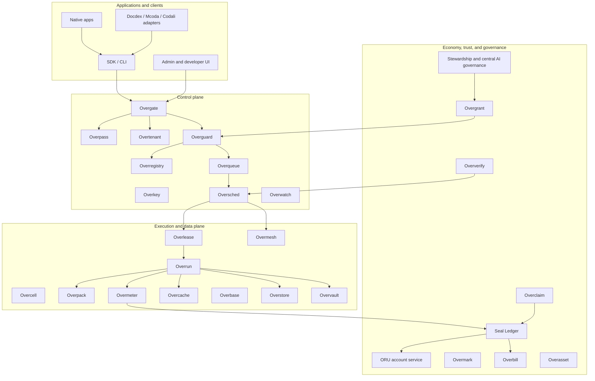

# Overrid Tool and Service Catalog

## Purpose

This document is the master catalog of the tools, services, apps, and support modules that need to be written for Overrid.

The build should not start by creating all of these as separate microservices. The first implementation should be a modular control plane, node agent, durable stores, SDK/CLI, and focused product integrations. Components become independently deployed services only after their API boundaries, load patterns, and operational ownership are proven.

## Operating Rules

- Every mutating command goes through identity, tenant context, idempotency, policy, and audit.
- Every workload has a manifest, workload class, resource card, policy decision, lease, execution record, metering record, and final state.
- Every accounting transition is append-only and explainable from usage, policy, dispute, grant, or operator evidence.
- Every native app uses ordinary Overrid APIs. Native apps do not bypass metering, privacy, policy, billing, or dispute controls.
- Public nodes are untrusted until verification, challenge checks, workload class limits, and payout holds prove otherwise.
- Founder hardware is bootstrap infrastructure. Core backbone services must migrate into protected grid-resident system workloads.
- ORU, Seal Ledger, and Overasset are utility infrastructure, not blockchain, NFT, or speculative-token mechanics.

## Service Map

## Build Phase Index

| Phase | Tools and services introduced |
| --- | --- |
| 0 | Repository layout, shared schemas, local dev stack, test harness, docs/spec system |
| 1 | Overpass-lite, Overtenant, Overgate, Overregistry, Overkey-lite, Overwatch event log, Overqueue skeleton |
| 2 | Overcell node agent, node installer, hardware discovery, benchmark runner, capability publisher |
| 3 | Overpack v0, Oversched v0, Overlease v0, Overrun v0, Overmeter raw events, retry/cancel/dead-letter flow |
| 4 | Overguard, policy dry-run API, Oververify, challenge checks, Overclaim, Overmesh private discovery, cache trust scopes |
| 5 | ORU account service, Seal Ledger, Overmeter rollups, Overmark, Overbill, provider payout holds |
| 6 | Docdex adapter, Mcoda adapter, Codali adapter, SDK/CLI hardening, admin/developer UI |
| 7 | System-service workload class, grid-resident backbone packaging, backups, failover, rolling update/rollback |
| 8 | Overbase, Overstore, Overvault, universal namespace, Overmesh route resolution, namespace dispute tools |
| 9 | Overpack application deployment planner, package validator, release strategies, provisioning engine |
| 10 | Federation templates, cross-tenant Overgrant, purpose tags, public-interest pool services |
| 11 | Public provider onboarding, anti-Sybil checks, public sandbox profile, fraud controls, payout holds |
| 12 | Overdesk desktop client, wallet, personal AI assistant, workspace, directory listings, search, messaging, social photo/video, maps, central AI stewardship interface |
| 13 | PIP registry, stewardship reporting, central AI evidence rules, compliance boundaries, threat modeling, incident drills, migration tooling |

## Per-Service Implementation Files

The canonical phase-to-service crosswalk lives in [Build Plan to Service Catalog Alignment](../build_plan/service_catalog_alignment.md). Each service implementation file should link its first build phase to the matching build-plan phase document.

| Category | Implementation files |
| --- | --- |
| Foundation and developer tooling | [Repository Layout](foundation/repository_layout.md), [Shared Schema Package](foundation/shared_schema_package.md), [Local Development Stack](foundation/local_development_stack.md), [Integration Test Harness](foundation/integration_test_harness.md), [SDK](foundation/sdk.md), [CLI](foundation/cli.md), [Admin and Developer UI](foundation/admin_developer_ui.md) |
| Control plane | [Overrid Protocol Core](control_plane/overrid_protocol_core.md), [Overpass](control_plane/overpass.md), [Overtenant](control_plane/overtenant.md), [Overgate](control_plane/overgate.md), [Overregistry](control_plane/overregistry.md), [Overkey](control_plane/overkey.md), [Overwatch](control_plane/overwatch.md), [Overqueue](control_plane/overqueue.md) |
| Execution and scheduling | [Overcell](execution_scheduling/overcell.md), [Node Installer](execution_scheduling/node_installer.md), [Hardware Discovery](execution_scheduling/hardware_discovery.md), [Benchmark Runner](execution_scheduling/benchmark_runner.md), [Oversched](execution_scheduling/oversched.md), [Overlease](execution_scheduling/overlease.md), [Overpack](execution_scheduling/overpack.md), [Overrun](execution_scheduling/overrun.md), [Overmesh](execution_scheduling/overmesh.md), [Overcache](execution_scheduling/overcache.md), [Overmeter](execution_scheduling/overmeter.md) |
| Data, storage, and namespace | [Overbase](data_storage_namespace/overbase.md), [Overstore](data_storage_namespace/overstore.md), [Overvault](data_storage_namespace/overvault.md), [Universal Namespace Service](data_storage_namespace/universal_namespace_service.md) |
| Trust, policy, verification, and disputes | [Overguard](trust_policy_verification/overguard.md), [Policy Dry-Run API](trust_policy_verification/policy_dry_run_api.md), [Workload Classifier](trust_policy_verification/workload_classifier.md), [Oververify](trust_policy_verification/oververify.md), [Challenge Task Service](trust_policy_verification/challenge_task_service.md), [Overclaim](trust_policy_verification/overclaim.md), [Reputation and Anti-Sybil Service](trust_policy_verification/reputation_anti_sybil_service.md) |
| Accounting, credits, billing, and resource rights | [ORU Account Service](accounting/oru_account_service.md), [Seal Ledger](accounting/seal_ledger.md), [Overmark](accounting/overmark.md), [Overbill](accounting/overbill.md), [Provider Payout Service](accounting/provider_payout_service.md), [Overgrant](accounting/overgrant.md), [Overasset](accounting/overasset.md) |
| Deployment and grid-resident backbone | [System-Service Workload Class](deployment_grid/system_service_workload_class.md), [Grid-Resident Service Packager](deployment_grid/grid_resident_service_packager.md), [Backup and Restore Service](deployment_grid/backup_restore_service.md), [Failover and Recovery Coordinator](deployment_grid/failover_recovery_coordinator.md), [Deployment Planner](deployment_grid/deployment_planner.md), [Release Strategy Service](deployment_grid/release_strategy_service.md), [Package Validator](deployment_grid/package_validator.md) |
| Federation and public capacity | [Federation Template Service](federation_public/federation_template_service.md), [Purpose Tag Registry](federation_public/purpose_tag_registry.md), [Public-Interest Pool Service](federation_public/public_interest_pool_service.md), [Public Provider Onboarding](federation_public/public_provider_onboarding.md), [Public Sandbox Profile](federation_public/public_sandbox_profile.md), [Fraud Control Service](federation_public/fraud_control_service.md) |
| AI, RAG, and model routing | [Personal AI Assistant](ai_rag_model_routing/personal_ai_assistant.md), [AI Gateway Router](ai_rag_model_routing/ai_gateway_router.md), [Lightweight Classifier](ai_rag_model_routing/lightweight_classifier.md), [ADES Enrichment Adapter](ai_rag_model_routing/ades_enrichment_adapter.md), [Encrypted Docdex RAG Adapter](ai_rag_model_routing/encrypted_docdex_rag_adapter.md), [Central AI Service](ai_rag_model_routing/central_ai_service.md) |
| Ecosystem adapters | [Docdex Adapter](adapters/docdex_adapter.md), [Mcoda Adapter](adapters/mcoda_adapter.md), [Codali Adapter](adapters/codali_adapter.md), [mSwarm Runtime Bridge](adapters/mswarm_runtime_bridge.md) |
| Native applications | [Overdesk Desktop Client](native_apps/overdesk_desktop_client.md), [Wallet and Usage Center](native_apps/wallet_usage_center.md), [Workspace and Office Suite](native_apps/workspace_office_suite.md), [Directory Listings](native_apps/directory_listings.md), [Search Engine](native_apps/search_engine.md), [Messaging Center](native_apps/messaging_center.md), [Social Photo/Video App](native_apps/social_photo_video_app.md), [Maps and Navigation](native_apps/maps_navigation.md), [Central AI Stewardship Interface](native_apps/central_ai_stewardship_interface.md) |
| Governance, compliance, and operations | [Protocol Improvement Proposal Registry](governance_ops/pip_registry.md), [Stewardship Reporting Service](governance_ops/stewardship_reporting_service.md), [Compliance Boundary Service](governance_ops/compliance_boundary_service.md), [Threat Modeling and Security Review Tracker](governance_ops/threat_modeling_security_review_tracker.md), [Incident Response Service](governance_ops/incident_response_service.md), [Migration Tooling](governance_ops/migration_tooling.md) |
| Mobile app service layer | [Mobile SDK](mobile/mobile_sdk.md), [Mobile Backend Gateway](mobile/mobile_backend_gateway.md) |

## Foundation and Developer Tooling

### Repository Layout

Purpose: Define the physical workspace for services, packages, SDKs, CLI tools, specs, tests, and local infrastructure.

Build:

- `services/control-plane` for the first modular API and worker.
- `services/node-agent` for Overcell.
- `packages/schemas` for shared protocol objects.
- `packages/sdk` for client libraries.
- `packages/cli` for developer and operator commands.
- `infra/local` for Overrid-shaped local durable state, durable job tables, object/artifact stubs, service definitions, and test services.
- `tests/integration` for cross-service validation.

Interfaces: File layout, package boundaries, build/test commands, documentation conventions.

First phase: Phase 0.

### Shared Schema Package

Purpose: Keep every service using the same identity, tenant, command, manifest, event, policy, lease, metering, ledger, and error contracts.

Build:

- Identity refs.
- Tenant refs.
- Command envelope.
- Workload manifest.
- Resource manifest.
- Package manifest.
- Event envelope.
- Audit record.
- Policy decision.
- Queue item.
- Lease record.
- Usage event and rollup.
- Ledger transition.
- Dispute record.

Interfaces: Schema validators, generated types, fixture builders, migration/deprecation metadata.

First phase: Phase 0.

### Local Development Stack

Purpose: Let the first developers run Overrid locally without external cloud services.

Build:

- Local API process.
- Local worker process.
- Overrid-shaped local durable job table.
- Overrid-shaped local durable state stub.
- Overrid-shaped object/artifact storage stub.
- One node-agent simulator.
- Seed tenant, identity, key, and workload fixtures.

Interfaces: `start`, `stop`, `reset`, `seed`, and integration-test commands.

First phase: Phase 0.

### Integration Test Harness

Purpose: Prove cross-service behavior instead of only unit-level correctness.

Build:

- Deterministic fixture generation.
- Local stack lifecycle.
- Signed command tests.
- Queue, lease, execution, metering, and ledger tests.
- Failure-mode tests for retries, cancellation, timeout, stale leases, and policy denial.

Interfaces: Test runner, fixture library, golden event traces.

First phase: Phase 0.

### SDK

Purpose: Give apps and ecosystem tools a safe client layer for Overrid.

Build:

- Request signing.
- Idempotency handling.
- Trace id generation.
- Manifest submission.
- Workload submission.
- Job status polling or subscriptions.
- Result retrieval.
- Usage and receipt queries.
- Error decoding.

Interfaces: Language SDKs, generated API client, auth helpers.

First phase: Phase 6 hardening, with a thin client earlier.

### CLI

Purpose: Let developers and operators use Overrid without manually calling internal APIs.

Build:

- Login or credential enrollment.
- Tenant and identity commands.
- Manifest validation.
- Workload submission.
- Job inspect/cancel/result commands.
- Node registration.
- Node health inspection.
- Usage, receipt, and ledger queries.
- Policy dry-run.
- Package validation.

Interfaces: Human CLI, scriptable JSON output, admin-safe commands.

First phase: Phase 6 hardening, with basic commands in Phase 1.

### Admin and Developer UI

Purpose: Provide operational visibility into tenants, nodes, jobs, usage, policy, audit, disputes, and system health.

Build:

- Tenant dashboard.
- Node inventory and health.
- Queue and job explorer.
- Policy decision explorer.
- Usage and ORU views.
- Dispute and claim views.
- Audit event explorer.
- System-service deployment status.

Interfaces: Overgate admin APIs, Overwatch events, Seal Ledger views.

First phase: Phase 6.

## Control Plane Services

### Overrid Protocol Core

Purpose: The umbrella protocol and ecosystem boundary for programmable resource allocation.

Build:

- Global protocol conventions.
- Service ownership map.
- Versioning rules.
- Compatibility rules.
- Workload lifecycle states.
- Command and event discipline.
- Governance hooks.

Interfaces: Specs, schemas, conformance tests, PIP process.

First phase: Phase 0.

### Overpass

Purpose: Identity and namespace layer for people, organizations, nodes, apps, services, swarms, agents, communities, tags, and routes.

Build:

- DID-compatible identity records where appropriate.
- Person, organization, node, app, service account, and system-service identities.
- Human-readable namespace records.
- Delegation and transfer records.
- Verification markers.
- Route and service binding refs.
- Impersonation and squatting dispute hooks.

Interfaces: Overgate auth, Overtenant membership, Overregistry owners, Overmesh routes, Overasset rights, Seal Ledger account owners.

First phase: Overpass-lite in Phase 1; broader namespace in Phase 8.

### Overtenant

Purpose: Tenant boundary for users, organizations, subtenants, private swarms, white-label systems, quotas, roles, suspension, and offboarding.

Build:

- Tenant creation and lifecycle.
- Membership and roles.
- Quotas and budgets.
- Suspension states.
- Private-swarm scope.
- White-label and air-gapped tenant modes.
- Offboarding cleanup records.

Interfaces: Overgate request context, Overguard policies, Overregistry ownership, Seal Ledger accounts.

First phase: Phase 1.

### Overgate

Purpose: Developer/admin API ingress and command gateway.

Build:

- Authentication.
- Request signing.
- Idempotency.
- Rate limits.
- Quota prechecks.
- Trace id assignment.
- Command envelope validation.
- Ingress audit.
- Stable error format.

Interfaces: SDK, CLI, native apps, admin UI, Overpass, Overtenant, Overguard, Overwatch.

First phase: Phase 1.

### Overregistry

Purpose: Registry for manifests, providers, packages, resources, purpose tags, policy facts, and public catalogs.

Build:

- Resource manifests.
- Workload manifests.
- Package manifests.
- Provider records.
- Node capability records.
- Tag definitions.
- Schema versions.
- Public catalog records.
- Immutable manifest versioning.

Interfaces: Overguard policy facts, Oversched candidate facts, Overpack package metadata, Oververify evidence.

First phase: Phase 1.

### Overkey

Purpose: Key management and credential lifecycle.

Build:

- API credentials.
- Signing key records.
- Delegated access.
- Rotation metadata.
- Revocation.
- Service account keys.
- Secret reference integration with Overvault.

Interfaces: Overgate auth, Overrun secret mounts, Overvault access policies, signed operator actions.

First phase: Overkey-lite in Phase 1; broader key services in Phase 8.

### Overwatch

Purpose: Observability, audit, incident tracking, health, reputation signals, and compliance evidence.

Build:

- Append-only event log.
- Request traces.
- Health events.
- Policy decision records.
- Execution state events.
- Incident records.
- Reputation and provider behavior signals.
- Compliance evidence exports.

Interfaces: Every service emits events; Overclaim uses evidence; governance and central AI use bounded evidence packages.

First phase: Phase 1 event log; mature observability through Phases 4, 7, and 13.

### Overqueue

Purpose: Durable workload queue with priority, backpressure, retry orchestration, deadlines, and dead-letter handling.

Build:

- Pending jobs.
- Priority lanes.
- Retry metadata.
- Deadline metadata.
- Cancellation.
- Dead-letter state.
- At-least-once delivery with idempotent workload ids.
- Backpressure signals.

Interfaces: Overgate writes commands, Overguard admits or denies, Oversched consumes, Overwatch records state.

First phase: Phase 1 skeleton; real execution in Phase 3.

## Node, Execution, and Scheduling Services

### Overcell

Purpose: Resource abstraction and node-agent layer for participant-owned compute, GPU, storage, network, data, model, and service capacity.

Build:

- Node-agent install.
- Registration.
- Heartbeat.
- Shutdown and drain.
- Capability discovery.
- Local runtime checks.
- Node state transitions.
- Upgrade path.

Interfaces: Overregistry capability records, Oversched placement, Oververify challenge checks, Overwatch health events.

First phase: Phase 2.

### Node Installer

Purpose: Make seed and provider node onboarding repeatable.

Build:

- Install package.
- Enrollment flow.
- Credential bootstrap.
- Service supervision.
- Config validation.
- Update channel.
- Uninstall/drain flow.

Interfaces: Overcell, Overkey, Overgate, Overwatch.

First phase: Phase 2.

### Hardware Discovery

Purpose: Discover usable node capacity beyond hardware names.

Build:

- CPU detection.
- Memory detection.
- GPU and accelerator runtime detection.
- Storage and filesystem detection.
- Network interface and bandwidth hints.
- OS/runtime discovery.
- Region/locality tags.

Interfaces: Overcell agent, Overregistry capability records, Oververify benchmark validation.

First phase: Phase 2.

### Benchmark Runner

Purpose: Measure useful capacity so scheduling is evidence-backed.

Build:

- CPU benchmark.
- GPU benchmark.
- Disk benchmark.
- Network benchmark.
- Cold-start benchmark.
- Sustained reliability hints.
- Signed benchmark records.

Interfaces: Overcell, Oververify, Overregistry, Oversched.

First phase: Phase 2.

### Oversched

Purpose: Policy-aware scheduler that chooses placements from availability, trust, cost, locality, cache, grant, and lease facts.

Build:

- Candidate filtering.
- Trust-class eligibility.
- Workload-class eligibility.
- Data locality and cache hints.
- Resource-card matching.
- Region/jurisdiction constraints.
- Gang scheduling for multi-node jobs.
- Explainable placement decisions.

Interfaces: Overqueue, Overregistry, Overguard, Overgrant, Overmark, Overlease, Overmesh, Oververify.

First phase: Phase 3.

### Overlease

Purpose: Short-lived reservations, concurrency locks, atomic lease sets, renewal, cancellation, and stale-lease cleanup.

Build:

- Lease records.
- Lease expiration.
- Lease renewal.
- Lease release.
- Stale cleanup.
- Atomic multi-node lease sets.
- Cancellation.

Interfaces: Oversched grants leases, Overrun validates leases, Overmeter links usage to lease windows.

First phase: Phase 3.

### Overpack

Purpose: Package and manifest layer for workloads, apps, services, artifacts, models, datasets, security, routes, scaling, geography, and billing intent.

Build:

- Workload manifest v0.
- Application-intent manifest.
- Artifact hash and signature checks.
- SBOM and dependency locks.
- Runtime contract.
- Route declarations.
- Data/storage/model declarations.
- Budget and billing declarations.
- Policy compatibility validation.

Interfaces: Overregistry stores manifests, Overrun verifies packages, Overguard checks policy, deployment planner provisions resources.

First phase: Workload manifest in Phase 3; deployment platform in Phase 9.

### Overrun

Purpose: Sandbox preparation, pre-flight checks, execution supervision, credential mounting, result handoff, and safe termination.

Build:

- Assignment fetch.
- Package verification.
- Sandbox setup.
- Input mounting.
- Egress policy enforcement.
- Secret mount enforcement.
- Execution supervision.
- Timeout and cancellation.
- Result capture.
- Cleanup.

Interfaces: Overlease, Overpack, Overvault, Overcache, Overstore, Overmeter, Overwatch.

First phase: Phase 3.

### Overmesh

Purpose: Connectivity, namespace resolution, service discovery, peer discovery, NAT traversal, artifact transfer, priority bandwidth leases, geographic routing, and traffic shaping.

Build:

- Private node discovery.
- Tenant-scoped service discovery.
- Route resolution.
- Artifact transfer.
- Connectivity health.
- NAT traversal where appropriate.
- Bandwidth lease hints.
- Deny-by-default cross-tenant routing.

Interfaces: Oversched, Overrun, Overpass namespace, Overstore object transfer, native app routes.

First phase: Private discovery in Phase 4; route resolution in Phase 8.

### Overcache

Purpose: Reuse layer for artifacts, model outputs, datasets, indexes, repeated workloads, static assets, API responses, model files, dataset chunks, and runtime snapshots.

Build:

- Cache keys.
- Trust scopes.
- Invalidation policy.
- Tenant-private caches.
- Trusted-swarm caches.
- Federation-grant caches.
- Public low-sensitivity caches.
- Cache metering.

Interfaces: Overrun, Overstore, Overguard, Overmeter, Oversched cache hints.

First phase: Trust scopes in Phase 4; broader reuse after Phase 8.

### Overmeter

Purpose: Usage events and signed rollups for compute, storage, bandwidth, requests, execution time, RAG retrieval, model inference, and app services.

Build:

- Raw usage events.
- Rollup windows.
- Rollup signing.
- Retention rules.
- Dispute windows.
- Resource-class dimensions.
- Native app usage records.
- Provider usage records.

Interfaces: Overrun emits raw events, Seal Ledger consumes rollups, Overbill emits receipts, Overwatch keeps evidence.

First phase: Raw events in Phase 3; signed rollups in Phase 5.

## Data, Storage, and Namespace Services

### Overbase

Purpose: Distributed application state substrate for documents, key-value records, event streams, vector indexes, schemas, indexes, replication, and consistency policies.

Build:

- Document collections.
- Key-value collections.
- Event streams.
- Vector indexes.
- Schema lifecycle.
- Index lifecycle.
- Sharding.
- Replication.
- Backup and recovery.
- Consistency policy options.

Interfaces: Native apps, Docdex RAG metadata, workspace, directory listings, search, Overwatch events, Overpack provisioning.

First phase: Phase 8.

### Overstore

Purpose: Durable content-addressed persistence for long-lived files, media, packages, datasets, models, snapshots, backups, and research outputs.

Build:

- Content addressing.
- Chunking.
- Checksums.
- Encryption-before-placement.
- Replication or erasure coding.
- Repair jobs.
- Storage leases.
- Proof or challenge hooks for provider trust.

Interfaces: Overrun result storage, Overpack artifacts, Overbase refs, Overvault policy, native media/workspace/search apps.

First phase: Phase 8.

### Overvault

Purpose: Secure storage for sensitive material, encrypted state, secrets, escrowed records, private app data, and protected access policies.

Build:

- Secret records.
- Encrypted private state.
- Access policies.
- Escrowed records.
- Key policy metadata.
- Secret mount integration.
- Audit of access decisions.

Interfaces: Overkey, Overrun, Overguard, native apps, personal AI assistant, workspace.

First phase: Phase 8, with minimal secret refs earlier.

### Universal Namespace Service

Purpose: Human-readable names for people, organizations, apps, services, agents, swarms, communities, tags, assets, and routes.

Build:

- Namespace records.
- Name ownership.
- Delegation.
- Transfer.
- Route binding.
- Service binding.
- Verification markers.
- Impersonation, squatting, and route-hijack disputes.

Interfaces: Overpass, Overasset, Seal Ledger, Overmesh, native apps, search, messaging.

First phase: Phase 8.

## Trust, Policy, Verification, and Disputes

### Overguard

Purpose: Policy enforcement for workload admission, data sensitivity, sandboxing, compliance, egress, secret access, provider eligibility, quota, and abuse prevention.

Build:

- Workload class rules.
- Data sensitivity rules.
- Tenant quota rules.
- Package trust rules.
- Egress rules.
- Secret access rules.
- Region/jurisdiction constraints.
- Budget reservation checks.
- Policy versioning.
- Reason codes.

Interfaces: Overgate, Overregistry, Overqueue, Overvault, Oversched, Overwatch, Overgrant.

First phase: Phase 4.

### Policy Dry-Run API

Purpose: Let developers, apps, and operators preview policy decisions before submitting work.

Build:

- Would accept/deny.
- Matched rules.
- Reason codes.
- Expected placement class.
- Estimated resource reservation.
- Missing prerequisites.
- Policy version.
- Stable dry-run id.

Interfaces: SDK, CLI, admin UI, Overguard, Overwatch.

First phase: Phase 4.

### Workload Classifier

Purpose: Normalize declared workload sensitivity and allowed execution environment.

Build:

- System-service class.
- Private tenant class.
- Trusted federation class.
- Public low-sensitivity class.
- Research/public-interest class.
- Regulated or secret-bearing class.
- Class downgrade or denial reasons.

Interfaces: Overguard, Oversched, Overregistry, Overrun, Oververify.

First phase: Phase 4.

### Oververify

Purpose: Provider attestation, benchmarking, certification, workload result checks, challenge protocols, and trust scoring.

Build:

- Provider verification records.
- Node verification records.
- Benchmark validation.
- Challenge tasks.
- Result consistency checks.
- Reliability history.
- Abuse markers.
- Explainable trust score.

Interfaces: Overcell, Overregistry, Oversched, Overwatch, Overclaim.

First phase: Phase 4.

### Challenge Task Service

Purpose: Actively test providers and nodes instead of trusting claims.

Build:

- Liveness challenges.
- GPU capability challenges.
- Benchmark rechecks.
- Result consistency checks.
- Repeated reliability probes.
- Challenge failure consequences.

Interfaces: Oververify, Overcell, Oversched, Overwatch, payout holds.

First phase: Phase 4 for trusted nodes; Phase 11 for public providers.

### Overclaim

Purpose: Disputes, evidence, holds, challenge windows, refunds, corrections, and settlement-finality handling.

Build:

- Dispute records.
- Evidence links.
- Claim types.
- Hold status.
- Challenge windows.
- Proposed corrections.
- Refund records.
- Final resolution records.

Interfaces: Overwatch, Overmeter, Oververify, Seal Ledger, Overbill.

First phase: Phase 4 records; full settlement integration in Phase 5.

### Reputation and Anti-Sybil Service

Purpose: Protect the public pool from fake providers, repeated abuse, identity farming, payout fraud, and coordinated manipulation.

Build:

- Verification tiers.
- Node uniqueness signals.
- Payout account signals where legal.
- Network and behavior correlation.
- Reputation records.
- Rate limits for new providers.
- Abuse throttles.
- Appeal/correction records.

Interfaces: Public provider onboarding, Oververify, Oversched, Overbill payout holds, Overwatch.

First phase: Phase 11.

## Accounting, Credits, Billing, and Resource Rights

### ORU Account Service

Purpose: Manage Overrid Resource Unit credits as the internal non-speculative resource credit unit.

Build:

- Person accounts.
- Organization accounts.
- App accounts.
- Native service accounts.
- Provider accounts.
- Grant pool accounts.
- Escrow/hold accounts.
- Reserve accounts.
- System-service accounts.
- State machine: available, reserved, held, spent, earned, sponsored, refunded, corrected, expired, revoked.

Interfaces: Seal Ledger, wallet app, Overgrant, Overbill, native apps.

First phase: Phase 5.

### Seal Ledger

Purpose: Append-only internal accounting for ORU balances, usage rollups, holds, corrections, dispute state, and settlement history.

Build:

- Reservation entries.
- Settlement entries.
- Hold entries.
- Release entries.
- Refund entries.
- Correction entries.
- Provider earning entries.
- Grant allocation entries.
- Native service usage entries.
- Query by account, tenant, workload, provider, and dispute.

Interfaces: Overmeter, ORU account service, Overbill, Overclaim, wallet app.

First phase: Phase 5.

### Overmark

Purpose: Resource valuation, reference rate bands, resource cards, marketplace offers, and placement signals.

Build:

- Resource cards.
- Capability tier markers.
- Trust tier markers.
- Availability signals.
- Reference bands.
- Budget signals.
- Placement cost hints.

Interfaces: Oversched, Overguard, Overmeter, Overbill, Overgrant.

First phase: Phase 5.

### Overbill

Purpose: Fiat billing, invoices, payment-provider integration, taxes, refunds, chargebacks, provider payouts, payout holds, and audit export.

Build:

- Invoices.
- Usage receipts.
- Payment provider references.
- Refund records.
- Chargeback handling.
- Provider payout batches.
- Payout holds.
- Tax and compliance export hooks.

Interfaces: Seal Ledger, ORU account service, Overclaim, wallet app, admin UI.

First phase: Phase 5.

### Provider Payout Service

Purpose: Batch and hold provider earnings safely before external payout.

Build:

- Earnings aggregation.
- Dispute-window holds.
- Fraud-trigger holds.
- Payout eligibility.
- Batch payout records.
- Payout failure handling.
- Compliance evidence export.

Interfaces: Seal Ledger, Overbill, Oververify, Overclaim, anti-Sybil service.

First phase: Phase 5 for private providers; Phase 11 for public providers.

### Overgrant

Purpose: Reservation, sponsorship, donation, purpose tags, quotas, priority allocation, and public-interest resource pools.

Build:

- Grant accounts.
- Grant source records.
- Eligible identities and tenants.
- Purpose tags.
- Resource dimensions.
- Time windows.
- Quotas.
- Fairness rules.
- Abuse controls.
- Reporting.

Interfaces: Overguard policy, Oversched placement, ORU accounts, Seal Ledger, central AI stewardship.

First phase: Phase 5 primitives; federation/public-interest expansion in Phase 10.

### Overasset

Purpose: Operational ownership and resource-right abstraction for resources, credits, reservations, capacity claims, storage leases, grants, and transferable utility rights where legally enabled.

Build:

- Resource-right records.
- Ownership evidence.
- Delegation.
- Transfer if legally enabled.
- Storage lease rights.
- Capacity claim rights.
- Grant rights.
- Namespace-linked rights.

Interfaces: Overpass namespace, Seal Ledger, Overregistry, Overgrant, Overclaim.

First phase: Phase 5/8 depending on which right type is implemented first.

## Deployment and Grid-Resident Backbone

### System-Service Workload Class

Purpose: Let Overrid run its own backbone services on trusted grid nodes without depending permanently on founder hardware.

Build:

- System workload classification.
- Trusted placement rules.
- Stricter logging.
- Backup requirements.
- Update and rollback requirements.
- Break-glass controls.

Interfaces: Overguard, Oversched, Overregistry, Overrun, Overwatch.

First phase: Phase 7.

### Grid-Resident Service Packager

Purpose: Package Overrid core services so they can run as protected grid workloads.

Build:

- Runtime artifacts.
- Config contracts.
- Secret contracts.
- Health and readiness checks.
- Migration commands.
- Backup/restore commands.
- Rollback commands.

Interfaces: Overpack, Overrun, Overvault, Overwatch, deployment planner.

First phase: Phase 7.

### Backup and Restore Service

Purpose: Protect critical control-plane, ledger, registry, queue, policy, and storage state.

Build:

- Backup schedule.
- Restore tests.
- Corruption detection.
- State verification.
- Restore audit.
- Disaster recovery runbooks.

Interfaces: Overbase, Overstore, Seal Ledger, Overregistry, Overqueue, Overwatch.

First phase: Phase 7.

### Failover and Recovery Coordinator

Purpose: Keep backbone services available through node failures and partial outages.

Build:

- Health-based route shifting.
- Leader election or equivalent failover.
- Queue worker failover.
- Split-brain prevention.
- Recovery sequencing.
- Drill records.

Interfaces: Overmesh, Overwatch, Overregistry, system-service workload class.

First phase: Phase 7.

### Deployment Planner

Purpose: Convert an Overpack application-intent manifest into ordered, resumable deployment steps.

Build:

- Validate.
- Authorize.
- Reserve budget.
- Allocate runtime.
- Allocate data stores.
- Allocate storage.
- Bind routes.
- Deploy services.
- Activate traffic.
- Observe health.
- Confirm metering and settlement hooks.

Interfaces: Overpack, Overguard, Overbase, Overstore, Overvault, Overmesh, Overmeter, Overbill.

First phase: Phase 9.

### Release Strategy Service

Purpose: Support rolling, blue-green, canary, rollback, route-weight, and version-pin deployments.

Build:

- Release plan records.
- Health gates.
- Traffic shifting.
- Manual rollback.
- Automatic rollback.
- Version pinning.
- Audit events.

Interfaces: Deployment planner, Overmesh, Overwatch, Overpack.

First phase: Phase 9.

### Package Validator

Purpose: Validate workload and app packages before execution or deployment.

Build:

- Schema validation.
- Signature validation.
- Artifact hash checks.
- SBOM checks.
- Dependency lock checks.
- Runtime contract checks.
- Permission minimization.
- Policy compatibility preview.

Interfaces: Overpack, Overregistry, Overguard, Overrun, deployment planner.

First phase: Phase 3 for workload packages; Phase 9 for application deployment.

## Federation, Public Capacity, and Provider Services

### Federation Template Service

Purpose: Let known organizations share capacity under explicit tenant, policy, billing, and dispute boundaries.

Build:

- University template.
- Company template.
- Research lab template.
- Nonprofit template.
- Family/community cloud template.
- Trusted partner swarm template.
- Emergency/disaster response template.

Interfaces: Overtenant, Overgrant, Overguard, Overbill, Overclaim.

First phase: Phase 10.

### Purpose Tag Registry

Purpose: Define stewarded tags for science, education, medical, opensource, climate, public infrastructure, and later approved purposes.

Build:

- Tag records.
- Eligibility criteria.
- Evidence requirements.
- Steward records.
- Abuse handling.
- Reporting hooks.

Interfaces: Overregistry, Overgrant, Overguard, central AI stewardship, public-interest pool service.

First phase: Phase 10.

### Public-Interest Pool Service

Purpose: Manage donated or sponsored resources for approved public-interest work.

Build:

- Pool accounts.
- Contributed resource records.
- Eligible grantee records.
- Per-grantee fairness.
- Quotas.
- Abuse throttles.
- Usage reports.
- Outcome reports.

Interfaces: Overgrant, ORU accounts, Seal Ledger, Overguard, central AI stewardship.

First phase: Phase 10.

### Public Provider Onboarding

Purpose: Admit unknown or semi-trusted providers only into bounded public low-sensitivity capacity.

Build:

- Provider identity levels.
- Node identity.
- Contact and payout eligibility where allowed.
- Resource claims.
- Software version.
- Jurisdiction/region.
- Accepted workload classes.
- Policy acknowledgement.

Interfaces: Overpass, Overcell, Oververify, Overbill, anti-Sybil service, Overregistry.

First phase: Phase 11.

### Public Sandbox Profile

Purpose: Prevent public nodes from receiving secrets, private data, regulated data, or backbone workloads.

Build:

- No secret injection.
- Minimal filesystem.
- Network restrictions.
- Runtime caps.
- Memory caps.
- Output validation.
- Artifact quarantine.
- Logs with privacy protection.

Interfaces: Overguard, Oversched, Overrun, Overwatch.

First phase: Phase 11.

### Fraud Control Service

Purpose: Detect provider fraud, workload abuse, payout abuse, result manipulation, and policy evasion.

Build:

- Fraud signals.
- Abuse throttles.
- Volume anomaly checks.
- Challenge-triggered holds.
- Result inconsistency records.
- Payout hold triggers.
- Evidence packages.

Interfaces: Oververify, Overwatch, Overbill, Overclaim, central AI governance.

First phase: Phase 11.

## AI, RAG, and Model Routing Services

### Personal AI Assistant

Purpose: The user's everyday AI surface using central AI coordination, encrypted Docdex RAG, model/resource routing, and ORU metering.

Build:

- User chat/task interface.
- Permission model.
- Context source selection.
- Encrypted Docdex RAG connection.
- Gateway routing.
- Model selection.
- Tool call routing.
- Usage display.
- Audit and privacy controls.

Interfaces: Overpass, Overvault, Docdex adapter, AI gateway router, Overmeter, ORU account service, wallet app.

First phase: Phase 12, with integration groundwork in Phase 6.

### AI Gateway Router

Purpose: Decide which model, node, provider, or local resource should handle a request.

Build:

- Request classification.
- Model capability matching.
- Resource availability lookup.
- Cost and budget constraints.
- Privacy constraints.
- Fallback policy.
- Routing audit.
- Usage hooks.

Interfaces: Personal AI assistant, central AI, Overregistry, Oversched, Overguard, Overmeter.

First phase: Phase 6 for product routing; Phase 12 for native assistant.

### Lightweight Classifier

Purpose: Cheaply classify request nature before using larger models.

Build:

- Intent labels.
- Sensitivity labels.
- Tool need labels.
- Model size recommendation.
- RAG need detection.
- Safety/policy hints.

Interfaces: AI gateway router, personal AI assistant, Overguard.

First phase: Phase 12.

### ADES Enrichment Adapter

Purpose: Use ADES as optional local semantic enrichment and domain-pack tagging for model/tool routing.

Build:

- Local ADES service connector.
- Domain-pack selection.
- Entity/topic/warning extraction.
- Routing hints.
- Timing metadata.
- Privacy-preserving local execution mode.

Interfaces: Personal AI assistant, AI gateway router, Docdex adapter, Overmeter where service usage is tracked.

First phase: Phase 12.

### Encrypted Docdex RAG Adapter

Purpose: Connect encrypted Docdex indexes to Overrid workloads and personal/org/repo AI context retrieval.

Build:

- Index job submission.
- Search/retrieval job submission.
- Encrypted cloud-capable index references.
- Tenant/repo/person/org scope.
- Context assembly.
- Usage rollups.
- Access audit.

Interfaces: Docdex, personal AI assistant, AI gateway router, Overstore, Overvault, Overmeter.

First phase: Phase 6.

### Central AI Service

Purpose: Ecosystem-level AI coordination for stewardship, fraud detection, grant recommendation, policy evidence review, and long-term public-interest investment.

Build:

- Evidence package ingestion.
- Fraud and abuse risk scoring.
- Grant recommendation support.
- Public-interest pool analysis.
- Native app surplus routing recommendations.
- Appeal/dispute awareness.
- Privacy boundary enforcement.
- Governance reports.

Interfaces: Overwatch, Overclaim, Overgrant, Seal Ledger, native apps, stewardship reporting.

First phase: Phase 12 interface, with stronger governance in Phase 13.

## Ecosystem Product Adapters

### Docdex Adapter

Purpose: Make Docdex encrypted indexing, search, retrieval, and RAG context assembly first-class Overrid workloads.

Build:

- Index job adapter.
- Search job adapter.
- Retrieval job adapter.
- Route/reference metadata for downstream AI Gateway decisions.
- Encrypted index and result refs through native Overrid storage/vault boundaries.
- Usage rollups.
- Result and artifact capture.
- Admin ingest and cleanup/deprovision evidence.

Interfaces: Docdex, Overpack, Overqueue, Overrun, Overstore, Overvault, Overmeter.

First phase: Phase 6.

### Mcoda Adapter

Purpose: Run Mcoda agent workloads through Overrid resource, policy, and metering rails.

Build:

- Agent task packaging.
- Model/resource selection.
- Tool-use boundary declaration.
- Execution result capture.
- Failure reason propagation.
- Usage reporting.
- Budget checks.

Interfaces: Mcoda, Overpack, Overqueue, Oversched, Overrun, Overmeter.

First phase: Phase 6.

### Codali Adapter

Purpose: Run Codali/code-agent workloads through Overrid with artifact, log, result, and usage capture.

Build:

- Code-agent package execution.
- Repository context refs.
- Log capture.
- Artifact capture.
- Structured result capture.
- Retry/repair loop boundaries.
- Resource usage per agent phase.

Interfaces: Codali, Overpack, Overrun, Overstore, Overmeter, Overwatch.

First phase: Phase 6.

### mSwarm Runtime Bridge

Purpose: Connect Overrid resource control to shared local-first runtime concerns such as identity sessions, sync, discovery, collaboration, and cloud coordination hooks.

Build:

- Identity/session bridge.
- Sync event bridge.
- Discovery bridge.
- Collaboration hooks.
- Runtime capability declarations.
- Failure and audit integration.

Interfaces: mSwarm, Overpass, Overtenant, Overgate, native apps.

First phase: Phase 6 or earlier if needed by native app runtime.

## Native Applications

### Overdesk Desktop Client

Purpose: Installable desktop front face for Overrid that lets users add a computer to the network, set resource sharing and access rules, browse Overrid addresses, use native apps, buy credits, inspect owned apps, deploy new apps, manage Overasset-owned assets, and operate workspace, directory, app catalog, identity, namespace, privacy, vault, Docdex/RAG, dispute, payout, grant, activity, fleet, developer, release, and governance surfaces.

Build:

- Desktop shell with account switcher, address bar, navigation, notifications, local encrypted cache, diagnostics, and support bundles.
- Add This Computer onboarding with installer handoff, hardware discovery, benchmark display, first sharing preset, and node health.
- Resource sharing rules for day/night/hour schedules, resource percentages, idle-only mode, caps, pause, drain, and emergency stop.
- Access rules for institutions, organizations, users, tags, purpose tags, private UUID allowlists, deny rules, expiry, and dry-run previews.
- Overrid browser for addresses such as `/hugo`, namespace resolution, route refs, tabs, bookmarks, and search/directory fallback.
- Native app host for messaging, search, personal AI, social, maps, wallet, workspace, directory, app catalog, identity/profile, namespace, central AI stewardship, and Overasset views.
- Credit purchase intent flow through Wallet, Overbill, ORU Account Service, and Seal Ledger.
- Owned apps dashboard for credit usage, credit earnings, resource costs, visitors/source-safe analytics, deployments, incidents, and disputes.
- Deploy New App wizard through Overpack, Package Validator, Policy Dry-Run API, Deployment Planner, namespace binding, wallet precheck, and Release Strategy Service.
- Overasset inventory for owned rights, capacity claims, app/service ownership, delegations, transfers, disputes, and related resources.
- Privacy and Permissions Center, Overvault Secure Storage Center, Docdex/RAG Index Manager, Disputes and Appeals Center, Provider Earnings and Payout Center, Grants and Public-Interest Projects, and Audit/Receipts Timeline through owner-service projections.
- Node Fleet Manager and Developer Console for provider fleets, node health, package validation, policy dry-runs, local dev state, logs, namespace drafts, and deployment previews.
- Release and Rollback Manager plus Governance Center for rollout state, health gates, backup/restore refs, failover refs, PIPs, stewardship reports, central-AI recommendations, incidents, security/compliance refs, and public correction paths.

Interfaces: Overgate, Overpass, Overtenant, Overkey, Overwatch, Node Installer, Hardware Discovery, Overcell, Overguard, Policy Dry-Run API, Universal Namespace Service, Overmesh, Wallet and Usage Center, Overbill, ORU Account Service, Seal Ledger, Overasset, Overvault, Encrypted Docdex RAG Adapter, AI Gateway Router, Provider Payout Service, Overgrant, Deployment Planner, Package Validator, Release Strategy Service, Backup and Restore Service, Failover and Recovery Coordinator, Protocol Improvement Proposal Registry, Stewardship Reporting Service, Compliance Boundary Service, Threat Modeling and Security Review Tracker, Incident Response Service, native apps.

First phase: Phase 12, with Phase 2/3 node onboarding dependencies and Phase 13 hardening.

### Wallet and Usage Center

Purpose: User-facing control panel for ORU balances, usage, grants, holds, refunds, receipts, app permissions, and service costs.

Build:

- Balance view.
- Usage view.
- Holds and refunds.
- Grants and sponsored credits.
- Receipts.
- Account statements.
- App permission controls.
- Privacy controls.

Interfaces: ORU account service, Seal Ledger, Overbill, Overgrant, Overpass, native apps.

First phase: Phase 12.

### Workspace and Office Suite

Purpose: Native productivity suite for documents, structured tables, presentations/pages, team folders, permissions, version history, search, and AI-assisted editing.

Build:

- Document editor.
- Structured tables.
- Shareable pages/presentations.
- Team folders.
- Permissions.
- Version history.
- AI assistance.
- Export/import.
- Search.

Interfaces: Overbase, Overstore, Overvault, Overpass, personal AI assistant, Overmeter, ORU account service.

First phase: Phase 12.

### Directory Listings

Purpose: Craigslist-like native utility for classifieds, services, jobs, housing, events, community groups, organization pages, local discovery, and disputes.

Build:

- Listing creation.
- Categories.
- Local discovery.
- Search.
- Messaging handoff.
- Reputation.
- Moderation.
- Dispute records.
- Organization/business pages.

Interfaces: Overbase, Overstore, Overpass namespace, search app, messaging center, Overclaim, wallet where payments or holds are legal.

First phase: Phase 12.

### Search Engine

Purpose: Permission-aware search across public Overrid content, native apps, directory listings, public-interest datasets, and user-authorized private content.

Build:

- Public content index.
- Directory index.
- Workspace private index.
- App page index.
- Permission-aware retrieval.
- Ranking without ad-trap monopoly mechanics.
- Abuse and spam controls.
- Search usage metering.

Interfaces: Overbase vector indexes, Overstore, Overpass namespace, Overguard, Overmeter.

First phase: Phase 12.

### Messaging Center

Purpose: Username-addressed replacement for fragmented email, phone, and chat identities.

Build:

- Direct username addressing.
- Organization inboxes.
- App notifications.
- Encrypted personal messages where appropriate.
- Attachments through Overstore.
- Identity verification markers.
- Spam and abuse controls.
- AI assistant triage with permission.

Interfaces: Overpass namespace, Overvault, Overstore, personal AI assistant, Overguard, Overwatch.

First phase: Phase 12.

### Social Photo/Video App

Purpose: Native media-sharing utility without addiction-driven extraction.

Build:

- Photo sharing.
- Video sharing.
- Follow graph.
- Groups.
- Media processing.
- Rights and attribution.
- Safety/moderation controls.
- Transparent recommendation controls.

Interfaces: Overstore, Overbase, Overmeter, Overpass, Overguard, Overclaim, central AI governance where evidence-supported.

First phase: Phase 12 after directory/search/messaging maturity.

### Maps and Navigation

Purpose: Native maps, local discovery, routes, places, and community map layers.

Build:

- Place records.
- Route records.
- Local discovery.
- Business/organization listing integration.
- Community map layers.
- Mobility integrations where available.
- Privacy-preserving location controls.
- Offline/cached map areas where feasible.

Interfaces: Overbase, Overstore, Overpass namespace, directory listings, search, messaging, Overvault for private location settings.

First phase: Phase 12 after privacy and abuse controls mature.

### Central AI Stewardship Interface

Purpose: Public/administrative interface for central AI stewardship, grants, project donations, fraud evidence, system health, appeals, and governance reports.

Build:

- Public-interest project views.
- Grant recommendation views.
- Native app surplus routing views.
- Fraud and abuse evidence summaries.
- Appeals and disputes.
- System health.
- Reporting exports.

Interfaces: Central AI service, Overgrant, Seal Ledger, Overwatch, Overclaim, stewardship reporting.

First phase: Phase 12 and Phase 13.

## Governance, Compliance, and Operations

### Protocol Improvement Proposal Registry

Purpose: Make protocol changes evidence-backed, reviewable, and traceable.

Build:

- Proposal records.
- Motivation.
- Specification.
- Security impact.
- Privacy impact.
- Economic impact.
- Compatibility.
- Migration.
- Review states.
- Acceptance and rollback records.

Interfaces: Overregistry, governance reporting, central AI evidence rules.

First phase: Phase 13.

### Stewardship Reporting Service

Purpose: Publish structured reports without exposing private user data.

Build:

- System health reports.
- Native service surplus routing reports.
- Public-interest grant reports.
- Abuse and fraud statistics.
- Security posture reports.
- Major incident reports.
- Protocol change reports.

Interfaces: Overwatch, Seal Ledger, Overgrant, Overclaim, central AI service.

First phase: Phase 13.

### Compliance Boundary Service

Purpose: Keep payment, custody-like, privacy, child-safety, regulated-workload, jurisdiction, and payout boundaries explicit.

Build:

- Jurisdiction rules.
- Payment/custody boundary markers.
- Retention policies.
- Deletion workflows.
- Regulated workload isolation.
- Provider payout restrictions.
- Compliance export.

Interfaces: Overguard, Overbill, Overvault, Overtenant, Overwatch.

First phase: Phase 13.

### Threat Modeling and Security Review Tracker

Purpose: Turn security review into tracked remediation rather than static notes.

Build:

- Threat records.
- Affected services.
- Mitigations.
- Test links.
- Accepted-risk records.
- Review owner/status.
- Remediation tracking.

Interfaces: Overwatch, PIP registry, admin UI, incident response.

First phase: Phase 13.

### Incident Response Service

Purpose: Coordinate investigation, containment, recovery, communication, and evidence retention.

Build:

- Incident records.
- Severity levels.
- Timeline.
- Affected tenants/services.
- Evidence links.
- Containment actions.
- Recovery actions.
- Post-incident follow-up.

Interfaces: Overwatch, Overclaim, Overguard, Overbill, stewardship reporting.

First phase: Phase 13, with simple incident records earlier in Overwatch.

### Migration Tooling

Purpose: Move services, tenants, data, routes, and workloads between seed, private, trusted federation, and grid-resident deployments.

Build:

- Service migration.
- Tenant workload migration.
- Data store migration.
- Route rebinding.
- Event replay.
- Ledger state verification.
- Post-migration integrity checks.

Interfaces: Deployment planner, Overbase, Overstore, Overmesh, Seal Ledger, Overwatch.

First phase: Phase 13, with grid migration tools starting in Phase 7.

## Mobile App Service Layer

### Mobile SDK

Purpose: Let mobile apps use Overrid as a backend/resource plane.

Build:

- Identity and session helpers.
- Wallet and usage helpers.
- Sync helpers.
- Storage helpers.
- Messaging hooks.
- Media upload and processing hooks.
- AI gateway client.
- Offline queueing.
- Permission prompts.

Interfaces: SDK, Overpass, Overbase, Overstore, Overvault, messaging center, AI gateway router.

First phase: Phase 12.

### Mobile Backend Gateway

Purpose: Expose stable mobile-friendly APIs over Overrid's core services.

Build:

- Auth/session endpoints.
- Sync endpoints.
- Push/notification bridge where needed.
- Media upload endpoints.
- AI request endpoints.
- Usage and billing endpoints.
- Abuse controls.

Interfaces: Overgate, Overbase, Overstore, Overvault, Overmeter, native apps.

First phase: Phase 12.

## Required First Implementation Order

1. Foundation: repo layout, schemas, local dev, tests.
2. Control plane: Overpass-lite, Overtenant, Overgate, Overregistry, Overkey-lite, Overwatch, Overqueue.
3. Seed private swarm: Overcell, node installer, hardware discovery, benchmark runner.
4. Private execution: Overpack v0, Oversched, Overlease, Overrun, Overmeter raw events.
5. Trust: Overguard, policy dry run, Oververify, Overclaim, Overmesh private discovery, cache scopes.
6. Accounting: ORU account service, Seal Ledger, Overmark, Overbill, provider holds.
7. Product proof: Docdex, Mcoda, Codali adapters plus SDK/CLI/admin UI.
8. Grid backbone: system-service class, grid packager, backups, failover.
9. Application substrate: Overbase, Overstore, Overvault, namespace, route resolution.
10. Deployment platform: Overpack app manifests, deployment planner, release strategies.
11. Federation: federation templates, purpose tags, public-interest pools.
12. Public pool: provider onboarding, anti-Sybil, public sandbox, fraud controls.
13. Native apps: wallet, personal AI, workspace, directory, search, messaging, social, maps, central AI interface.
14. Governance and hardening: PIP registry, reporting, compliance, threat modeling, incident response, migration.

## Completion Criteria for This Catalog

This catalog is complete enough for implementation planning when every service entry has:

- A clear purpose.
- A concrete build scope.
- Interfaces to adjacent services.
- A first build phase.
- No speculative financial projections.
- No dependency on blockchain, NFTs, or per-transaction external fee mechanics.
