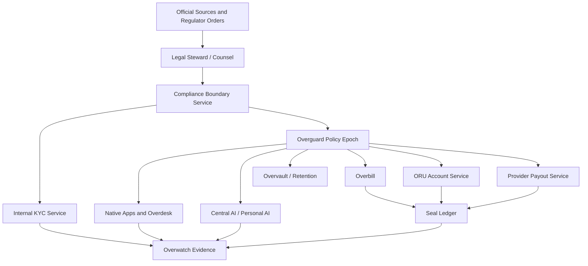

# Turkish Law Compliance Matrix

## Purpose

Overrid is not just a software stack. It includes identity, messaging, search, social media, directory listings, maps, AI assistants, wallets, credits, app deployment, public hosting, provider payouts, and a distributed resource grid. In Turkey, those surfaces touch multiple regulated areas.

This document converts the Turkish-law compliance question into a product and architecture checklist. It is not legal advice. Before public launch, Turkish counsel must review the classifications, thresholds, notification paths, regulator-facing procedures, and contracts.

Last source review: 2026-06-21.

## Compliance Position

Overrid should treat compliance as protocol behavior, not as manual after-the-fact cleanup.

```text
Law or regulator requirement
    -> legal-steward interpretation
    -> Compliance Boundary policy bundle
    -> signed Overguard policy epoch
    -> owner services enforce before action
    -> Overwatch evidence and Seal Ledger records where relevant
```

No regulator should need root access to the distributed grid. Lawful orders, takedowns, freezes, delays, retention duties, disclosure duties, and reporting duties should become signed, scoped, auditable facts that owner services enforce.

## Distributed Design, State Power, and Censorship Risk

This section answers the design questions that must stay visible while Turkish compliance is implemented:

- How does Turkish-law compliance affect Overrid design?
- Does it break the complete distributed structure?
- How much power does the state have over the system?
- What can the state do to censor, block, or pressure Overrid in a political way?

### How Turkish Compliance Affects Design

Turkish-law compliance changes the system boundary, not the core trust model. Overrid must add compliance-aware control points around Turkey-facing operations, payment/cash-out, public hosting, content distribution, search, app publishing, identity, KYC, and legal-order response.

The required design additions are:

- Compliance Boundary Service converts counsel-reviewed Turkish-law rules into jurisdiction-scoped policy bundles.
- Legal Order Gateway verifies court, prosecutor, regulator, KEP/UETS, MASAK, BTK, KVKK, cyber authority, and other competent-authority requests before any service acts.
- Overguard distributes signed policy epochs that services can verify locally.
- Overwatch records legal-order intake, steward approvals, enforcement decisions, appeal state, and evidence packages.
- Seal Ledger records financial freezes, releases, payout holds, settlement holds, and compliance-related credit state changes as append-only facts.
- Internal KYC and AML rules gate credit purchase limits, cash-out, provider payouts, source-of-funds review, related-party risk, and suspicious activity handling.
- Native apps, search, directory, social, messaging, maps, AI, and app publishing services must enforce prohibited-category and takedown policy before routing, indexing, ranking, monetizing, or displaying public content.

### Does Compliance Break Distribution?

No, if Overrid is designed correctly.

Compliance would break the distributed structure only if the state, a company admin, or a developer group received a hidden root key or direct database mutation path. That must not exist.

The protocol rule is:

```text
The state does not get root access.
The state does not mutate accounts directly.
The state does not rewrite ledger history.
The state does not silently edit public protocol facts.

Lawful orders become signed, scoped, auditable protocol facts.
Owner services enforce those facts through deterministic policy checks.
```

This means Turkish compliance makes the Turkey-facing deployment legally governed, but it should not make the whole protocol centrally controlled. The global protocol remains verifiable if clients, nodes, and services reject unsigned actions, out-of-scope legal facts, invalid policy epochs, and any ledger mutation that violates protocol invariants.

### How Much Power the State Has

The Turkish state can have significant practical power over Turkey-facing operations:

- Piyote/Overrid as a Turkish legal entity.
- Licensed payment, e-money, bank, and payout partners.
- Turkish ISPs, access providers, hosting providers, data centers, and local gateways.
- Turkish universities, public institutions, enterprise customers, and local node operators.
- App stores, device platforms, DNS/gateway endpoints, public domains, and local distribution channels.
- Tax, accounting, grant, consumer, employment, cyber, data-protection, telecom, and AML compliance processes.
- MASAK/legal freeze, transaction-delay, suspicious-activity, and asset-control duties where legally applicable.

That power is real. It can affect local access, company operations, cash-out, public distribution, service availability, and legal risk.

The state should not have automatic technical power over:

- Global protocol rules.
- Foreign or non-Turkey nodes that are outside Turkish legal reach.
- Cryptographic keys it does not own.
- End-to-end encrypted content that Overrid does not technically possess in plaintext.
- Append-only ledger history.
- User assets or credits except through valid, scoped legal-order facts enforced by the relevant owner service.

This distinction is critical. Turkish law may control the Turkey-facing legal perimeter. It should not become a hidden universal admin panel.

### What Political Censorship or Blocking Could Look Like

Overrid should assume political-pressure risk exists and design for visible, scoped, reviewable enforcement rather than pretending it cannot happen.

Possible Turkey-side pressure or blocking surfaces include:

- Domain, DNS, URL, gateway, IP, or route blocking through Turkish access providers.
- Orders to remove content, delist search results, disable listings, restrict accounts, block apps, or suppress public pages.
- Bandwidth throttling or access sanctions for social-network-like services if the service is classified under applicable Turkish rules and does not comply with binding orders.
- Pressure on Turkish payment, bank, e-money, and payout rails to block funding, refunds, cash-out, or settlement.
- Regulatory action against Piyote/Overrid, local partners, data centers, universities, or institution-operated nodes.
- App store or desktop-distribution pressure against the Overdesk client or native apps.
- Data preservation, traffic/log, incident, cybersecurity, tax, consumer, or AML information demands where legally valid.

Overrid cannot honestly promise that no government can block local access. A state can pressure domestic network, legal, and payment choke points. The stronger promise is narrower and more defensible:

```text
No hidden state root access.
No silent takedowns.
No direct account mutation.
No private-data disclosure unless legally valid and technically available.
No global protocol rewrite through a local legal order.

Every legal action is scoped, signed, logged, reviewable, appealable where lawful,
and reported in transparency summaries where legally allowed.
Turkey-specific restrictions stay Turkey-scoped wherever technically possible.
```

### Architecture Guardrails

To preserve public trust, Overrid must implement these guardrails:

| Guardrail | Design requirement |
| --- | --- |
| No root legal access | Regulators and state bodies submit legal orders through the Legal Order Gateway; they do not receive node, wallet, ledger, app, search, messaging, or database admin access. |
| Scoped legal facts | Every order identifies jurisdiction, authority, legal basis, subject, action, expiry/review time, affected asset/account/app/content, and appeal/dispute state. |
| Signed policy epochs | Overguard only accepts Compliance Boundary policy epochs signed by the required stewardship threshold. |
| Client-verifiable enforcement | Clients and nodes can verify that a freeze, delisting, takedown, or payout hold refers to a valid policy fact and has not exceeded its scope. |
| Append-only evidence | Overwatch and Seal Ledger keep immutable enforcement evidence; corrections and releases are new records, not history edits. |
| Regional containment | Turkey-specific takedowns, freezes, or access limits are projected to Turkish users, Turkish legal entities, Turkish payout rails, or Turkey-scoped gateways whenever technically possible. |
| Transparency and appeals | Publish aggregate transparency reports, support appeals through Overclaim, and expose reason codes unless disclosure is legally prohibited. |
| Minimum data disclosure | Disclose only what the order lawfully requires and what Overrid technically has; do not weaken encryption to create new disclosure capacity. |
| Multi-party control | Broad legal policy changes, emergency rules, or high-impact jurisdiction changes require stewardship threshold approval, not a single developer or company operator. |
| Abuse and rights balance | Trust and safety prohibitions, AML enforcement, child safety, and illegal-listing controls remain strict, but legal enforcement must still be logged and reviewable. |

## Immediate Launch Gates

| Gate | Why it matters | Must be true before public launch |
| --- | --- | --- |
| Payment and cash-out classification | ORU, wallet, Seal Ledger, credits, and provider payouts may trigger payment/e-money or AML obligations. | Counsel signs the 6493/MASAK classification; ORU-first internal settlement is preserved; cash-out runs only through licensed/approved rails; no anonymous cash-out exists. |
| Public hosting/content classification | Social, directory listings, search, messaging, app hosting, and namespace resolution may trigger 5651 duties. | Content/hosting/social-network roles are mapped; takedown, removal, evidence, log, and appeal paths are implemented. |
| Personal data and AI memory | Identity, KYC, location, messaging metadata, Docdex RAG, assistant context, and social media all process personal data. | KVKK data inventory, privacy notices, processing bases, retention/deletion, breach response, cross-border transfer controls, and child-data controls are implemented. |
| KYC/KYB and AML | Credits can be abused for laundering through fake apps and provider cash-out. | Internal KYC Service, AML rules, cooling periods, related-party graph checks, source-of-funds review, and regulatory freeze support are live. |
| Cybersecurity and incident handling | Overrid will operate critical distributed infrastructure and security-sensitive software. | Threat modeling, incident response, vulnerability handling, log integrity, access controls, and Turkish cyber authority obligations are mapped. |
| Tax, invoicing, and consumer rights | Users will buy credits and services; providers may earn revenue. | GIB e-document process, invoices, VAT/accounting treatment, refund/cancellation rules, consumer disclosures, and support workflows are ready. |

## Architecture Flow



## Compliance Matrix

| Law / regulator area | Applies to Overrid surfaces | Required controls | Primary owners |
| --- | --- | --- | --- |
| KVKK Law No. 6698 and secondary guidance | Overpass identity, Overdesk, personal AI, central AI, messaging, social media, maps/location, directory listings, search, encrypted Docdex RAG, KYC/KYB, analytics, logs. | Data inventory; privacy notices; lawful processing basis; explicit consent where required; purpose limitation; minimization; retention/deletion; DSAR handling; breach process with KVKK Board notification when required; special-category data controls for biometrics, health, criminal, location-sensitive, and child data; cross-border transfer mechanism such as adequacy, standard contracts, or other legal basis. | Compliance Boundary, Overpass, Overvault, Internal KYC, native apps, AI Gateway, Personal AI, Overwatch. |
| 5651 internet publications, hosting, access, and social-network duties | Public app hosting, Overpack deployments, universal namespace, social photo/video app, directory listings, search engine, messaging public channels, user-generated pages, app pages. | Role classification for content provider, hosting provider, access provider, and social network provider; takedown/removal workflow; access-blocking order enforcement through signed policy facts; complaint intake; traffic/log retention where applicable; integrity-protected evidence; personal-right and privacy request handling; public-content moderation; appeal path. | Compliance Boundary, Overguard, Directory Listings, Search Engine, Social App, Messaging Center, Overvault, Overwatch. |
| Law No. 7545 Cyber Security Law and cyber authority obligations | Whole grid, node software, Overdesk node enrollment, Overgate, Overcell, Overmesh, Overpack, Overvault, identity, key management, public services, security products. | Counsel review of scope and secondary regulations; vulnerability disclosure process; cyber incident reporting path; asset inventory; secure software lifecycle; critical-service risk classification; audit logs; SOME/CSIRT model if required; cooperation workflow for official cyber authority requests; no uncontrolled export or sale of regulated cyber tools. | Threat Modeling and Security Review Tracker, Incident Response, Overwatch, Overkey, Overguard, Overvault, Release Strategy. |
| Law No. 6493 payment services and electronic money, TCMB | Wallet, ORU, Seal Ledger, Overbill, credit buy screen, provider payouts, mobile gateway, 402-style machine payments, app monetization. | Formal legal classification of ORU and credits; preserve the ORU-first internal economy where apps, native services, subscriptions, in-app purchases, one-time charges, paid unlocks, resource usage, and machine-to-machine calls are paid in ORU; publisher terms and user-facing Terms of Service must prohibit app-level third-party payment collection; if that triggers payment/e-money licensing, use a licensed payment/e-money partner or obtain authorization instead of weakening ORU-only settlement; do not let users cash out bought ORU; no anonymous redemption or cash-out; fund safeguarding model if required; payment-provider reconciliation; chargeback/dispute path; no per-transaction blockchain-fee framing. | Overbill, ORU Account Service, Seal Ledger, Provider Payout, Wallet and Usage Center, Compliance Boundary. |
| MASAK AML/CFT/PF: Laws No. 5549, 6415, 7262 and MASAK regulations/guides | Credit funding, provider earnings, app monetization, cash-out, refunds, suspicious usage, fake-app laundering, high-value credit purchases, legal freezes. | KYC/KYB before payout; beneficial-owner checks; source-of-funds/source-of-wealth review; active threshold policy bundles; connected-transaction aggregation; no anonymous cash-out; no direct cash-out of bought credits; cooling periods; fake-app laundering detection; suspicious activity evidence; no tipping off; MASAK/legal freeze and transaction-delay support through signed legal-order facts. | Internal KYC, AML Rules, Fraud Control, Overbill, ORU Account Service, Seal Ledger, Provider Payout, Regulatory Freeze architecture. |
| Consumer Protection Law No. 6502, distance contracts, subscriptions, digital services | Credit purchases, native app paid services, workspace subscriptions, AI usage packages, app marketplace, directory paid listings, provider services. | Pre-contract information; clear pricing; tax-inclusive totals where required; terms that avoid unfair clauses; clear disclosure that app subscriptions, in-app purchases, one-time purchases, paid unlocks, paid listings, and service-unit charges are collected in ORU only; cancellation/refund/withdrawal handling for applicable digital services; subscription renewal/cancellation controls; service support; complaint and dispute records; chargeback alignment. | Overbill, Wallet and Usage Center, Overdesk, Provider Payout, native apps, Overclaim. |
| Electronic Commerce Law No. 6563, ETBIS, IYS, marketplace/intermediary rules | Directory listings, app marketplace, native app services, commercial messages, provider pages, search ads or paid reach, social commerce if ever allowed. | ETHS/ETAHS role classification; ETBIS registration if applicable; seller/provider verification; commercial electronic message consent and opt-out through IYS where required; transparent ranking/paid placement; marketplace terms that ban external checkout bypass by app publishers; transaction records; ad disclosure. | Directory Listings, Search Engine, Messaging Center, Social App, Overbill, Compliance Boundary. |
| Tax law: VUK No. 213, VAT Law No. 3065, Corporate Tax No. 5520, Income Tax/withholding rules, GIB e-documents | Credit sales, invoices, provider payouts, native app revenue, donations, grants, university contracts, marketplace commissions, employee/contractor payments. | e-Fatura/e-Arsiv/e-Defter or applicable e-document workflow; VAT treatment; revenue recognition; provider invoice/receipt collection; payout withholding review; grant/donation accounting; audit trail; separation between non-profit-oriented pricing policy and taxable commercial facts. | Overbill, Provider Payout, Seal Ledger, Stewardship Reporting, accounting ops. |
| Turkish Penal Code No. 5237, Criminal Procedure Law No. 5271, illegal betting Law No. 7258, narcotics/trafficking/child-safety laws | Trust and safety across social, directory, messaging, search, maps, hosting, AI, wallet, payments, public apps. | Permanent prohibition of porn, casinos, betting, gambling, wager-like products, underage sexual content, trafficking, illegal drugs, illegal weapons, fraud, stolen data, malware, and laundering flows; detection and reporting workflow; evidence preservation; lawful response to prosecutor/court orders; emergency containment; appeal only where lawful and safe. | Trust Safety, Compliance Boundary, Overguard, Overwatch, Fraud Control, Directory, Search, Messaging, Social App, Internal KYC. |
| Intellectual property: FSEK No. 5846 and Industrial Property Law No. 6769 | Social media uploads, workspace documents, app packages, overassets, maps data, search index, AI/RAG outputs, branding, app names. | Rights metadata; upload and app-publisher warranties; takedown/dispute workflow; repeat-infringer handling; license provenance for app assets and datasets; no monetization while rights dispute is unresolved; trademark/name conflict review for namespaces and native apps. | Overasset, Overpack, Search Engine, Social App, Workspace, Universal Namespace, Overclaim. |
| Electronic Signature Law No. 5070, KEP, UETS, official notice channels | Legal orders, contracts, provider agreements, university agreements, high-risk approvals, revenue-share contracts, regulator communications. | Qualified e-signature validation where required; KEP/UETS intake for legal notices; timestamping; signature-chain evidence; legal-order gateway; non-repudiation for approvals; contract authority records. | Legal Order Gateway, Compliance Boundary, Overwatch, Overvault, stewardship ops. |
| Electronic Communications Law No. 5809 and BTK telecom rules | Merged messaging center, username-based replacement for email/phone/Discord-like contact, SMS/phone bridges, push messaging, routing, possible telecom-like services. | Legal classification before offering telecom-like services; avoid regulated electronic communications services unless authorized or partnered; no PSTN/SMS/numbering service without licensed partner; metadata privacy; lawful request workflow; service quality/availability claims review. | Messaging Center, Overgate, Mobile Backend Gateway, Compliance Boundary, Incident Response. |
| Competition Law No. 4054 and digital market fairness | Native apps, search ranking, directory ranking, app marketplace, provider onboarding, payment rails, public resource grid, AI routing. | No self-preferencing hidden inside ranking; transparent marketplace terms; provider portability; open APIs/SDKs where feasible; non-discriminatory access to native service rails; audit ranking changes; avoid tying wallet/search/social/workspace in abusive ways; publish stewardship reports. | Search Engine, Directory Listings, App Marketplace/Overdesk, Stewardship Reporting, Compliance Boundary. |
| Commercial contracts: Turkish Commercial Code No. 6102 and Turkish Obligations Code No. 6098 | Piyote/Overrid corporate structure, provider agreements, university agreements, advisor/revenue-share agreements, native app terms, enterprise contracts. | Contract authority; versioned terms; signatures; approval records; ORU-only publisher monetization covenant; liability boundaries; IP ownership/assignment; revenue-share accounting; dispute venue; audit rights; termination/offboarding terms. | Stewardship ops, Overclaim, Overwatch, Overvault, legal operations. |
| Employment, social security, and occupational safety: Laws No. 4857, 5510, 6331 | Core team hiring, contractors, TUBITAK-funded staff, university project staff, remote/office work, node maintenance workers if any. | Employee vs contractor classification; SGK registration and payroll; timesheets for grant projects; occupational health and safety duties; confidentiality/IP assignment; termination planning; no unrecorded work on funded projects. | People ops, TUBITAK project ops, Stewardship Reporting, accounting ops. |
| TUBITAK/TEYDEB grant, R&D incentive, technopark, university cooperation rules | TUBITAK 1501 projects, university compute network pilot, R&D expense claims, personnel budgets, academic/advisor involvement. | Eligible expense tracking; personnel allocation evidence; procurement documentation; project deliverables; audit-ready records; no double funding; university data controller/processor contracts; separation of company shares from revenue-share/advisor contracts. | TUBITAK docs, accounting ops, Overwatch evidence, Stewardship Reporting. |
| Advertising, rankings, and dark-pattern restrictions under consumer/e-commerce/advertising rules | Search ads, directory paid promotion, social reach, app pages, AI recommendations, credit purchase screens. | Ad labels; no disguised paid ranking; no manipulative credit-buy flows; no addictive recommendation loops; clear cancellation; no child-targeted manipulative ads; ranking explanation and audit records. | Search Engine, Directory Listings, Social App, Overdesk, Central AI, Compliance Boundary. |
| Maps, location, and public data licensing | Maps/navigation app, directory locations, live route data, university/private campus maps, community POI edits. | Location minimization; opt-in background location; retention limits; export/deletion; source-license tracking for map data; exact-location protection for private users; safe routing disclaimers; abuse controls for stalking/harassment. | Maps and Navigation, Directory Listings, Overvault, Overguard, Personal AI. |

## Service Enforcement Rules

Compliance checks must be enforced before the action, not only reported after the action.

| Action | Required pre-check |
| --- | --- |
| Buy credits | Overbill verifies payment provider status, active funding cap, KYC tier if needed, tax invoice path, and consumer disclosures. |
| Spend credits | ORU Account Service verifies credits are spendable, not frozen, not dispute-held, and not prohibited-category spend; internal app, native-service, subscription, in-app purchase, one-time, paid unlock, resource, and machine-to-machine payments use ORU. |
| Earn provider ORU | Provider Payout and ORU services verify app legitimacy, actual service delivery, dispute window, related-party risk, and policy allow facts. |
| Cash out | Provider Payout requires KYC/KYB, beneficial-owner checks, payout destination ownership, AML allow fact, cooling-period expiry, no legal freeze, and proof that the cash-out is provider-earned ORU rather than bought ORU. Do not let users cash out bought ORU. |
| Publish app or listing | Overpack/Directory verifies prohibited-category policy, provider identity tier, content class, 5651 role handling, moderation route, accepted ORU-only monetization terms, and absence of external checkout/payment bypass. |
| Index public content | Search Engine verifies permission, takedown state, rights metadata, private-data redaction, and prohibited-category blocklist. |
| Send message | Messaging Center verifies account status, contact permission, spam/abuse limits, legal hold state, and encryption policy. |
| Use AI/RAG | AI Gateway verifies user grant, context scope, data residency/transfer policy, model class, logging/redaction, and no unsafe tool side effects. |
| Process legal order | Legal Order Gateway verifies source, signature, scope, legal basis, steward approval, Overguard policy epoch, and Overwatch evidence. |

## Documents This Matrix Depends On

- [Overrid AML Rules](aml_rules.md)
- [App Monetization Terms Policy](app_monetization_terms_policy.md)
- [Regulatory Freezes Without Breaking Distribution](regulatory_freeze_distributed_system.md)
- [Trust and Safety Abuse Prevention](trust_safety_abuse_prevention.md)
- [SDS #76 - Compliance Boundary Service](sds/governance_ops/compliance_boundary_service.md)
- [SDS #85 - Internal KYC Service](sds/governance_ops/internal_kyc_service.md)
- [Phase 13: Governance, Compliance, and Scale Hardening](build_plan/phase_13_governance_compliance_scale_hardening.md)

## Open Legal Review Questions

These must be answered before a public Turkey launch:

1. Are ORU credits, wallet balances, Seal Ledger settlement, third-party app payments, subscriptions, provider payouts, or 402-style machine payments within Law No. 6493 as payment service/e-money, and which licensed-partner or Overrid-licensed structure best preserves ORU-first internal settlement?
2. Which Overrid entities are content provider, hosting provider, social network provider, marketplace intermediary, or access/electronic communications provider under Turkish law?
3. Which Overrid services require ETBIS/IYS registration, commercial-message consent, or marketplace threshold reporting?
4. What exact MASAK obliged-party classification applies to Piyote/Overrid and which obligations can be delegated to licensed payment/e-money partners?
5. Which KYC method is legally acceptable for Turkish users, especially if biometric liveness, OCR identity verification, or foreign vendors are used?
6. What cybersecurity authority notifications, certifications, audits, or incident reports apply under Law No. 7545 and its secondary regulations?
7. What tax treatment applies to ORU credit purchases, provider payouts, native-app surplus donations, grant-funded development, and university contracts?
8. Which data transfers leave Turkey when AI models, RAG indexes, cloud nodes, foreign providers, or global federation nodes process user data?
9. What child-safety age-assurance, parental consent, and content moderation duties apply to social, messaging, maps, search, AI, and directory services?
10. What contract structure best separates Piyote shares, Overrid project revenue share, university collaboration, advisor compensation, and TUBITAK deliverables?

## Source Links

Primary sources and regulator pages used for this matrix:

- KVKK home and breach notification: <https://www.kvkk.gov.tr/> and <https://www.kvkk.gov.tr/Icerik/5362/Veri-Ihlali-Bildirimi>
- KVKK cross-border transfer guidance: <https://www.kvkk.gov.tr/Icerik/8143/Kisisel-Verilerin-Yurt-Disina-Aktarilmasi-Rehberi>
- KVKK biometric-data guidance and 2026 biometric decision: <https://www.kvkk.gov.tr/SharedFolderServer/CMSFiles/bd06f5f4-e8cc-487e-abe1-d32dc18e2d7e.pdf> and <https://www.kvkk.gov.tr/Icerik/8762/mesai-takibi-amaciyla-biyometrik-veri-islenmesi-hakkinda-kisisel-verileri-koruma-kurulunun-29-04-2026-tarihli-ve-2026-921-sayili-ilke-kararina-iliskin-kamuoyu-duyurusu>
- BTK internet law and hosting-provider pages: <https://internet.btk.gov.tr/turkiye-de-internet-hukuku> and <https://internet.btk.gov.tr/yer-saglayici-listesi>
- TCMB payment services and Law No. 6493 pages: <https://www.tcmb.gov.tr/wps/wcm/connect/TR/TCMB%2BTR/Main%2BMenu/Temel%2BFaaliyetler/Odeme%2BHizmetleri> and <https://www.tcmb.gov.tr/wps/wcm/connect/TR/TCMB%2BTR/Main%2BMenu/Banka%2BHakkinda/Mevzuat/6493/>
- MASAK obligations and law pages: <https://masak.hmb.gov.tr/yukumlulukler>, <https://masak.hmb.gov.tr/5549-sayili-suc-gelirlerinin-aklanmasinin-onlenmesi-hakkinda-kanun-2/>, and <https://masak.hmb.gov.tr/6415-sayili-terorizmin-finansmaninin-onlenmesi-hakkinda-kanun/>
- Ticaret Bakanligi e-commerce and consumer pages: <https://ticaret.gov.tr/ic-ticaret/elektronik-ticaret/mevzuat>, <https://etbis.ticaret.gov.tr/>, <https://tuketici.ticaret.gov.tr/yayinlar/tuketici-bilgi-rehberi/mesafeli-sozlesmeler-hakkinda-bilgilendirme>, and <https://tuketici.ticaret.gov.tr/yayinlar/tuketici-bilgi-rehberi/abonelik-sozlesmeleri-hakkinda-bilgilendirme>
- GIB e-document portal: <https://ebelge.gib.gov.tr/>
- EGM cybercrime overview and FAQ: <https://www.egm.gov.tr/siber/sibersucnedir> and <https://www.egm.gov.tr/siber/sikca-sorulan-sorular>
- BTK e-signature FAQ: <https://www.btk.tr/e-imza-ile-ilgili-sikca-sorulan-sorular>
- Rekabet Kurumu Law No. 4054 and digital markets material: <https://www.rekabet.gov.tr/tr/Sayfa/Mevzuat/4054-sayili-kanun> and <https://www.rekabet.gov.tr/Dosya/dijital-piyasalar-calisma-metni.pdf>
- Telif Haklari and Turk Patent pages: <https://www.telifhaklari.gov.tr/> and <https://www.turkpatent.gov.tr/mevzuat>
- SGK and Calisma Bakanligi employment/OHS pages: <https://sgk.gov.tr/Content/Post/d9d838d8-6585-40f5-bbcc-47bd43c59bb4/Isverenin-Yukumlulukleri-2022-05-15-06-17-29>, <https://www.csgb.gov.tr/Media/crldhi51/4857-say%C4%B1l%C4%B1-i%C5%9F-kanunu.pdf>, and <https://www.csgb.gov.tr/Media/fldk2co0/6331_isgkanunu_tr.pdf>
- Cyber Security Law No. 7545 official publication path to verify with counsel: <https://www.resmigazete.gov.tr/eskiler/2025/03/20250319-1.htm>
