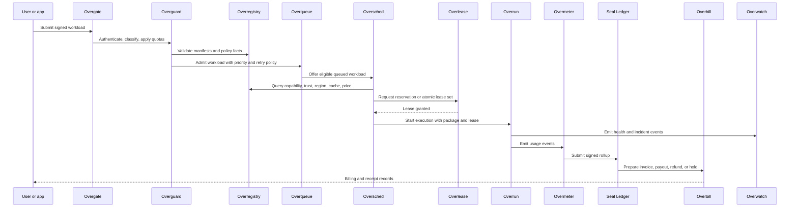
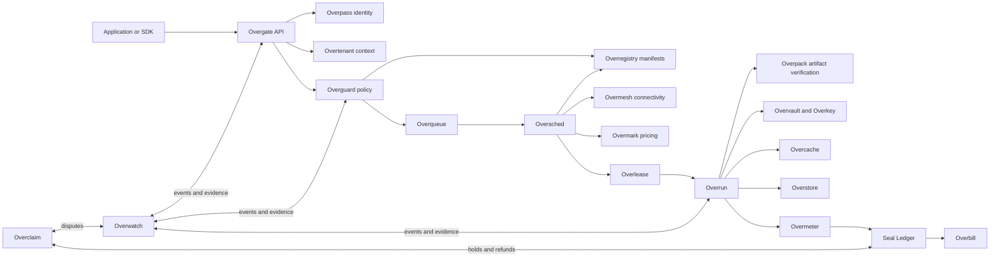
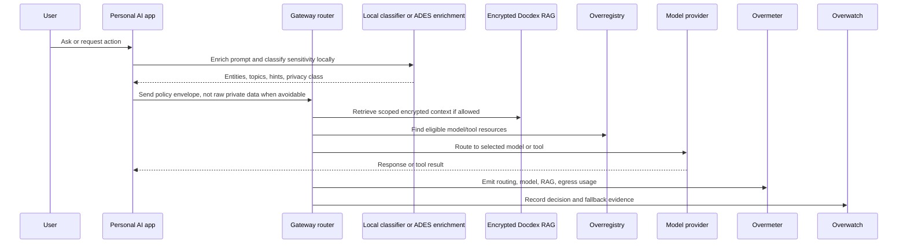
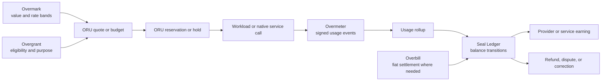

# Overrid White Paper

Programmable Resource Allocation for Local-First AI Infrastructure

## Table of Contents

1. [Executive Summary](#1-executive-summary)
2. [Problem and Design Goals](#2-problem-and-design-goals)
3. [System Overview](#3-system-overview)
4. [Ecosystem Layers](#4-ecosystem-layers)
5. [Core Components to Build](#5-core-components-to-build)
6. [Native Applications and Public Services](#6-native-applications-and-public-services)
7. [Resource and Workload Model](#7-resource-and-workload-model)
8. [Overgrant: Programmable Resource Allocation](#8-overgrant-programmable-resource-allocation)
9. [Workload Lifecycle](#9-workload-lifecycle)
10. [How Components Communicate](#10-how-components-communicate)
11. [Personal AI Assistant, Encrypted RAG, and Model Routing](#11-personal-ai-assistant-encrypted-rag-and-model-routing)
12. [Trust, Security, and Governance](#12-trust-security-and-governance)
13. [Economics and Stewardship](#13-economics-and-stewardship)
14. [Primary Use Cases](#14-primary-use-cases)
15. [Implementation Roadmap](#15-implementation-roadmap)
16. [Specification Work Remaining](#16-specification-work-remaining)
17. [Conclusion](#17-conclusion)

## 1. Executive Summary

Overrid exists to fix the broken internet.

The current internet is no longer just a communication network. It has become an extraction machine: a small number of dominant platforms control identity, discovery, marketplaces, communication, cloud infrastructure, AI access, workplace tools, and personal data. Their incentives reward addiction loops, surveillance, monopoly rents, artificial scarcity, and endless centralized infrastructure spending that ordinary people and small businesses are forced to fund.

Overrid is a proposed infrastructure protocol and product ecosystem for turning distributed compute, storage, network capacity, AI models, data services, identities, and resource rights into programmable infrastructure owned and governed for human benefit.

The central claim of this paper is simple: infrastructure should serve humanity, not harvest it.

The system builds on the local-first direction represented by mSwarm: users and organizations keep useful work close to their own devices and private nodes, while shared services provide identity, synchronization, collaboration, discovery, routing, and optional marketplace access.

Overrid extends that foundation into a broader resource allocation network. It does not treat infrastructure only as private capacity or marketplace capacity. A resource owner can reserve capacity, sell it, donate it, sponsor an organization, assign it to a trusted swarm, or route it to a verified cause such as science, education, open source, medicine, or climate research.

The strongest primitive is Overgrant. Overgrant turns resource allocation into policy. It lets owners express who may use their resources and why, while the rest of the Overrid stack enforces identity, trust, scheduling, metering, billing, verification, and dispute rules.

The native application layer is part of the vision, but it is not a shortcut around the protocol. Central AI, personal AI, wallet, messaging, social photo/video, maps, workspace, search, and directory listings should be public utility surfaces for everyday life, not new walled gardens. They should all use the same identity, metering, billing, privacy, audit, and policy controls as any other Overrid application.

Native services can collect fees where real resource or operational costs exist, but they should be non-profit oriented. Pricing should nearly match cost, with a modest safety buffer for support, fraud, refunds, taxes, reserves, legal obligations, and operational risk. Extra earnings should route to central AI stewardship for donations, scientific research, open technical work, public-interest projects, and ecosystem investment.

Overrid also rejects the idea that a public digital economy must be built on speculative blockchain tokens, NFT bubbles, or per-transaction tolls. ORU credits, Seal Ledger, and Overasset are utility primitives: they are designed for low-friction accounting, ownership, resource rights, and machine-to-machine settlement, not for speculation.

The deployment model starts with seed hardware, not permanent founder dependence. The first servers and GPUs can host the initial control plane, development workloads, and private execution pool. As the grid matures, the core backbone itself must become grid-resident: Overrid, Overcell, Overgate, Overregistry, Overtenant, Overqueue, Oversched, Overlease, Overmeter, Overwatch, Oververify, Overbill, and related system services should run as protected system workloads across trusted grid nodes rather than depending indefinitely on the founder's own machines.

## 2. Problem and Design Goals

The internet's deepest failure is ownership. The systems that mediate daily life are increasingly controlled by companies whose business models depend on capturing attention, extracting personal information, selling behavioral access, controlling marketplaces, and charging tolls on basic digital work. This is not a minor user-experience problem. It is a civic, economic, and technological failure.

Extractive platforms create unhealthy dependency by design. They optimize feeds, notifications, rankings, ads, and marketplaces for profit rather than human autonomy. They collect personal and organizational data, convert that data into leverage, and use the leverage to deepen lock-in. They make small and medium-sized businesses pay more and more for visibility inside marketplaces they do not control. They turn communication, work, hosting, AI usage, search, discovery, and distribution into rent streams.

The new AI infrastructure race makes the problem worse. Instead of reducing waste, the dominant direction asks society to pay for enormous centralized data centers, GPU clusters, training runs, speculative mega-projects, and circular investment narratives between the largest technology actors. The result is a system where users, businesses, workers, and public institutions absorb the cost while the control remains concentrated.

Speculative crypto repeated the same mistake in another form. Conventional blockchains turned accounting and coordination into asset markets, fee markets, token games, and governance by financial pressure. NFTs repeated that failure for ownership: instead of making digital rights practical, they became speculative receipts around scarcity, hype, and resale expectations. That model is not fit for a governing currency or ownership layer inside a human utility network.

Overrid rejects that direction. The goal is not to build another hyperscale platform. The goal is to build a distributed infrastructure and native application layer owned by humanity itself: a system where identity, compute, storage, AI, messaging, search, work tools, discovery, and public services are governed as shared infrastructure rather than as machinery for extracting value from people.

Modern AI infrastructure has four structural problems.

First, useful compute is fragmented. Personal devices, workstations, university clusters, company servers, and idle GPUs are often underused because they are not easy to expose safely.

Second, private context is trapped. The most valuable AI context often lives in private files, source code, business systems, research corpora, logs, operational memory, and local databases. Sending all of it to a third-party cloud is expensive, risky, and sometimes legally impossible.

Third, resource ownership is too simple. Most systems assume a resource is either privately used or sold. Real owners may want to reserve capacity for themselves, sponsor a university, donate to cancer research, support open source, or share within a family or community cloud.

Fourth, marketplaces are fragile without trust. A public pool of unknown hardware can create fraud, data leakage, payment risk, abuse, chargebacks, and quality problems unless identity, workload class, package provenance, verification, metering, and dispute handling are first-class.

Overrid is designed around the following goals:

- Resource sovereignty: owners decide what to expose and under which policy.
- Local-first privacy: private data and sensitive workloads stay local or inside trusted swarms by default.
- Trust-aware placement: workload class, tenant policy, region, cost, data sensitivity, and provider trust determine placement.
- Programmable allocation: resources can be reserved, sold, sponsored, donated, or routed by verified tags.
- Explicit lifecycle control: workloads, queues, leases, execution, metering, settlement, billing, and disputes have durable state transitions.
- Measured economics: usage is metered, priced, billed, audited, refunded, and settled through explicit records.
- Native public utility layer: first-party ecosystem services exist for everyday use, but remain application clients of Overrid rather than privileged exceptions.
- Human ownership: the backbone and native applications should be governed for public benefit, not for extracting attention, personal data, marketplace rents, or monopoly control.

## 3. System Overview

Overrid should be understood as a resource control plane above local-first AI tools and below native applications.

mSwarm provides shared runtime direction for local-first AI tools. It can coordinate identity sessions, sync, collaboration, cloud coordination, web discovery, and cross-application hooks. Mcoda, Docdex, and Codali are natural early applications in that direction.

Overrid defines the resource layer. It answers questions such as:

- Who owns this resource?
- What is the resource capable of?
- Which identities, organizations, swarms, tags, or tenants may use it?
- What workload classes may run on it?
- What does it cost?
- What evidence proves it ran correctly?
- How is usage billed, settled, disputed, or refunded?

Overrid has three operating modes:

- Private swarm: known nodes owned or approved by one tenant.
- Trusted federation: multiple known organizations share approved capacity under explicit policies.
- Public low-sensitivity pool: unknown or semi-trusted providers can run capped workloads that do not require private-data guarantees.

The public pool is not the starting point. The safe path is to prove private execution, policy, metering, billing, and failure handling first, then expand toward trusted federation and limited public supply.

### Bootstrap and Backbone Independence

Overrid has a bootstrap problem: a grid cannot fully host itself before the first control plane and first resource nodes exist. The practical answer is a staged seed model.

At the beginning, founder-operated servers and GPUs can run the initial Overrid control plane, the first Overcell nodes, development environments, model workloads, Docdex indexes, and early native services. This is acceptable for development and private-swarm proof because the nodes are known, physically controlled, and easier to debug.

That seed hardware must not become the permanent backbone. The steady-state architecture should treat core Overrid services as protected grid workloads:

- Core services run inside the grid under a special system-service workload class.
- System-service placement is restricted to trusted, verified, high-availability nodes, not arbitrary public providers.
- The control plane is replicated across multiple independent nodes with signed state changes, durable backups, quorum or leader-election rules, and disaster-recovery procedures.
- Founder hardware may remain a trusted provider, recovery anchor, or development environment, but the ecosystem must continue operating without requiring the founder's servers to carry normal production load.
- Public low-sensitivity nodes may supply ordinary compute after trust controls mature, but they should not host critical backbone authority until they meet stronger verification and governance requirements.

This means the initial question is not whether the first hardware can run the required systems. It can. The deeper requirement is that every core service is designed from the beginning to migrate from seed deployment into self-hosted grid deployment.

## 4. Ecosystem Layers

```mermaid
flowchart TB
    subgraph Apps["Native and ecosystem applications"]
        CentralAI["Central AI"]
        PersonalAI["Personal AI assistant"]
        Wallet["Wallet"]
        Messaging["Messaging center"]
        Social["Photo/video social"]
        Maps["Maps and navigation"]
        Workspace["Workspace and office"]
        Search["Search"]
        Directory["Directory listings"]
        Mcoda["Mcoda"]
        Docdex["Docdex"]
        Codali["Codali"]
    end

    subgraph Runtime["Shared local-first runtime"]
        MSwarm["mSwarm identity, sync, discovery, collaboration"]
    end

    subgraph Control["Overrid resource control plane"]
        Overpass["Overpass identity"]
        Overtenant["Overtenant tenancy"]
        Overgate["Overgate API ingress"]
        Overregistry["Overregistry manifests"]
        Overguard["Overguard policy"]
        Oversched["Oversched placement"]
        Overmeter["Overmeter usage"]
    end

    subgraph Execution["Execution and data plane"]
        Overcell["Overcell resources"]
        Overqueue["Overqueue durable queue"]
        Overlease["Overlease reservations"]
        Overpack["Overpack packages"]
        Overrun["Overrun execution"]
        Overmesh["Overmesh networking"]
        Overbase["Overbase metadata"]
        Overvault["Overvault secrets"]
        Overcache["Overcache reuse"]
        Overstore["Overstore durable data"]
    end

    subgraph Economy["Economics, trust, and governance"]
        Overgrant["Overgrant allocation policy"]
        Oververify["Oververify attestation"]
        Overwatch["Overwatch audit and incidents"]
        Overmark["Overmark pricing"]
        SealLedger["Seal Ledger accounting"]
        Overbill["Overbill fiat billing"]
        Overclaim["Overclaim disputes"]
        Stewardship["Central AI stewardship"]
    end

    Apps --> Runtime
    Runtime --> Control
    Control --> Execution
    Execution --> Economy
    Economy --> Control
```



The layers are intentionally separated:

- Applications request work and pay for resources.
- mSwarm coordinates shared local-first application runtime concerns.
- Overrid controls resource identity, manifests, policy, scheduling, and metering.
- Execution services run workloads and manage data.
- Economic and governance services account for value, verify trust, settle usage, and handle disputes.

## 5. Core Components to Build

The component names define ownership boundaries. They do not require separate microservices in the first implementation. The initial build should be a modular control plane, local node agent, and durable stores. Components can become separately deployed services only after their APIs and operational load are proven.

| Component | Role |
| --- | --- |
| Overrid | Umbrella protocol and ecosystem for programmable resource allocation. |
| mSwarm | Shared runtime for local-first AI tools: identity sessions, sync, collaboration, discovery, and cloud coordination hooks. |
| Overpass | DID-compatible identity and namespace layer for people, organizations, nodes, swarms, communities, workloads, and tags. |
| Overtenant | Tenant, subtenant, role, quota, suspension, private-swarm, white-label, and offboarding boundary. |
| Overgate | Developer/admin API ingress, authentication, request signing, idempotency, rate limiting, quota checks, and ingress audit. |
| Overregistry | Registry for resource manifests, workload manifests, package manifests, provider records, tag definitions, and public catalogs. |
| Overcell | Unit abstraction for participant-owned compute, storage, network, data, model, or service capacity. |
| Overqueue | Durable workload queue, backpressure, priority lanes, retry orchestration, deadlines, and dead-letter handling. |
| Oversched | Policy-aware scheduler that chooses placements from availability, trust, cost, data locality, and lease facts. |
| Overlease | Short-lived reservations, concurrency locks, atomic lease sets, renewal, cancellation, and stale-lease cleanup. |
| Overpack | Package and artifact manifest layer for applications, services, images, WASI modules, model bundles, datasets, SBOMs, dependency locks, signatures, runtime contracts, routes, storage, database, security, billing, scaling, and geographic intent. |
| Overrun | Sandbox preparation, pre-flight checks, execution supervision, credential mounting, result handoff, and safe termination. |
| Overmesh | Connectivity, namespace resolution, service discovery, peer discovery, NAT traversal, artifact transfer, priority bandwidth leases, geographic routing, and traffic shaping. |
| Overbase | Distributed application state substrate for documents, key-value records, event streams, vector indexes, schemas, indexes, replication, and consistency policies. |
| Overvault | Secure storage for sensitive material, encrypted state, secrets, escrowed records, private app data, and protected access policies. |
| Overcache | Reuse layer for artifacts, model outputs, datasets, indexes, repeated workloads, static assets, API responses, model files, dataset chunks, and runtime snapshots. |
| Overstore | Durable content-addressed persistence for long-lived user data, media, workspace files, research outputs, directory data, packages, datasets, models, snapshots, backups, and storage leases. |
| Overkey | Key management, credential lifecycle, delegated access, signatures, rotation, and revocation. |
| Overguard | Policy enforcement for workload admission, data sensitivity, sandboxing, compliance, egress, secret access, and abuse prevention. |
| Oververify | Provider attestation, benchmarking, certification, workload result checks, challenge protocols, and trust scoring. |
| Overwatch | Observability, incident tracking, audit events, health, uptime, reputation signals, and compliance evidence. |
| Overmeter | Usage events and signed rollups for compute, storage, bandwidth, requests, execution time, RAG retrieval, model inference, and app services. |
| Overmark | Resource valuation, pricing, marketplace offers, reference price bands, and rate discovery. |
| Overgrant | Reservation, sponsorship, donation, purpose tags, quotas, and priority allocation. |
| ORU credits | Overrid Resource Unit credits: the non-speculative internal credit unit for resource usage, grants, refunds, holds, service charges, and HTTP 402-style machine-to-machine settlement. ORU is not a blockchain token. |
| Overasset | Operational ownership and resource-right abstraction for resources, credits, reservations, capacity claims, storage leases, grants, and transferable utility rights if legally enabled. Overasset is not an NFT. |
| Seal Ledger | Append-only internal accounting for ORU balances, usage rollups, holds, corrections, settlement state, audit evidence, and policy-driven dispute history. Seal Ledger is not a blockchain. |
| Overbill | Fiat billing, invoices, payment-provider integration, taxes, refunds, chargebacks, cash-out, and payout holds. |
| Overclaim | Disputes, evidence, escrow, challenge windows, refunds, slashing, and settlement-finality handling. |

### Data, Storage, and Addressing Primitives

The older white paper had a stronger view of the data plane. The current architecture should keep that insight: Overrid should not only schedule compute. It should make application state, files, vectors, events, models, datasets, packages, and routes part of the same resource system.

Overbase should support multiple data models through one policy-aware substrate:

| Overbase model | Purpose |
| --- | --- |
| Document collections | Profiles, app records, workspace objects, listings, content, and ordinary application data. |
| Key-value collections | Sessions, counters, configuration, locks, short-lived state, and fast lookup data. |
| Event streams | Activity feeds, audit records, workload history, application events, AI memory, and replayable state transitions. |
| Vector indexes | Embeddings, semantic search, RAG retrieval, entity memory, and hybrid AI search. |

Different collections should be able to request different consistency models: eventual for social/content data, session consistency for ordinary SaaS and AI applications, strong consistency for critical state, and ledger-grade consistency for accounting, ownership, and settlement records. Overbase should hide sharding, indexing, replication, recovery, and geo-placement from application developers while still exposing enough policy for regulated or latency-sensitive workloads.

Overstore and Overvault should split storage concerns clearly. Overstore is the durable content-addressed object layer for packages, files, datasets, model weights, backups, research archives, media, and runtime snapshots. Overvault is the protection layer for secrets, encryption policies, private state, escrowed records, and controlled access. Stored objects should be encrypted before placement, chunked for parallel transfer, content addressed for integrity and deduplication, replicated or erasure-coded for durability, and challenged through proof-of-storage or equivalent verification where provider trust requires it. Repair should be automatic when redundancy drops below policy.

The universal namespace is also a missing first-class primitive. Overpass should not only identify people and organizations; it should provide human-readable names for people, organizations, applications, services, AI agents, swarms, communities, purpose tags, assets, and routes. Names such as `/bekir`, `/mcoda`, `/science`, `/search`, or `/newton` should resolve through Overpass, Overasset, Seal Ledger, Overmesh, and service manifests into the right identity, application, service, route, or ownership record. This replaces fragmented addressing with one semantic layer for humans and AI agents.

Namespace records should be treated as operational rights, not speculative collectibles. A namespace record can control routing, delegation, service association, transfer, and discovery. Governance should prevent squatting, impersonation, fraud, and abusive extraction while preserving the core benefit: people and agents interact with names, while Overrid manages the underlying identifiers, routes, ownership evidence, and service endpoints.

## 6. Native Applications and Public Services

Overrid should ship with native applications for everyday use. These are not side products. They are the practical replacement layer for a broken internet: communication, work, search, discovery, personal AI, public AI, wallets, media sharing, maps, and local listings should be available as human-centered utilities instead of addictive, surveillance-driven, monopoly-owned platforms.

These services should be first-party ecosystem utilities, but they must remain normal clients of Overrid. They should not bypass identity, metering, billing, privacy, policy, audit, or dispute controls. Their purpose is to prove that useful digital services can be built without turning users into inventory, small businesses into captive ad buyers, or public infrastructure into private extraction machinery.

The native utility set should include:

| Native service | Purpose |
| --- | --- |
| Central AI | Main ecosystem assistant, governance recommendation, fraud detection, stewardship interface, and public-interest allocator. |
| Personal AI assistant | User's private everyday assistant for personal context, tools, code, workspace, search, and model routing. |
| Wallet | Balances, usage payments, service charges, grants, refunds, and economic audit records. |
| Messaging center | Username-addressed communication replacing email/phone/Discord-style fragmentation. |
| Social photo/video sharing | Public, private, organization, and community media publishing. |
| Maps and navigation | Location search, routing, local discovery, and eventually resource-aware navigation services. |
| Workspace and office suite | Documents, spreadsheets, presentations, shared files, organization administration, and collaboration. |
| Search engine | Public, private, organizational, and ecosystem search across web content, resources, namespaces, grants, and public records. |
| Directory listings | Craigslist-like directory for classifieds, services, jobs, housing, events, groups, organization pages, business pages, and local discovery. |

Native services can collect fees where real resource or operational costs exist. The white paper keeps concrete price schedules, customer mixes, and adoption models out of scope. The relevant principle is that native services are non-profit oriented: collected fees should stay close to actual cost with a modest safety buffer, and any surplus should route to the central AI stewardship fund. The system should make abusive extraction structurally hard: no hidden data resale, no dark-pattern engagement business model, no marketplace ad trap, and no private monopoly over the user's identity or social graph.

The directory listings service is especially aligned with Overrid. It can use:

- Overpass for username, organization, business, community, and location-bound identities.
- Overguard for fraud, spam, illegal listing, and scam policy checks.
- Oververify for verified businesses, verified employers, verified housing providers, and reputation claims.
- Overmeter and Overbill for promoted listings, verified pages, paid categories, and business tools.
- Maps/navigation for local discovery.
- Search for listing discovery.
- Messaging for buyer/seller communication.
- Wallet for payments, deposits, escrow-like flows where legally supported, and refunds.
- Overclaim for disputes and abuse evidence.

This makes directory listings an early-to-mid native utility. It exercises identity, reputation, moderation, local discovery, payments, search, and messaging without requiring the global scale of a social network.

### Mobile App Services

If Overrid succeeds, the same infrastructure becomes a strong backend for mobile applications. A mobile client can rely on Overpass identity, wallet, sync, encrypted storage, messaging, media processing, AI gateway/model routing, Docdex RAG, metering, fraud detection, notifications, and resource-aware execution without every mobile app building its own backend from scratch.

Mobile apps should still follow the same resource rules. A mobile photo app pays for media storage and processing. A mobile marketplace pays for listing search, moderation, and messaging. A mobile assistant pays for model inference, RAG retrieval, and bandwidth. This keeps native and third-party app economics transparent.

## 7. Resource and Workload Model

Overrid needs explicit manifests so schedulers and policy engines can reason about resources and jobs.

A resource manifest says what a provider offers:

```yaml
resource:
  schema_version: overrid.resource.v1
  owner: /researchlab
  node_id: node_123
  trust_class:
    - private-swarm
    - trusted-federation
  capabilities:
    cpu_cores: 32
    gpu:
      model: RTX_4090
      memory_gb: 24
      count: 2
    storage_gb: 4000
    bandwidth_mbps: 1000
  region: EU
  availability:
    max_concurrent_jobs: 2
    maintenance_window: sunday
  service_level:
    uptime_target: 99.0
    max_interruption_minutes: 30
```

A workload manifest says what a job requires:

```yaml
workload:
  schema_version: overrid.workload.v1
  owner: /researchlab
  class: trusted-federation
  data_sensitivity: restricted
  resources:
    gpu_seconds: 3600
    storage_gb: 50
  scheduling:
    priority: 50
    deadline_at: 2026-07-01T00:00:00Z
    max_queue_wait_seconds: 900
    required_capabilities:
      - cuda
    optional_capabilities:
      - tensor-cores
  dataset:
    cache_key: dataset_abc
    size_gb: 50
    prefer_cached_nodes: true
  network:
    traffic_class: high-priority-artifact-transfer
    priority_bandwidth_lease: optional
  model:
    id: model_xyz
    weights_hash: sha256:example
    license: research-only
  package:
    artifact_ref: overpack://packages/job_789/v1
    artifact_hash: sha256:artifact_example
    signature: sig_example
    runtime: wasi
    egress_policy: deny-by-default
  verification:
    verification_level: deterministic_hash
```

Manifest compatibility is a protocol contract. Every manifest needs a schema version, supported-version window, deprecation rules, and migration path. Required capabilities are hard filters. Optional capabilities influence ranking, cost, and quality.

Private, regulated, and sensitive workloads must not be eligible for arbitrary public placement. Workload class is a safety boundary, not a user-interface label.

### Node Classes and Resource Normalization

The old paper's node model should remain explicit. Not every participant contributes the same kind of capacity, and the scheduler should not treat raw hardware labels as enough evidence of useful work.

Overrid should recognize at least these node classes:

| Node class | Provides | Typical use |
| --- | --- | --- |
| Compute node | CPU, memory, process isolation, ordinary runtime capacity. | APIs, workers, data processing, background tasks, small services. |
| GPU node | Accelerator memory, tensor throughput, model runtime support, scientific acceleration. | LLM inference, image/video generation, rendering, simulation, scientific workloads. |
| Storage node | Durable disk capacity, storage bandwidth, proof/repair participation. | Overstore objects, backups, datasets, media, model storage. |
| Database node | Replicated state capacity, consensus participation, index serving. | Overbase documents, events, key-value state, vector indexes. |
| Cache node | Fast local storage, proximity, high read throughput. | Overcache artifacts, static assets, model files, dataset chunks, API responses, runtime snapshots. |
| Gateway node | Public ingress, routing, protocol bridging, rate-limit edge. | Overgate, Overmesh, API ingress, application routing. |
| Specialized node | Domain-specific capability or data. | Large-memory machines, high-bandwidth nodes, scientific datasets, private model hosts, regulated environments. |

Resource registration should include identity creation, hardware discovery, benchmark execution, capability publication, Oververify evidence, and Overgrant policy attachment. Benchmarking must cover useful performance, not only hardware names: CPU integer/floating-point throughput, GPU inference and memory bandwidth, storage throughput and IOPS, network latency and stability, and availability windows. This keeps ORU valuation tied to productive capacity rather than marketing labels.

Applications should request resource cards and objectives rather than specific machines. A workload should be able to request `ai.medium`, `cpu.small`, `storage.warm`, or `vector.search.high-recall` and let Oversched find the best eligible placement from trust, location, cache, cost, lease, and policy facts.

### Standard Lifecycles

The old paper defined several lifecycles that are worth preserving because they clarify how the system operates.

| Lifecycle | Stages |
| --- | --- |
| Application | Build, package, deploy, allocate, execute, scale, settle, evolve. |
| Resource | Register, benchmark, normalize, advertise, allocate, consume, measure, settle, release. |
| Identity | Create, verify, link wallets/devices/organizations/apps, authorize, operate, transfer where allowed, archive. |
| Economy | Supply, measure, produce, consume, balance, settle, redeem or correct through approved channels. |

These lifecycles make the system auditable. Every transition should produce a durable event with identity, tenant, policy version, input facts, decision result, and evidence links where relevant. Overwatch can observe the transition, Overclaim can dispute it, Seal Ledger can account for it, and Overbill can settle only when the transition reaches the right state.

### Application Packaging and Deployment as Intent

The old paper's strongest deployment idea is that developers and AI agents should describe intent, not infrastructure. Overpack should be the language for that intent.

An Overpack application definition should be able to declare:

- application identity, owner, version, package signatures, and provenance;
- services and runtime cards;
- model and dataset dependencies;
- Overbase collections, indexes, event streams, and vector stores;
- Overstore object buckets, durability tier, encryption class, and geographic policy;
- permissions, secret mounts, egress policy, and sandbox profile;
- wallet, ORU budget, spending limits, billing policy, and refund/dispute hooks;
- routes, namespace entries, custom domains, traffic policy, and geographic placement;
- scaling bounds, queue policy, deployment strategy, and health checks.

The deployment flow should be consistent: package, validate, authorize, plan, allocate, deploy, activate traffic, observe, scale, update, and recover. A developer or AI agent should be able to submit one signed package and let Overrid assemble runtime, database, storage, networking, scaling, security, metering, and billing. This is the zero-DevOps direction of the ecosystem: deployment becomes a platform primitive rather than a pile of infrastructure chores.

AI-native deployment depends on this. A personal assistant or central AI agent should eventually be able to generate an application, generate its Overpack manifest, request approval where required, deploy it, monitor it through Overwatch, optimize it through Overmark feedback, and keep spending inside Overguard and wallet limits. The goal is not uncontrolled automation. The goal is capability-bounded automation with explicit identity, budget, policy, and audit.

## 8. Overgrant: Programmable Resource Allocation

Overgrant lets resource owners express intent.

Instead of only asking:

```text
How much should I be paid?
```

Overgrant asks:

```text
Who may use my resources, for what purpose, and under what limits?
```

Example:

```yaml
resource_policy:
  window: 30d
  allocation:
    owner_reserved:
      target: /bekir
      quota: 10%
      priority: 100
    sponsor_anadolu:
      target: /anadolu
      quota: 30%
      priority: 80
    science_donation:
      target: tag:science
      quota: 20%
      priority: 60
      requires_verified_tag: true
    marketplace:
      target: marketplace
      quota: 40%
      priority: 40
  fallback:
    unused_sponsor_quota: marketplace
    unused_donation_quota: marketplace
```

This supports:

- Owner-reserved capacity.
- Organization sponsorship.
- Family and community clouds.
- Scientific donation networks.
- Open source infrastructure pools.
- Educational resource pools.
- Trusted financial swarms.
- Marketplace capacity.

Tags such as `science`, `education`, `medical`, `opensource`, or `climate` require governance. A verified tag should be issued by an Overpass organization admitted to a steward set. Tag issuance, revocation, eligibility changes, and steward key rotation should be recorded in Overregistry and audited through Overwatch.

Overgrant makes the system more than a resource marketplace. It turns infrastructure into a programmable allocation network.

## 9. Workload Lifecycle



The lifecycle should be:

1. Provider registers a resource manifest through Overcell and Overregistry.
2. Oververify benchmarks or certifies the resource.
3. Resource owner attaches Overgrant and Overguard policies.
4. Consumer submits a signed Overpack workload package through Overgate.
5. Overgate authenticates, resolves tenant context, checks quotas, and records an ingress audit event.
6. Overguard applies workload class, data sensitivity, package, egress, and secret policy.
7. Overqueue persists the workload with priority, deadline, retry, and dead-letter policy.
8. Oversched queries availability, trust, cost, data locality, and Overgrant facts.
9. Overlease grants a short-lived reservation.
10. Overrun performs pre-flight checks and executes the workload in the required sandbox or trusted profile.
11. Overmeter records raw usage and emits signed rollups.
12. Overwatch records health, failures, audit events, and incidents.
13. Oververify checks results when required.
14. Seal Ledger records balance and settlement state.
15. Overbill handles invoices, refunds, chargebacks, payout holds, and provider cash-out through compliant payment rails.
16. Overclaim handles disputes before settlement finality.

Complex multi-node AI workloads need co-scheduling. Oversched should support gang scheduling where a workload starts only after all required nodes, accelerators, storage paths, and network constraints can be leased together. Overlease should grant an atomic lease set or no lease at all so one reserved node does not sit idle while a job waits indefinitely for another node.

## 10. How Components Communicate

Overrid components communicate through signed commands, durable state transitions, and event records.



Important communication rules:

- All mutating requests pass through Overgate.
- Every command has identity, tenant context, idempotency key, and audit record.
- Overguard policy decisions include policy version, input facts, allow/deny result, and reason codes.
- Policy dry-runs are first-class operations with stable ids, estimated wait/cost, matched rules, and Overwatch retention.
- Overqueue uses durable at-least-once delivery with idempotent workload ids.
- Overlease prevents double-booking and releases stale reservations.
- Overpack and Overrun verify artifact hashes, signatures, runtime contract, dependency lock, SBOM, egress policy, and secret mounts before execution.
- Overmeter rollups settle into Seal Ledger; high-frequency raw events stay in metering storage for audit/dispute windows.
- Overbill connects accounting records to real payment rails; Seal Ledger is not payment finality.
- Overclaim can reference Overmeter, Overwatch, Oververify, Overbill, and Seal Ledger evidence.

## 11. Personal AI Assistant, Encrypted RAG, and Model Routing

The personal native AI assistant is the user's everyday AI surface. It should use the central AI mechanism for identity, policy, billing, resource discovery, and ecosystem coordination, but it should not require every request to be answered by one giant central model.

Docdex is an important building block. Its encrypted repository index mechanism can live in the cloud and provide retrieval-only RAG over person, organization, or repository context. The assistant can retrieve relevant context without requiring the LLM gateway to own raw source files or personal document stores.



The classifier can be a small local model, rules-plus-entity-extraction, or ADES. In this paper, ADES means the existing local-first semantic enrichment tool that can install small domain libraries, tag text or files locally, and run as a local HTTP service. ADES can provide entities, topics, warnings, timing metadata, and domain-pack signals for the router. It is useful as a lightweight pre-routing enrichment layer, especially when the assistant needs to understand whether a request is about finance, medicine, general knowledge, code, a person, an organization, a location, or another domain before selecting a model or tool. ADES is not a required public protocol dependency and should not be treated as the only intent classifier.

The gateway should choose model and resource class by:

- task type,
- sensitivity class,
- trust tier,
- required reasoning strength,
- latency target,
- region,
- cost,
- available model resources,
- encrypted RAG source,
- user or tenant policy.

Privacy-preserving dispatch is required for private and regulated workloads. Classification should happen on the user's device, inside the tenant gateway, or inside a trusted node before a public gateway sees raw prompt content. The public routing layer should receive only the minimum policy envelope needed for placement.

Encrypted Docdex RAG needs key and leakage controls:

- Primary keys stay in Overkey/Overvault.
- Cloud-hosted encrypted indexes receive only narrow, rotatable derived content keys.
- RAG responses carry `source_refs`, sensitivity class, and scope annotations.
- Source-artifact removal generates signed Overwatch deletion-confirmation events.
- Highly sensitive indexes should support stronger encrypted-search profiles when lexical-index leakage is unacceptable.
- Index access requires a live Overgate session token scoped to the owning namespace.

Model routing should fail safely. If no suitable model is available, the gateway should:

1. Queue and notify if an eligible resource is expected within the user's `max_wait_seconds`.
2. Ask for explicit consent before downgrading to a less capable or cheaper model.
3. Return a structured failure such as `no_capacity`, `quota_exceeded`, `trust_class_mismatch`, or `no_matching_model`.

Silent downgrade to a less-trusted or less-private model is forbidden.

## 12. Trust, Security, and Governance

Overrid needs strong security from the beginning.

Core requirements:

- Cryptographic identity for people, organizations, nodes, resources, workloads, swarms, communities, and tags.
- Explicit consent before a resource is exposed.
- Workload class and data-sensitivity enforcement before placement.
- Clear separation between public marketplace resources and private trusted resources.
- Signed workload packages and deterministic artifact hashes.
- Deny-by-default network egress for public workloads.
- Sandboxed execution for public workloads.
- Secure key management and delegated short-lived credentials.
- Provider attestation, benchmarks, reputation, and certification.
- Auditable metering and signed rollups.
- Dispute-ready evidence.
- Tamper-evident event logs.
- Policy dry-runs and explainable decisions.
- Protocol Improvement Proposal governance for material protocol changes.

Provider reputation should resist Sybil attacks. A practical trust ladder is:

| Level | Meaning | Capabilities |
| --- | --- | --- |
| Level 0 | Pseudonymous | Catalog access, no payout eligibility. |
| Level 1 | Basic | Payment method on file, capped low-sensitivity workloads, payout holds. |
| Level 2 | Verified | KYC-lite, business registration, hardware attestation, or sustained reputation; higher limits and trusted-federation consumer eligibility. |
| Level 3 | Certified | Strong business/KYC verification, hardware attestation, deposit or insurance, SLA commitment; federation provider eligibility. |

Cache reuse also needs trust boundaries. The first scopes should be:

- private-tenant,
- trusted-swarm,
- federation with signed reuse grants,
- public low-sensitivity content hashes.

Poisoned cache responses should trigger quarantine, forced cache miss, and Overwatch incident creation.

Central AI governance must be protocol-bound. The central AI can use large-scale compute to detect fraud, Sybil networks, malicious providers, abusive workloads, coordinated manipulation, payment abuse, fake resource claims, unsafe grant applications, and other ill-intended behavior. Its outputs should be evidence packages, risk scores, recommendations, and policy decisions that Overguard, Overclaim, tenant administrators, auditors, and legally responsible operators can inspect.

Automated intervention should be proportional. Emergency containment may suspend a workload, freeze a payout, quarantine a provider, throttle an account, or require re-verification. Durable penalties require policy grounds, evidence retention, notification where legally possible, and an appeal or dispute path.

Central AI data use must be bounded. Messaging graphs, workspace files, wallet activity, search history, location data, social connections, and private assistant context should each require category-specific consent or another explicit legal basis before use. Governance evidence packages should contain minimum necessary facts, not raw private content.

## 13. Economics and Stewardship

Overrid needs economic rails, but detailed financial forecasts, adoption models, and concrete price schedules belong in later business planning, pricing policy, and jurisdiction-specific compliance work.

The protocol-level economics are simpler:

- resource usage should be metered;
- costs should be visible to users, tenants, native services, and resource providers;
- billing records should be auditable;
- refunds, chargebacks, payout holds, reserves, and disputes should have explicit state transitions;
- resource providers should be paid according to clear settlement rules;
- donated, sponsored, and public-interest allocations should remain distinguishable from commercial usage;
- native ecosystem services should be non-profit oriented and priced close to actual operating cost with a modest safety buffer;
- surplus from native services should route to the central AI stewardship fund rather than becoming opaque private profit.

### ORU Credits, Seal Ledger, and Overasset

Blockchain is the wrong default for this system. A public utility internet cannot ask every request, message, model call, file operation, or resource reservation to become a fee-bearing transaction in a speculative network. That is unnecessary friction, unnecessary cost, and unnecessary governance risk.

ORU credits are the internal utility credit unit for Overrid. ORU should mean Overrid Resource Units: a practical accounting denomination for usable capacity, service obligations, and settlement rights inside the ecosystem. ORU should cover resource usage, grants, refunds, reserves, holds, service charges, sponsored allocations, native-service charges, and machine-to-machine payment authorization. ORU is not a blockchain token, not a speculative asset, and not a promise that every internal accounting event must touch an external payment rail.

Overrid is an ORU-first economy. Inside the Overrid network, services must charge and settle in ORU, not in separate fiat, card, bank-transfer, crypto, stablecoin, or app-specific payment systems. A participant can share their own computer resources and earn ORU. The same participant can spend ORU on Overrid-native services, other parties' apps, subscriptions, one-time purchases, AI calls, storage, hosting, directory listings, messaging add-ons, workspace features, and machine-to-machine usage. This is not an optional feature; it is the economic loop that lets the grid grow without forcing every service to integrate its own payment rail.

This rule must be written into publisher terms and the user-facing Terms of Service. Subscriptions, in-app purchases, one-time purchases, paid unlocks, paid listings, app-specific support payments, service-unit charges, and machine-to-machine payments inside Overrid must be collected in ORU and recorded through Overbill, ORU Account Service, and Seal Ledger-backed evidence. Apps must not ask users for direct card payments, bank transfers, crypto or stablecoin transfers, payment links, external subscriptions, QR-code payments, or private payment arrangements to unlock anything delivered through Overrid. If apps bypass ORU, the ecosystem loses the maintenance, fraud-control, support, and stewardship budget that keeps the shared network alive.

The ORU economic chain is simple: Overmark determines value, Overmeter measures resources, Seal Ledger records balances, and Overgrant determines where resources should go. ORU is the credit layer that makes that chain operational. It gives the system a common unit for expressing priced usage, sponsored usage, donated usage, reserved capacity, earned provider compensation, refunds, and stewardship allocations without forcing every event into a public asset market.

ORU accounts should exist for people, organizations, native services, applications, resource providers, grant pools, purpose tags, and system-controlled escrow or reserve accounts. A wallet can show the user's usable ORU balance, pending holds, sponsored credits, expiring grants, earned provider credits, refunds, and disputed amounts. The same account model should work for a human, a company, a university lab, a native directory listing service, a personal AI assistant, or an autonomous agent paying for a model call.

ORU should have lifecycle states, not just a number:

| ORU state | Meaning |
| --- | --- |
| Available | Usable credit that can authorize work under policy limits. |
| Reserved | Credit set aside for a lease, quota, subscription period, grant commitment, or workload budget. |
| Held | Credit temporarily locked for an active workload, fraud review, dispute, refund window, payout reserve, or compliance check. |
| Spent | Credit consumed by confirmed usage, service charges, or settlement. |
| Earned | Credit owed to a resource provider, service operator, contributor, or grant beneficiary after metered work. |
| Sponsored | Credit tied to an Overgrant policy, purpose tag, donor intent, organization budget, or public-interest allocation. |
| Refunded or corrected | Credit returned or adjusted after error, overbilling, failed workload, chargeback, dispute, or policy correction. |
| Expired or revoked | Credit removed because a grant window, promotional allocation, compliance approval, or policy condition ended. |

The important design point is separation. Overmark can quote prices and reference value bands. Overmeter can measure actual usage. Overgrant can decide eligibility and purpose. Seal Ledger can record balance transitions and evidence. Overbill can connect aggregate settlement to fiat rails where needed. ORU sits between these layers as internal utility accounting, so the system can meter fine-grained activity while settling coarse-grained obligations.

ORU should also preserve resource-class information internally. A wallet may show a simple usable balance, but Overmark and Overmeter need to know what type of resource created or consumed value:

| ORU dimension | Represents |
| --- | --- |
| CPU-ORU | General processing, workers, APIs, compilation, ordinary compute. |
| GPU-ORU | Accelerator work, model inference, rendering, simulation, high-parallel workloads. |
| STOR-ORU | Durable storage capacity, replication, erasure coding, proof, repair, retrieval. |
| NET-ORU | Bandwidth, artifact transfer, streaming, gateway traffic, priority network leases. |
| MEM-ORU | Memory-heavy workloads, large context windows, vector search, in-memory databases, large simulations. |
| DATA-ORU | Curated datasets, licensed corpora, private indexes, verified knowledge resources, retrieval services. |

These dimensions let Overmark calculate exchange relationships between resource classes without pretending that all resources are interchangeable. GPU scarcity in one region, storage abundance in another region, or high demand for a specialized dataset should affect placement and budget estimates. The purpose is not to let humans speculate on resource classes. The purpose is to let the scheduler, wallet, grants, and settlement system understand real infrastructure scarcity and route work efficiently.

Overmark should therefore act as an autonomous economic engine with guardrails. It should observe supply, demand, region, trust level, workload class, latency, energy profile, cache locality, and provider reliability. It should produce bounded reference rates, budgets, and placement signals. It should not be a black-box price manipulator, and it should not create opaque rents. Native services and public-interest pools can use Overmark data while still enforcing near-cost, non-profit-oriented pricing policy.



ORU should support at least four acquisition paths: purchase through compliant payment rails, earning through verified resource provision or service operation, receiving Overgrant sponsorship, and receiving refunds or corrections. It should support at least four spending paths: resource execution, storage and bandwidth, native service usage, and machine-to-machine calls. Transfers should be policy-bound; a sponsored medical-research ORU allocation should not automatically become a freely tradable general balance. Purpose-restricted ORU is how the system preserves donor intent without inventing speculative token classes.

ORU spending must include third-party service payments. If a developer publishes a legitimate app, a node owner contributes compute, or a native service charges a subscription, the user-facing payment inside Overrid must still be ORU. Free arbitrary user-to-user transfers are not required and should remain policy-bound, because they create laundering and e-money risk without proving service delivery. Service-scoped ORU charges, subscriptions, and one-time payments are required, because they are how useful work turns into provider earnings.

The app monetization rule is therefore strict: third-party apps and native apps may earn through ORU-backed subscriptions, in-app purchases, one-time charges, paid feature unlocks, paid listings where allowed, and service-unit billing, but they may not run their own external checkout for those same Overrid-delivered services. Overpack, Overregistry, Overguard, Overbill, Search, Directory, Native App Catalog, Provider Payout Service, and Overdesk should all treat payment bypass as a terms violation, payout risk, and possible laundering signal.

The same principle applies to provider compensation. A provider should not need to receive a payment for every tiny workload event. Overmeter can produce signed events, Seal Ledger can aggregate them into ORU earnings, Overclaim can hold or correct disputed amounts, and Overbill can settle eligible balances through compliant payout rails on a schedule. This gives providers accountability and settlement without imposing transaction-fee friction on every request.

Seal Ledger is the accounting substrate behind ORU. It should record balances, usage rollups, holds, corrections, dispute states, settlement state, audit evidence, and stewardship allocations. It is append-only and evidence-oriented, but it is not a blockchain. Its purpose is accountable utility accounting, not public speculative consensus, mining, gas markets, validator rent, or per-transaction toll collection.

This distinction matters because low-friction payments are infrastructure. HTTP 402-style machine-to-machine payments become practical only when small events can be authorized, metered, aggregated, refunded, disputed, and settled without forcing the user or agent to pay a separate network fee for every operation. Overrid should use signed usage events, policy limits, prepaid or sponsored credit, batching, rollups, and settlement windows so machines can pay for useful work without turning every call into an economic obstacle.

Overasset applies the same correction to ownership. NFT systems were built around scarcity speculation and resale incentives. Overasset should represent operational rights tied to real utility: resource ownership, capacity claims, storage leases, reservations, grant rights, verified licenses, service entitlements, and transfer records where law and policy allow them. An Overasset record should answer what right exists, who controls it, what policy limits it, what evidence supports it, and how disputes are handled. It is not an NFT, and it should not create an economy of artificial scarcity where utility should be enough.

The central AI stewardship fund can support:

- ecosystem infrastructure,
- open technical tooling,
- scientific research,
- public-interest compute pools,
- education,
- safety systems,
- high-leverage technology projects,
- donations to aligned public-interest projects.

The stewardship entity needs a formal legal structure before it receives meaningful surplus: nonprofit foundation, public benefit corporation, cooperative, or equivalent jurisdiction-specific form. It should have independent governance, conflict-of-interest policy, annual public reporting, public eligibility rules, allocation outcomes, and appeals.

Payment-provider selection should remain an Overbill implementation decision. External money enters or leaves at the boundary: account funding, refunds, chargeback handling, taxes, and eligible provider payout. The internal service payment medium remains ORU. If the ORU-first economy triggers payment-service or electronic-money licensing obligations in a jurisdiction, Overrid should obtain the required license, operate through a licensed payment/e-money partner, or isolate that jurisdiction behind an approved regulated structure. The answer is not to weaken the ORU economy; without ORU-only internal settlement, Overrid loses the loop that lets contributors earn and spend inside the grid. Stablecoin or tokenized settlement is a separate regulated track, not the default, and it should never be required for normal ORU accounting or fee-free internal settlement.

## 14. Primary Use Cases

### Private AI Infrastructure

Companies can run local-first AI over private files, code, logs, business data, and internal knowledge without sending everything to a third-party cloud.

### University and Research Swarms

Universities can combine owned resources with donated resources and sponsored capacity. A university namespace can behave like a distributed supercomputer after eligibility, tag governance, and workload admission controls exist.

### Scientific Donation Networks

Participants can donate compute, storage, or GPU time to verified causes such as cancer research, astronomy, climate analysis, materials science, or public-interest AI safety.

### Open Source Infrastructure

Open source projects can receive donated capacity for builds, test runners, package hosting, documentation, demos, model inference, and public services.

### Family and Community Clouds

Families, teams, neighborhoods, clubs, and local communities can combine owned devices into shared private infrastructure.

### Trusted Financial Infrastructure

Banks, trading firms, settlement systems, and regulated companies can form private approved swarms where every node belongs to known participants and every workload is admitted under a compliance profile.

### Hybrid Cloud Cost Reduction

Organizations can reserve sensitive workloads for private nodes while pushing low-sensitivity batch jobs, builds, caches, simulations, and public artifacts into trusted federations or capped public pools.

### White-Label and Air-Gapped Swarms

Organizations with strict sovereignty requirements can run Overrid as a white-label or air-gapped private swarm. Air-gapped mode requires standalone identity, registry, scheduling, accounting, package import/export, update, and audit-export workflows.

### Native Ecosystem Utilities

Users can rely on native public utilities for AI, wallet, messaging, social media, maps, workspace, search, and directory listings while still preserving local-first privacy and near-cost non-profit pricing.

## 15. Implementation Roadmap

The public marketplace should not be built first. That would combine untrusted providers, malicious workloads, heterogeneous hardware, fraud, chargebacks, support burden, liquidity problems, and regulatory exposure before the control plane is proven.

The first development phase can run on founder-provided seed servers and GPUs. That seed environment should be treated as the first private swarm and as the initial proving ground for all required systems. The roadmap must then progressively move the backbone into the grid itself so the system is not operationally dependent on founder machines.

The safer roadmap is:

| Phase | Focus | Completion signal |
| --- | --- | --- |
| 0. Control-plane skeleton | Overpass-lite, Overtenant, Overgate, Overregistry, Overkey, Overwatch event log. | Tenant admin can create tenant, credentials, resource manifest, signed API command, idempotency rejection, audit event, and synthetic test job in pending Overqueue state. |
| 1. Private execution loop | Overcell agent, Overpack manifest, Overqueue, simple Oversched, Overlease, Overrun, Overmeter. | Known private nodes can run a real job through queue, scheduler, lease, runner, metering, result return, retry, and controlled failure. |
| 2. Trust and policy foundation | Overguard, Oververify, Overmesh private discovery, cache trust, Overclaim. | Policy decisions have reason codes, package failures are rejected, scheduler decisions are replayable, and failed jobs produce dispute evidence. |
| 3. Product integration | SDK/API clients for Mcoda, Docdex, Codali, developer/admin views. | At least one ecosystem product submits real jobs, retrieves results, shows usage, and survives retries/cancellation without manual repair. |
| 4. Grid-resident backbone | Protected system-service workload class, replicated control plane, trusted placement for Overgate/Overregistry/Overqueue/Oversched/Overmeter/Overwatch, backups, recovery runbooks. | Core services can run on trusted grid nodes with founder hardware removed from the normal production path. |
| 5. Commercial private swarm | Seal Ledger rollups, Overbill through payment rails, invoices, support tooling, audit exports. | Private customer can complete a billing cycle without Overrid directly holding funds. |
| 6. Trusted federation | Multi-tenant registry partitions, stronger verification, federation templates, cross-tenant Overgrant. | Known organizations can share approved low-risk capacity with tenant boundaries, billing scope, and dispute handling. |
| 7. Limited public low-sensitivity pool | Public provider onboarding, anti-Sybil levels, bounded pricing, fraud controls, payout holds. | Unknown public nodes can run only capped low-sensitivity jobs with no path for private workloads to leak into public placement. |
| 8. Public-interest pools | Verified tag stewards, collective grants, donated resource policies, public-interest reporting. | Donated pools enforce grants, per-grantee fairness, and abuse controls. |
| 9. White-label and air-gapped product | Offline identity, registry, scheduling, accounting, package import/export, support bundles. | Customer can operate without public mSwarm or public Overregistry access. |
| 10. Strategic native app layer | Central AI, personal AI, wallet, workspace, directory listings, and later messaging/social/maps/search. | Native apps run through Overrid metering and billing, use normal privacy and policy controls, and route surplus through accountable stewardship. |

The personal AI assistant and workspace can start after private execution, metering, and billing are proven. Directory listings can follow as an early-to-mid native utility. Messaging, social, maps, and broad search are longer-term product tracks that need their own product-market proof.

## 16. Specification Work Remaining

The next specification layer should define:

- exact resource and workload manifest schemas,
- Overpack application-intent manifest sections for services, data, storage, models, permissions, wallet budgets, routes, scaling, geography, and security,
- schema deprecation windows,
- node class taxonomy, benchmark suites, resource cards, and normalization rules,
- lease TTL, renewal, cancellation, and checkpoint protocols,
- meter rollup signing and retention formats,
- Overgate authentication, idempotency, and request-signing contracts,
- Overbase collection models, consistency levels, index lifecycle, vector search contract, event replay, sharding, replication, and recovery policies,
- cache eviction and revalidation policies,
- Overstore durability proof, chunking, encryption, erasure coding, repair, storage-tier, model/dataset/package storage, and storage-lease policy,
- universal namespace ownership, resolution, delegation, transfer, route binding, domain coexistence, anti-squatting, and dispute rules,
- exact provider verification thresholds per trust level,
- policy dry-run API shape,
- tag steward eligibility and revocation processes,
- native app pricing and subsidy rules,
- directory listing moderation, verification, paid-placement, and dispute rules,
- central AI stewardship legal form and board structure,
- central AI fraud evidence thresholds,
- encrypted Docdex RAG leakage profiles,
- ADES pack selection, local-service policy, and router policy for each sensitivity class,
- ORU unit precision, resource-class dimensions, Overmark rate-band guardrails, account types, balance states, sponsored-credit restrictions, acquisition paths, spending paths, provider-earning rules, fee-free internal settlement, HTTP 402-style machine-to-machine authorization, Seal Ledger retention/finality policy, and Overasset non-NFT rights schemas,
- application/resource/identity/economic lifecycle event schemas and audit retention,
- Protocol Improvement Proposal process,
- payment rail and custody boundaries by jurisdiction.

## 17. Conclusion

Overrid is best understood as a programmable resource allocation network for local-first AI infrastructure and a direct challenge to the extractive internet.

mSwarm provides shared runtime direction. Overrid provides the resource control plane. Overpass gives identities and a universal namespace. Overtenant defines tenant boundaries. Overgate protects API ingress. Overregistry records manifests. Overcell registers resources. Overqueue absorbs workload bursts. Oversched places workloads. Overlease reserves capacity. Overpack turns application intent into deployable manifests. Overrun runs workloads. Overmesh connects services and resolves routes. Overbase preserves application state. Overcache accelerates reuse. Overstore preserves durable objects. Overvault and Overkey protect secrets and private state. Overguard enforces policy. Oververify checks trust. Overwatch records evidence. Overmeter measures usage. Overmark values resource classes. Overgrant expresses owner intent. ORU credits make internal utility accounting possible. Overasset records practical resource rights without NFT speculation. Seal Ledger accounts for usage without blockchain tolls. Overbill connects records to real payments. Overclaim handles disputes.

The native application layer brings that infrastructure into daily life: central AI, personal AI, wallet, messaging, social media, maps, workspace, search, and directory listings. These services should be useful, paid where appropriate, near-cost in pricing, and non-profit oriented in surplus treatment. They should exist so humanity has its own basic digital services, not only services rented back from corporations that profit from dependency, surveillance, and lock-in.

If built carefully, Overrid can turn local-first AI from a set of separate tools into an infrastructure economy where capacity is owned, trusted, metered, donated, sponsored, routed, audited, and governed without erasing privacy or resource sovereignty.

The intended outcome is not just cheaper compute. The intended outcome is a different power structure for the internet: people, communities, researchers, small businesses, and public-interest institutions should be able to use modern AI and digital infrastructure without being harvested, manipulated, locked in, or priced into dependence by monopolies.
